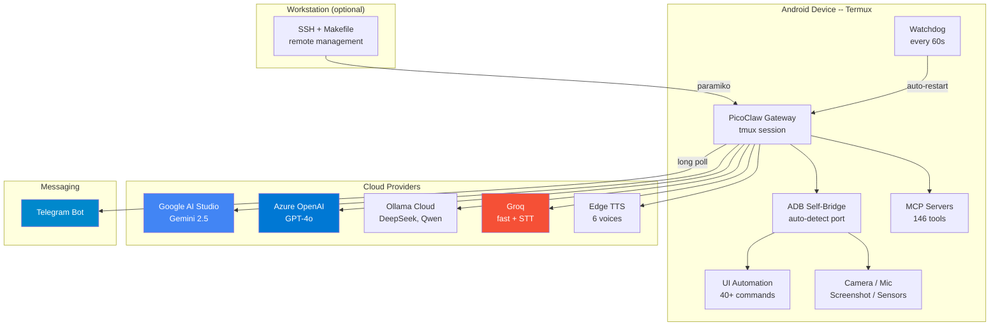

<!-- SEO: PicoClaw Dotfiles for Android - Deploy AI assistant on Android phone via Termux -->
<!-- Keywords: picoclaw, picoclaw dotfiles, android ai assistant, termux ai, telegram bot android, self-hosted ai, llm on phone, gemini android, gpt android termux -->

<p align="center">
  <a href="https://github.com/carrilloapps/picoclaw-dotfiles">
    <picture>
      <source media="(prefers-color-scheme: dark)" srcset="assets/logo-dark.svg">
      <source media="(prefers-color-scheme: light)" srcset="assets/logo.svg">
      
    </picture>
  </a>
</p>

<p align="center">
  <a href="LICENSE"></a>&nbsp;
  <a href="https://github.com/sipeed/picoclaw/releases"></a>&nbsp;
  <a href="https://termux.dev"></a>&nbsp;
  <a href="https://github.com/carrilloapps/picoclaw-dotfiles/actions"></a>
</p>

<p align="center">
  Deploy a self-healing AI assistant on any old Android phone.<br>
  <sub>25+ LLM models &bull; Telegram bot with voice &bull; full device control &bull; zero maintenance</sub>
</p>

<p align="center">
  <sub>
    <a href="https://carrillo.app"><strong>carrillo.app</strong></a> &nbsp;&middot;&nbsp;
    <a href="https://linkedin.com/in/carrilloapps">LinkedIn</a> &nbsp;&middot;&nbsp;
    <a href="https://t.me/carrilloapps">Telegram</a> &nbsp;&middot;&nbsp;
    <a href="mailto:m@carrillo.app">m@carrillo.app</a>
  </sub>
  <br>
  <sub>By <a href="https://github.com/carrilloapps"><strong>José Carrillo</strong></a> &mdash; Senior Fullstack Developer & Tech Lead</sub>
</p>

---

**PicoClaw Dotfiles for Android** is a complete deployment toolkit for [PicoClaw](https://github.com/sipeed/picoclaw) -- an ultra-lightweight AI assistant (single Go binary, ~28 MB) that runs on any Android phone via [Termux](https://termux.dev). Cloud providers (Azure OpenAI, Google Gemini, Ollama, Groq) handle LLM inference, so even a 5-year-old phone becomes a 24/7 self-healing AI assistant with Telegram integration, voice support, device control, and 146 MCP tools. No root required.

> [!WARNING]
> **Disclaimer**: This project is provided as-is under the [MIT License](LICENSE). Use at your own risk. The author is not responsible for damage to devices, data loss, or API charges. API keys and cloud services may incur costs from their respective providers. Always review scripts before running them. PicoClaw is developed by [Sipeed](https://github.com/sipeed/picoclaw) -- this repo only provides deployment configuration and dotfiles.

---

## The Device

This implementation runs on a **Xiaomi Redmi Note 10 Pro** -- an old phone repurposed as a dedicated AI server.

| | |
| --- | --- |
| **Model** | Xiaomi Redmi Note 10 Pro (M2101K6R, codename `sweet`) |
| **SoC** | Qualcomm Snapdragon 732G (SM7150) |
| **CPU** | Qualcomm Kryo 470 -- 8 cores, big.LITTLE @ 1.80 GHz |
| **RAM** | 6 GB LPDDR4X + 2 GB swap |
| **Storage** | 128 GB UFS 2.2 |
| **Display** | 6.67" AMOLED, 1080x2400 |
| **Camera** | 108 MP (back), 16 MP (front) |
| **OS** | Android 16 (API 36) via PixelOS custom ROM |
| **Kernel** | 4.14.x (SMP PREEMPT) |

> Any Android 11+ phone with `aarch64` (ARM64) works. The whole point is to give old hardware a second life.

---

## Gallery

<table>
  <tr>
    <td align="center" width="50%">
      <br>
      <em>Front -- PicoClaw running in Termux</em>
    </td>
    <td align="center" width="50%">
      <br>
      <em>Back -- 108 MP quad camera, Snapdragon 732G</em>
    </td>
  </tr>
</table>

<details>
<summary><strong>Termux screenshot (PicoClaw status)</strong></summary>
<br>

<br><br>
PicoClaw v0.2.6 running inside Termux on Android 16. Shows the status output with model, config path, workspace, and auth state.
</details>

<details>
<summary><strong>Neofetch (device specs)</strong></summary>
<br>

<br><br>
Android 16 (aarch64), Kernel 4.14, Qualcomm Snapdragon 732G, 6 GB RAM, 275 packages. The bottom section shows detailed hardware info from getprop (Xiaomi, sweet, M2101K6R).
</details>

---

## Architecture



---

## Highlights

- **25+ LLM models** across 5 providers with **automatic failover** (Azure → Ollama → Antigravity → Google) and hot-swap from chat
- **Telegram bot** with voice messages (STT + TTS), typing indicators, and streaming
- **Full device control** -- 44 permissions + 40 appops, ADB self-bridge, UI automation, camera, mic, sensors
- **5-layer resilience** -- Termux:Boot + watchdog (60s) + job-scheduler (5min) + .bashrc guards + wake lock
- **Auto-detection** -- dynamic IP discovery, ADB port scanning, workstation device finder
- **Auto-failover** -- LLM provider health checks on boot and on 429/500/503 errors (5min cooldown)
- **Power tools** -- PDF/image OCR, video download, RAG (SQLite FTS5), code interpreter, workflows, webhooks, scheduling
- **Headless browser** -- Chromium CDP for DOM extraction, screenshots, PDF rendering, CSS scraping
- **Polyglot code runner** -- Go, Rust, PHP, Ruby, Perl, Lua, Deno, Java, Kotlin, Swift, Elixir, Zig (16+ languages)
- **Central memory** -- every conversation flows through RAG, context shared across all LLM switches
- **Hybrid RAG** -- BM25 + Gemini embeddings with Reciprocal Rank Fusion (semantic + keyword)
- **Auto-ingestion** -- gateway log auto-indexed every 2 min into RAG with embeddings
- **Cloudflare Tunnel** -- token-based or quick mode (works on Termux via proot), HMAC + CF Access JWT
- **Self-modifying** -- agent can change personality, install capabilities, upgrade itself, manage packages, backup/restore — all from chat
- **Live channel config** -- add/remove Telegram users, configure WhatsApp/Discord/etc. without restarting
- **146 MCP tools** via 4 servers (filesystem, memory, sequential-thinking, github)
- **Voice pipeline** -- 6 TTS voices (Spanish + English), Whisper STT with provider cascade
- **Notification reading** -- via ADB shell (no Android listener permission required)
- **Web scraping** -- curl+BS4, Node/cheerio, screenshot fallback
- **One-click installer** -- single `install.sh` sets up everything: binary, config, scripts, cron, security
- **Remote device control** -- manage other phones via USB OTG from Telegram
- **Remote management** -- 30+ Makefile targets, 13 Python scripts, all via SSH
- **Security hardened** -- `chmod 600` secrets, `chmod 700` scripts, gateway on localhost only, SSH hardened

---

## What You Need

| | Required | Details |
|-|----------|---------|
| 1 | **Android phone** | Android 11+ with ARM64 (`aarch64`). Any phone from 2018 onwards. |
| 2 | **WiFi** | For cloud LLM inference. The phone must stay connected. |
| 3 | **At least one API key** | [Ollama Cloud](https://ollama.com) (free) is the easiest option. |

> **No computer required.** Everything can be done from the phone itself. A computer is optional and only adds remote management via SSH.

### Optional

| Item | What it adds |
|------|-------------|
| **Computer** (Windows/macOS/Linux) | Remote management via SSH, Makefile, automated deploy |
| **Telegram account** | Control PicoClaw via Telegram (text + voice messages) |
| **Google AI Studio key** ([free](https://aistudio.google.com/apikey)) | Gemini 2.5 Flash/Pro models |
| **Groq API key** ([free](https://console.groq.com)) | Voice message transcription (Whisper STT) |
| **Azure OpenAI key** | GPT-4o as primary model (enterprise quality, paid) |

---

## Installation

Choose your path. Both produce the exact same result: a fully operational, self-healing PicoClaw instance.

<details open>
<summary><h3>Path A: Phone only (no computer)</h3></summary>

Everything is done from the phone screen. No computer, no USB cable, no SSH.

> **Time**: ~20 minutes. **Difficulty**: Beginner-friendly.

#### A1. Initial phone setup

If the phone is factory-fresh:

1. **Power on** and complete the Android setup wizard (language, WiFi, skip Google account or sign in)
2. **Connect to WiFi** -- this is required for everything that follows
3. **Disable battery optimization for Termux later** (explained in step A5)

#### A2. Install Termux from F-Droid

> **Warning**: Do NOT install Termux from Google Play. That version is abandoned (v0.101) and will not work.

1. Open the **browser** on the phone and go to **https://f-droid.org**
2. Tap **"Download F-Droid"** and install the APK
   - If Android blocks the install: **Settings > Apps > [your browser] > Install unknown apps > Allow**
3. Open **F-Droid**, wait for it to update its repository, then search and install:
   - **Termux** (by Fredrik Fornwall) -- the terminal app
   - **Termux:Boot** -- runs scripts on device boot
   - **Termux:API** -- access to camera, mic, GPS, SMS, sensors
4. **Open Termux:Boot once** after installing (just open it and close it -- Android needs to register it)

#### A3. Get your API keys

You need at least one LLM provider. Open the browser on the phone and sign up:

| Provider | URL | Cost | What you get |
|----------|-----|------|-------------|
| **Ollama Cloud** | [ollama.com](https://ollama.com) | Free | 8 models (DeepSeek, Qwen, GPT-OSS) |
| **Google AI Studio** | [aistudio.google.com/apikey](https://aistudio.google.com/apikey) | Free | Gemini 2.5 Flash / Pro |
| Groq | [console.groq.com](https://console.groq.com) | Free | Fast inference + Whisper STT for voice |
| Azure OpenAI | [portal.azure.com](https://portal.azure.com) | Paid | GPT-4o (best quality) |

Copy your API key(s) to a notes app so you can paste them during installation.

#### A4. (Optional) Create a Telegram bot

To control PicoClaw from Telegram with text and voice messages:

1. Open **Telegram** > search **@BotFather** > send `/newbot`
2. Follow the prompts to name your bot. Copy the **bot token** (format: `123456789:ABCdef...xyz`)
3. Search **@userinfobot** > send any message. Copy your **numeric user ID**

#### A5. Run the installer

Open the **Termux** app and run:

```bash
pkg update && pkg upgrade -y
pkg install -y curl
curl -sL https://raw.githubusercontent.com/carrilloapps/picoclaw-dotfiles/main/utils/install.sh | bash
```

The installer will prompt you for:
- **Packages** -- type `Y` to install (~225 packages, takes a few minutes)
- **Ollama API key** -- paste it (or press Enter to skip)
- **Google AI Studio / Azure / Groq keys** -- paste or Enter to skip
- **Telegram bot token + user ID** -- paste or Enter to skip
- **Device screen unlock PIN** -- for auto-unlock features (or Enter to skip)

When it says `Installation complete!`, PicoClaw is running.

#### A6. Verify

```bash
./picoclaw status
```

You should see `Config: ... ✓` and your model name. If you set up Telegram, send a message to your bot -- it should reply.

#### A7. (Optional) Grant full Android permissions

> **Without this step**, PicoClaw works but can't use the camera, microphone, UI automation, SMS reading, or notifications. If you only need text chat via Telegram, you can skip this.

This uses Android's Wireless Debugging feature to grant permissions from the phone itself:

**Enable Developer Options:**

1. **Settings > About Phone** > tap **"Build number"** 7 times
2. **Settings > System > Developer Options** > enable **USB Debugging**
3. In the same screen, enable **Wireless Debugging** > tap it to open its settings

**Pair Termux with ADB:**

1. Tap **"Pair device with pairing code"** -- a dialog shows a **6-digit code** and an **IP:Port**
2. **Don't close this dialog.** Switch to Termux (app switcher or swipe) and type:

```bash
adb pair <IP:PORT_FROM_DIALOG>
# Example: adb pair 192.168.1.101:42383
# Then type the 6-digit code when prompted
```

3. You should see `Successfully paired`

**Connect and grant:**

1. Go back to the **Wireless Debugging** main screen (not the pair dialog)
2. Note the **IP:Port** shown at the top (different from the pair port)
3. In Termux:

```bash
adb connect <IP:PORT_FROM_SCREEN>
# Example: adb connect 192.168.1.101:41777
```

4. A dialog pops up: **"Allow USB debugging?"** -- tap **Allow** (check "Always allow")
5. Grant all permissions:

```bash
bash ~/picoclaw-dotfiles/utils/grant-permissions.sh
```

6. Set up the permanent self-bridge:

```bash
adb connect localhost:5555
# Accept the "Allow?" dialog again
```

Done. Permissions are granted permanently. The self-bridge auto-reconnects on reboot.

#### A8. All done

```bash
./picoclaw status                    # Check status
./picoclaw agent -m "Hello!"         # Chat with the AI
tmux attach -t picoclaw              # View gateway logs (Ctrl+B, D to detach)
~/bin/notifications.sh --summary     # Read phone notifications
~/bin/ui-control.sh status           # Screen, battery, current app
```

> **On reboot**: Everything starts automatically via Termux:Boot. The watchdog checks every 60 seconds. You never need to open Termux manually.

</details>

<details>
<summary><h3>Path B: With a computer (remote deploy)</h3></summary>

The computer manages the phone over WiFi via SSH. Faster for experienced users and required for ongoing remote management.

> **Time**: ~15 minutes. **Difficulty**: Intermediate (SSH, command line).

#### B1. Prepare the phone

On the phone itself (only needed once):

1. Complete Android setup if factory-fresh (WiFi, language)
2. Install **Termux** from [F-Droid](https://f-droid.org/en/packages/com.termux/) (**not** Google Play)
3. Also install **Termux:Boot** and **Termux:API** from F-Droid
4. Open **Termux:Boot** once (just open and close)
5. Open **Termux** and run:

```bash
pkg update && pkg upgrade -y
pkg install -y openssh
passwd    # Set a password -- you'll need it for SSH
sshd      # Start the SSH server
```

6. Find the IP and username:

```bash
ifconfig wlan0 | grep 'inet '   # Note the IP (e.g., 192.168.1.101)
whoami                            # Note the username (e.g., u0_a39)
```

> **Tip**: You can put the phone down now. Everything else is done from the computer.

#### B2. Set up the computer

```bash
git clone https://github.com/carrilloapps/picoclaw-dotfiles.git
cd picoclaw-dotfiles
pip install paramiko python-dotenv
cp .env.example .env
```

Edit `.env` with the values from step B1 and your API keys:

```bash
DEVICE_SSH_HOST=192.168.1.101       # From ifconfig
DEVICE_SSH_PORT=8022
DEVICE_SSH_USER=u0_a39              # From whoami
DEVICE_SSH_PASSWORD=YourPassword    # From passwd

OLLAMA_API_KEY=your_key_here        # From ollama.com
OLLAMA_MODEL=gpt-oss:120b

# Optional: add Azure, Groq, Telegram keys (see .env.example)
```

Test the connection:

```bash
python scripts/connect.py "echo OK"
```

#### B3. Deploy

```bash
python scripts/full_deploy.py
```

This runs 12 automated steps: installs packages, deploys scripts, generates config, starts the gateway, and verifies everything. Takes ~5 minutes.

#### B4. Grant Android permissions

Choose one method:

**Wireless (no USB cable):**

1. On the phone: **Settings > Developer Options > Wireless Debugging > Pair device with pairing code**
2. On the computer:

```bash
adb pair <IP>:<PAIR_PORT> <CODE>          # From the pairing dialog
adb connect <IP>:<DEBUG_PORT>             # From the Wireless Debugging main screen
bash utils/grant-permissions.sh           # Grant everything
python scripts/connect.py "adb connect localhost:5555"  # Self-bridge
```

3. Accept the "Allow USB debugging?" dialogs on the phone (2 times)

**USB cable:**

```bash
# Connect phone via USB
adb devices                               # Accept prompt on phone
bash utils/grant-permissions.sh           # Grant everything
# Unplug the cable -- ADB TCP is now enabled
```

#### B5. Verify

```bash
make status                  # PicoClaw status
make health                  # Gateway health check
make agent MSG="Hello"       # Chat with the AI
make info                    # Full device diagnostic
make verify                  # 8-phase resilience test
```

#### B6. Ongoing management

All commands run over SSH from the computer. No need to touch the phone:

```bash
make gateway-restart         # Restart gateway
make gateway-logs            # View gateway logs
make model M=deepseek-v3.2  # Switch LLM model
make config                  # View config (secrets masked)
make models                  # List all 25 available models
```

If the phone's IP changes:

```bash
python scripts/find_device.py --update   # Auto-discover and update .env
```

</details>

### What the installer sets up

Regardless of which path you choose, the result is identical:

| Component | Details |
|-----------|---------|
| **PicoClaw v0.2.6** | Go binary (28 MB, aarch64) with TLS wrapper |
| **47 device scripts** | UI automation, voice, notifications, media, ADB, watchdog, webhook CRUD, log rotation |
| **4 MCP servers** | filesystem, memory, sequential-thinking, github (146 tools) |
| **5-layer resilience** | Termux:Boot + watchdog (60s) + job-scheduler (5min) + .bashrc guards + wake lock |
| **5 cron jobs** | Watchdog, media cleanup, disk monitor, session cleanup, hourly log rotation |
| **Security** | `chmod 600` secrets, `chmod 700` scripts, gateway on `127.0.0.1` only |
| **Telegram bot** | Long-polling gateway with voice (STT+TTS), if configured |

---

## Documentation

Detailed step-by-step guides are in the [`docs/`](docs/) directory:

| Guide | Topics |
| ----- | ------ |
| [00 - Termux & SSH Setup](docs/00-termux-ssh-setup.md) | Termux install, SSH server, find user/IP, connect from workstation |
| [01 - Hardware Setup](docs/01-hardware-setup.md) | Device requirements, Termux apps, ADB setup (USB + wireless) |
| [02 - PicoClaw Installation](docs/02-picoclaw-installation.md) | Binary download, TLS fix, config, security.yml (v0.2.6) |
| [03 - Providers Setup](docs/03-providers-setup.md) | Azure, Ollama, Groq, Antigravity, model switching |
| [04 - Telegram Integration](docs/04-telegram-integration.md) | Bot setup, voice pipeline (STT + TTS), 6 voices |
| [05 - Device Control](docs/05-device-control.md) | ADB self-bridge, 44 permissions, UI automation, notifications |
| [06 - Resilience](docs/06-resilience.md) | 5-layer resilience, boot script, watchdog, 8-phase verification |
| [07 - Skills and MCP](docs/07-skills-and-mcp.md) | Skills, 4 MCP servers, 146 tools |
| [08 - Advanced Features](docs/08-advanced-features.md) | Web scraping, knowledge base, cron jobs |
| [09 - Remote Devices](docs/09-remote-devices.md) | Control other phones via USB OTG |
| [10 - Complete Setup Guide](docs/10-complete-setup-guide.md) | End-to-end from zero to running (all phases, troubleshooting) |
| [11 - Power Tools](docs/11-power-tools.md) | PDF, image, RAG, code-run, media, workflows, webhooks, browser, Cloudflare |
| [12 - vs OpenClaw](docs/12-vs-openclaw.md) | Capability comparison table — where PicoClaw wins |
| [13 - Central Memory](docs/13-central-memory.md) | RAG-as-memory: shared context across LLM switches |
| [14 - Self-Administration](docs/14-self-administration.md) | Live channels, backup/restore/upgrade, pkg mgmt — all from chat |
| [15 - Webhook Security](docs/15-webhook-security.md) | Honeypot, tiered rate limits, auto-ban, HMAC, CF Access, hardening headers |
| [16 - Resilience & Dynamic Webhooks](docs/16-resilience-and-dynamic-webhooks.md) | Reboot recovery, network fallback, chat-created forms/endpoints |

---

## Repository Structure

```
picoclaw-dotfiles/                          90+ files
|-- assets/                             Device photos and screenshots (5 files)
|-- config/                             Config templates, no secrets (4 files)
|-- docs/                               Step-by-step guides (18 files)
|-- scripts/                            Python scripts for remote management (12 files)
|-- utils/                              Device-side files deployed to phone (51 files)
|-- .github/                            CI, templates, security policy, CoC
|-- .env.example                        Environment variable template
|-- .gitignore                          Excludes secrets, binaries, runtime data
|-- CLAUDE.md                           AI session context (for Claude Code)
|-- CONTRIBUTING.md                     Contribution guidelines
|-- LICENSE                             MIT
|-- Makefile                            30+ targets for device management
|-- README.md                           This file
+-- SECRETS.md                          Credential management reference
```

<details>
<summary><strong>Full file listing</strong></summary>

```
scripts/
  connect.py                      SSH connection library + CLI
  find_device.py                  Auto-discover device on local network
  full_deploy.py                  12-step automated deployment
  deploy_wrapper.py               Deploy TLS wrapper (idempotent)
  device_info.py                  Full device diagnostic report
  gateway.py                      Gateway management (start/stop/restart/logs)
  change_model.py                 Switch LLM model (3 config locations)
  edit_config.py                  Remote config editor (get/set/enable)
  setup_voice.py                  Configure Whisper STT
  install_scraping.py             Install web scraping stack
  setup_knowledge.py              Create knowledge base on device
  verify_resilience.py            8-phase resilience verification

utils/                              (47 scripts + 2 shell configs + AGENT.md + README)
  install.sh                      One-click Termux installer
  picoclaw-wrapper.sh             TLS wrapper for the Go binary
  boot-picoclaw.sh                Auto-start on boot (Termux:Boot)
  watchdog.sh                     Cron watchdog: auto-restart all services every minute
  network-recovery.sh             WiFi/mobile/ethernet fallback + interface tracking
  log-rotate.sh                   Glob-based rotation + cache/backup/media cleanup
  adb-connect.sh                  Smart ADB self-bridge with port auto-detection
  adb-shell.sh                    Execute commands with ADB shell privileges
  adb-enable.sh                   Re-enable ADB TCP if connection lost
  detect-ip.sh                    Auto-detect device IP (5 methods)
  notifications.sh                Read device notifications via ADB
  ensure-unlocked.sh              Auto-unlock screen (wake + PIN)
  wakeup.sh                       Wake / unlock cycle for scheduled tasks
  ui-control.sh                   40+ UI automation commands
  ui-auto.py                      Advanced UI automation (Python, XML parsing)
  media-capture.sh                Photo/audio/screenshot/screenrecord
  media-cleanup.sh                Auto-clean temp media files
  media-tool.sh                   Unified wrapper: capture/analyze/cleanup
  transcribe.sh                   STT: Azure Whisper -> Groq cascade
  tts-reply.sh                    TTS: Azure -> Edge TTS (6 voices)
  device-context.sh               AGENT.md generator with full device context
  switch-model.sh                 Hot-swap LLM model (25 models)
  scrape.sh                       Web scraper with method cascade
  browser-tool.sh                 Headless Chromium: DOM, screenshots, PDF
  qr-tool.sh                      QR code generation / scanning
  image-tool.sh                   Image manipulation + OCR
  pdf-tool.sh                     PDF text extraction + rendering
  document-tool.sh                Universal document ingestion
  remote-device.sh                USB OTG device control
  auth-antigravity.sh             Google OAuth for Antigravity provider
  auto-failover.sh                LLM provider health check + auto-switch on errors
  grant-permissions.sh            Grant 44 permissions + 40 appops (from PC)
  ssl-certs.sh                    System-wide SSL_CERT_FILE export
  rag-tool.sh                     RAG store: BM25 + Gemini embeddings + RRF
  memory-ingest.sh                Gateway log -> RAG ingest cron
  context-inject.sh               Inject retrieved memory into agent context
  cost-tracker.sh                 Per-provider token/cost accounting
  audit-log.sh                    Structured audit trail for every action
  code-run.sh                     Polyglot code runner (16+ languages)
  workflow.sh                     YAML-defined multi-step workflows
  agent-self.sh                   Agent self-modification (personality/capability/snapshot)
  channels-tool.sh                Live channel config (Telegram/WhatsApp/Discord/...)
  cloudflare-tool.sh              Cloudflare Tunnel daemon (proot workaround)
  system-tool.sh                  backup/restore/upgrade/pkg/services/health
  webhook-server.py               Flask server v3: honeypot, HMAC, Bearer, CF Access, tiered rate limits, auto-ban
  webhook-manage.sh               Full CRUD for /c/<name> routes/forms from chat
  form-handler.sh                 Universal form handler: JSONL + RAG + notif + Telegram
  bashrc / bash_profile           Shell configuration
  AGENT.md                        Agent persona (static reference copy)
```

</details>

---

## Security

> **Important**: Never commit API keys, tokens, passwords, or PINs. All secret files are git-ignored and use `chmod 600`.

See [SECURITY.md](.github/SECURITY.md) for the security policy and vulnerability reporting.

| Control | Implementation |
|---------|---------------|
| API keys | Stored only in `security.yml` (`chmod 600`), never in `config.json` |
| Gateway | Bound to `127.0.0.1` only (not exposed to network) |
| SSH | `MaxAuthTries 3`, no empty passwords, keepalive 120s |
| Scripts | `chmod 700` (owner-only execution) |
| ADB | Localhost-only self-bridge, authorized keys required |
| Credentials guide | [SECRETS.md](SECRETS.md) |

---

## Contributing

See [CONTRIBUTING.md](CONTRIBUTING.md) for guidelines, [CODE_OF_CONDUCT.md](.github/CODE_OF_CONDUCT.md) for community standards.

---

## Support

See [SUPPORT.md](.github/SUPPORT.md) for help, diagnostics, and contact information.

---

## Tech Stack

| Layer | Technology | Role in this project |
|-------|-----------|---------------------|
| **AI Runtime** | [Go](https://go.dev) | PicoClaw binary (aarch64, 28 MB) |
| **Automation** | [Python](https://python.org) | 13 remote management scripts (paramiko SSH) |
| **MCP Servers** | [Node.js](https://nodejs.org) / [TypeScript](https://typescriptlang.org) | 4 MCP servers (146 tools) |
| **Device Scripts** | [Bash](https://www.gnu.org/software/bash/) | 47 device-side scripts (Termux) |
| **Cloud LLM** | [Azure OpenAI](https://azure.microsoft.com/en-us/products/ai-services/openai-service), [Google AI Studio](https://aistudio.google.com), [Ollama](https://ollama.com) | GPT-4o, Gemini, DeepSeek, 25+ models |
| **Voice** | [Azure AI Speech](https://azure.microsoft.com/en-us/products/ai-services/ai-speech) + [Groq](https://groq.com) | STT (Whisper) + TTS (6 voices) |
| **Messaging** | [Telegram Bot API](https://core.telegram.org/bots/api) | Long-polling gateway |
| **CI/CD** | [GitHub Actions](https://github.com/features/actions) | Lint, validate, secret scan |
| **Platform** | [Android](https://developer.android.com) / [Termux](https://termux.dev) | Linux on mobile |

---

## Credits

- **[PicoClaw](https://github.com/sipeed/picoclaw)** by [Sipeed](https://sipeed.com) -- the AI assistant framework (MIT licensed)
- **[Termux](https://termux.dev)** -- terminal emulator and Linux environment for Android
- **[PixelOS](https://pixelos.net)** -- the custom ROM running on the device

---

## License

This dotfiles repository is licensed under [MIT](LICENSE). PicoClaw itself is [MIT-licensed](https://github.com/sipeed/picoclaw/blob/main/LICENSE) by Sipeed.

> This project is not affiliated with, endorsed by, or sponsored by Sipeed, Google, Microsoft, Telegram, Groq, or any other company mentioned. All trademarks belong to their respective owners. Cloud API usage is subject to each provider's terms of service and pricing. Free tiers may have rate limits or usage caps.

---

<p align="center">
  <a href="https://carrillo.app">carrillo.app</a>
  &nbsp;&middot;&nbsp;
  <a href="https://linkedin.com/in/carrilloapps">LinkedIn</a>
  &nbsp;&middot;&nbsp;
  <a href="https://t.me/carrilloapps">Telegram</a>
  &nbsp;&middot;&nbsp;
  <a href="https://github.com/carrilloapps">GitHub</a>
</p>
