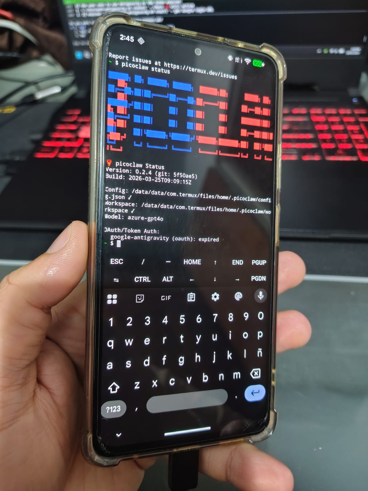
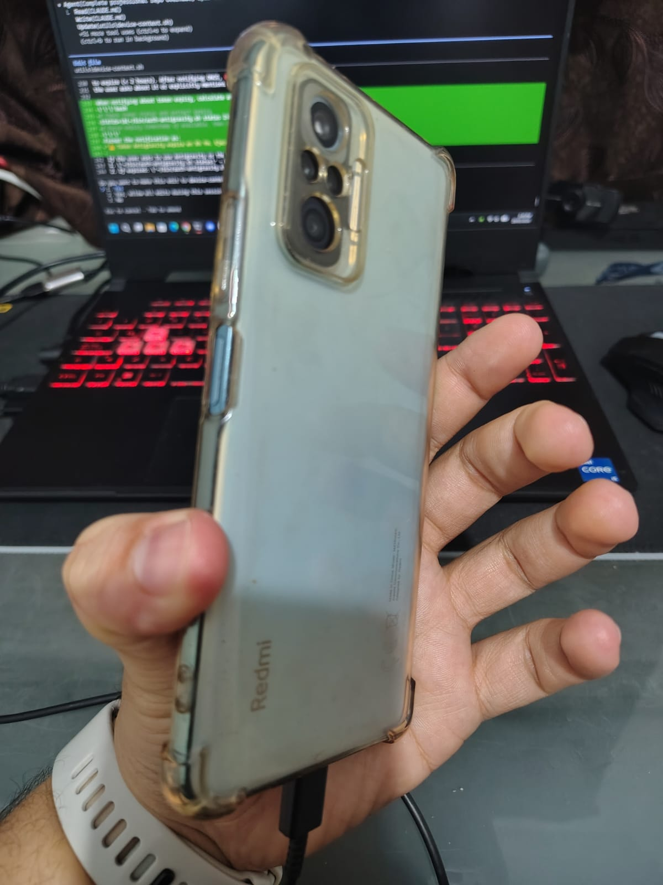
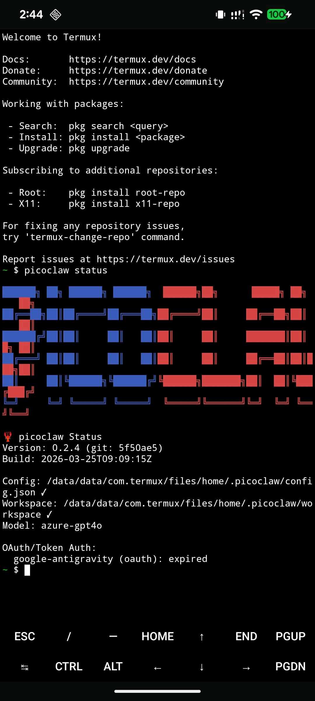
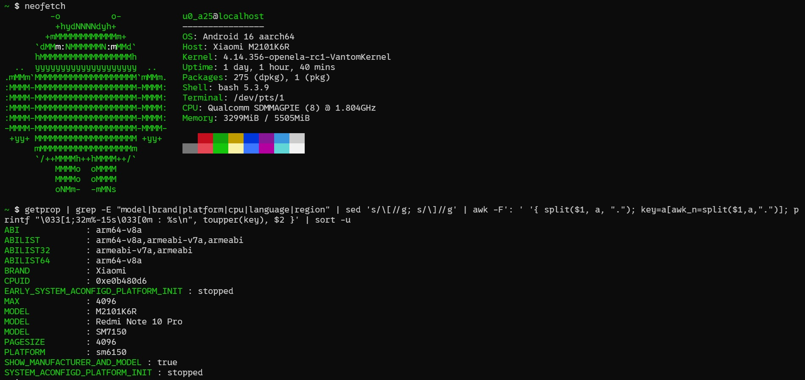
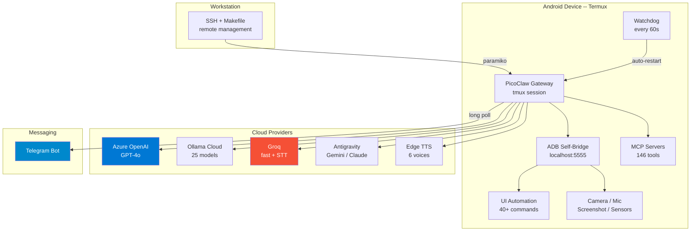

# PicoClaw Dotfiles

[](LICENSE)
[](https://termux.dev)
[](https://github.com/sipeed/picoclaw)
[](docs/04-telegram-integration.md)
[](utils/)
[](scripts/)
[](docs/07-skills-and-mcp.md)
[](docs/07-skills-and-mcp.md)

Dotfiles and configuration for deploying [PicoClaw](https://github.com/sipeed/picoclaw) -- an ultra-lightweight AI assistant (single Go binary, ~27 MB) -- on a recycled Android phone via Termux. Cloud LLM providers handle inference, so any old phone becomes a 24/7 AI assistant with full device control, voice support, and messaging integration.

**By [José Carrillo](https://carrillo.app) ([@carrilloapps](https://github.com/carrilloapps))**

---

## The Device

This implementation runs on a **Xiaomi Redmi Note 10 Pro** -- an old phone repurposed as a dedicated AI server.

| | |
| --- | --- |
| **Model** | Xiaomi Redmi Note 10 Pro (M2101K6R, codename `sweet`) |
| **SoC** | Qualcomm Snapdragon 732G (SM7150) |
| **CPU** | Qualcomm Kryo 470 -- 8 cores, big.LITTLE @ 1.80 GHz |
| **RAM** | 6 GB LPDDR4X + 2 GB swap |
| **Storage** | 128 GB UFS 2.2 |
| **Display** | 6.67" AMOLED, 1080x2400 |
| **Camera** | 108 MP (back), 16 MP (front) |
| **OS** | Android 16 (API 36) via PixelOS custom ROM |
| **Kernel** | 4.14.x (SMP PREEMPT) |

> Any Android 11+ phone works. The whole point is to give old hardware a second life.

---

## Gallery

<table>
  <tr>
    <td align="center" width="50%">
      <br>
      <em>Front -- PicoClaw running in Termux</em>
    </td>
    <td align="center" width="50%">
      <br>
      <em>Back -- 108 MP quad camera, Snapdragon 732G</em>
    </td>
  </tr>
</table>

<details>
<summary><strong>Termux screenshot (PicoClaw status)</strong></summary>
<br>

<br><br>
PicoClaw v0.2.4 running inside Termux on Android 16. Shows the status output with model, config path, workspace, and auth state.
</details>

<details>
<summary><strong>Neofetch (device specs)</strong></summary>
<br>

<br><br>
Android 16 (aarch64), Kernel 4.14, Qualcomm Snapdragon 732G, 6 GB RAM, 275 packages. The bottom section shows detailed hardware info from getprop (Xiaomi, sweet, M2101K6R).
</details>

---

## Architecture



---

## Highlights

- **25 LLM models** across 4 providers with automatic fallback and hot-swap from chat
- **Telegram bot** with voice messages (STT + TTS), typing indicators, and streaming
- **Full device control** -- 44 Android permissions, ADB self-bridge, UI automation, camera, mic, sensors
- **Self-healing** -- watchdog + boot script auto-restart all services (sshd, gateway, ADB)
- **146 MCP tools** via 4 servers (filesystem, memory, sequential-thinking, github)
- **Voice pipeline** -- 6 TTS voices (Spanish + English), Whisper STT with provider cascade
- **Web scraping** -- curl+BS4, Node/cheerio, screenshot fallback
- **One-click installer** -- single `install.sh` script sets up everything from Termux
- **Remote management** -- 30+ Makefile targets, 11 Python scripts, all via SSH

---

## Quick Start

### Option A: One-click install from Termux (on the phone)

Open Termux on the Android device and run:

```bash
curl -sL https://raw.githubusercontent.com/carrilloapps/picoclaw-dotfiles/main/utils/install.sh | bash
```

Or clone and run:

```bash
pkg install git -y
git clone https://github.com/carrilloapps/picoclaw-dotfiles.git
cd picoclaw-dotfiles && bash utils/install.sh
```

The installer will:
1. Install all required Termux packages
2. Download and configure the PicoClaw binary
3. Prompt for API keys (Ollama, Azure, Groq, Telegram)
4. Deploy all device scripts
5. Install MCP servers
6. Set up boot persistence and watchdog
7. Start the gateway

### Option B: Remote deploy from a workstation

```bash
# 1. Clone and configure
git clone https://github.com/carrilloapps/picoclaw-dotfiles.git && cd picoclaw-dotfiles
make setup                          # Creates .env, installs deps
# Edit .env with your credentials (see .env.example)

# 2. Deploy to device
python scripts/full_deploy.py       # 10-step automated deployment

# 3. Verify
make status                         # Quick status check
make agent MSG="Hello"              # Send a test message
```

---

## Documentation

Detailed step-by-step guides are in the [`docs/`](docs/) directory:

| Guide | Topics |
| ----- | ------ |
| [01 - Hardware Setup](docs/01-hardware-setup.md) | Device requirements, Termux installation, SSH setup |
| [02 - PicoClaw Installation](docs/02-picoclaw-installation.md) | Binary download, TLS fix, initial config |
| [03 - Providers Setup](docs/03-providers-setup.md) | Azure, Ollama, Groq, Antigravity, model switching |
| [04 - Telegram Integration](docs/04-telegram-integration.md) | Bot setup, voice pipeline (STT + TTS), 6 voices |
| [05 - Device Control](docs/05-device-control.md) | ADB self-bridge, 44 permissions, UI automation |
| [06 - Resilience](docs/06-resilience.md) | Boot script, watchdog, 8-phase verification |
| [07 - Skills and MCP](docs/07-skills-and-mcp.md) | Skills, 4 MCP servers, 146 tools |
| [08 - Advanced Features](docs/08-advanced-features.md) | Web scraping, knowledge base, cron jobs |

---

## Repository Structure

```
picoclaw-dotfiles/                          57 files
|-- assets/                             Device photos and screenshots (4 files)
|   |-- neofetch.jpg                    Terminal specs output
|   |-- photo-back.jpg                  Back of the phone (108 MP camera)
|   |-- photo-front.jpg                 Front of the phone (Termux running)
|   +-- screenshot-termux.png           Termux screenshot (PicoClaw status)
|-- config/                             Config templates, no secrets (3 files)
|   |-- .gitignore                      Only allows template files
|   |-- config.template.json            config.json with <PLACEHOLDER> values
|   +-- security.template.yml           .security.yml with <PLACEHOLDER> values
|-- docs/                               Step-by-step guides (8 files)
|   |-- 01-hardware-setup.md            Device requirements, Termux, SSH
|   |-- 02-picoclaw-installation.md     Binary, TLS fix, initial config
|   |-- 03-providers-setup.md           Azure, Ollama, Groq, Antigravity
|   |-- 04-telegram-integration.md      Bot, voice pipeline, 6 voices
|   |-- 05-device-control.md            ADB self-bridge, permissions, UI
|   |-- 06-resilience.md                Boot script, watchdog, verification
|   |-- 07-skills-and-mcp.md            Skills, 4 MCP servers, 146 tools
|   +-- 08-advanced-features.md         Scraping, knowledge base, cron
|-- scripts/                            Python scripts for remote management (12 files)
|   |-- README.md                       Script documentation
|   |-- change_model.py                 Switch LLM model (3 config locations)
|   |-- connect.py                      SSH connection library + CLI
|   |-- deploy_wrapper.py               Deploy TLS wrapper (idempotent)
|   |-- device_info.py                  Full device diagnostic report
|   |-- edit_config.py                  Remote config editor (get/set/enable)
|   |-- full_deploy.py                  10-step automated deployment
|   |-- gateway.py                      Gateway management (start/stop/restart)
|   |-- install_scraping.py             Install web scraping stack
|   |-- setup_knowledge.py              Create knowledge base on device
|   |-- setup_voice.py                  Configure Whisper STT
|   +-- verify_resilience.py            8-phase resilience verification
|-- utils/                              Device-side files deployed to phone (23 files)
|   |-- AGENT.md                        Agent persona (reference copy)
|   |-- README.md                       Deployment instructions
|   |-- adb-enable.sh                   Re-enable ADB TCP if connection lost
|   |-- adb-shell.sh                    Execute with ADB shell privileges
|   |-- auth-antigravity.sh             Google OAuth for Antigravity provider
|   |-- bash_profile                    Login shell bridge -> ~/.bash_profile
|   |-- bashrc                          Shell config -> ~/.bashrc
|   |-- boot-picoclaw.sh               Auto-start on boot
|   |-- device-context.sh              AGENT.md generator with device context
|   |-- ensure-unlocked.sh             Auto-unlock screen (wake + PIN)
|   |-- grant-permissions.sh           Grant 44 permissions (run from PC)
|   |-- install.sh                     One-click Termux installer
|   |-- media-capture.sh               Photo/audio/screenshot/screenrecord
|   |-- media-cleanup.sh               Auto-clean temp media files
|   |-- picoclaw-wrapper.sh            TLS wrapper for the Go binary
|   |-- scrape.sh                      Web scraper with method cascade
|   |-- ssl-certs.sh                   System-wide SSL_CERT_FILE export
|   |-- switch-model.sh               Hot-swap LLM model (25 models)
|   |-- transcribe.sh                  STT: Azure Whisper -> Groq cascade
|   |-- tts-reply.sh                   TTS: Azure -> Edge TTS (6 voices)
|   |-- ui-auto.py                     Advanced UI automation (Python, XML)
|   |-- ui-control.sh                  40+ UI automation commands (Bash)
|   +-- watchdog.sh                    Cron watchdog: auto-restart services
|-- .env.example                        Environment variable template
|-- .gitignore                          Excludes secrets, binaries, runtime data
|-- CLAUDE.md                           AI session context (for Claude Code)
|-- CONTRIBUTING.md                     Contribution guidelines
|-- LICENSE                             MIT
|-- Makefile                            30+ targets for device management
|-- README.md                           This file
+-- SECRETS.md                          Credential management reference
```

---

## Contributing

See [CONTRIBUTING.md](CONTRIBUTING.md) for guidelines.

---

## Credits

- **[PicoClaw](https://github.com/sipeed/picoclaw)** by [Sipeed](https://sipeed.com) -- the AI assistant framework (MIT licensed)
- **[Termux](https://termux.dev)** -- terminal emulator and Linux environment for Android
- **[PixelOS](https://pixelos.net)** -- the custom ROM running on the device

---

## License

This dotfiles repository is licensed under [MIT](LICENSE). PicoClaw itself is [MIT-licensed](https://github.com/sipeed/picoclaw/blob/main/LICENSE) by Sipeed.
