# Secrets & Credentials Reference

> **This file documents the required secrets for PicoClaw operation. It does NOT contain actual
> secret values.** All real credentials are stored exclusively in `.env` (local machine) and on
> the target device.

---

## Table of Contents

- [Secret Inventory](#secret-inventory)
- [Secret Formats](#secret-formats)
- [Where Secrets Are Used](#where-secrets-are-used)
- [Credential Flow](#credential-flow)
- [Setup Instructions](#setup-instructions)
- [Rotation & Revocation](#rotation--revocation)
- [Files That Must NEVER Be Committed](#files-that-must-never-be-committed)

---

## Secret Inventory

| Secret | `.env` Variable | Location(s) on Device | Purpose |
| ------ | --------------- | --------------------- | ------- |
| Ollama Cloud API Key | `OLLAMA_API_KEY` | `config.json` (providers + model_list), `.security.yml` | Ollama Cloud LLM inference |
| Azure OpenAI API Key | `AZURE_OPENAI_API_KEY` | `config.json` (providers + model_list), `~/.picoclaw_keys` | Azure GPT-4o inference + Whisper STT + TTS |
| Azure OpenAI Base URL | `AZURE_OPENAI_BASE_URL` | `config.json` (providers + model_list), `~/.picoclaw_keys` | Azure resource endpoint |
| Azure Deployment Name | `AZURE_OPENAI_DEPLOYMENT` | `config.json` (model_list) | Azure LLM deployment ID |
| Azure Whisper Deployment | `AZURE_WHISPER_DEPLOYMENT` | `~/.picoclaw_keys` | Azure Whisper STT deployment name |
| Groq API Key | `GROQ_API_KEY` | `config.json` (providers), `.security.yml`, `~/.picoclaw_keys` | Groq Whisper STT (fallback) |
| Telegram Bot Token | `TELEGRAM_BOT_TOKEN` | `.security.yml` (channels.telegram.token) | Telegram bot authentication |
| Telegram Owner ID | `TELEGRAM_OWNER_ID` | `config.json` (channels.telegram.allow_from) | Restrict bot access to owner |
| SSH Password | `DEVICE_SSH_PASSWORD` | Termux internal auth (`termux-auth`) | SSH remote access |
| Device PIN | `DEVICE_PIN` | `~/.device_pin` on device | Screen unlock for UI automation |

---

## Secret Formats

### Ollama Cloud API Key

```
Format:  <32-char-hex-id>.<26-char-alphanumeric-secret>
Example: 00000000000000000000000000000000.XXXXXXXXXXXXXXXXXXXXXXXXXX
```

Obtained from: [ollama.com](https://ollama.com) account settings.

### Azure OpenAI API Key

```
Format:  <32-char-hex>
Example: 00000000000000000000000000000000
```

Obtained from: Azure Portal > your OpenAI resource > Keys and Endpoint.

### Azure OpenAI Base URL

```
Format:  https://<RESOURCE_NAME>.openai.azure.com
Example: https://my-openai-resource.openai.azure.com
```

### Groq API Key

```
Format:  gsk_<alphanumeric>
Example: gsk_xxxxxxxxxxxxxxxxxxxxxxxxxxxxxxxxxxxxxxxxxxxxxxxx
```

Obtained from: [console.groq.com](https://console.groq.com) > API Keys (free account).

### Telegram Bot Token

```
Format:  <bot_id>:<hash>
Example: 1234567890:ABCdefGHIjklMNOpqrsTUVwxyz
```

Obtained from: [@BotFather](https://t.me/BotFather) on Telegram.

### Telegram User ID

```
Format:  <numeric>
Example: 123456789
```

Obtained from: [@userinfobot](https://t.me/userinfobot) on Telegram.

### SSH Password

Set via `passwd` command inside Termux. No format restriction.

### Device PIN

The numeric PIN used to unlock the Android lock screen. Stored in `~/.device_pin` on the device.

---

## Where Secrets Are Used

### Credential Flow Diagram

```mermaid
graph TB
    ENV[".env file<br/>(local machine)"]

    subgraph "Device: ~/.picoclaw/config.json"
        P_OAI["providers.openai.api_key<br/>(Ollama)"]
        P_AZ["providers.azure.api_key"]
        P_GQ["providers.groq.api_key"]
        ML1["model_list[0].api_key<br/>(Azure)"]
        ML2["model_list[1].api_key<br/>(Ollama)"]
        CH_TG["channels.telegram.allow_from<br/>(owner ID)"]
    end

    subgraph "Device: ~/.picoclaw/.security.yml"
        S_OAI["model_list.ollama:0.api_keys"]
        S_TG["channels.telegram.token"]
        S_GQ["voice.groq_api_key"]
    end

    subgraph "Device: ~/.picoclaw_keys"
        K_AZ["AZURE_OPENAI_API_KEY"]
        K_AZU["AZURE_OPENAI_BASE_URL"]
        K_GQ["GROQ_KEY"]
    end

    subgraph "Device: ~/.device_pin"
        PIN["Device PIN"]
    end

    ENV -->|"deploy scripts"| P_OAI
    ENV -->|"deploy scripts"| P_AZ
    ENV -->|"deploy scripts"| P_GQ
    ENV -->|"deploy scripts"| ML1
    ENV -->|"deploy scripts"| ML2
    ENV -->|"deploy scripts"| CH_TG
    ENV -->|"deploy scripts"| S_OAI
    ENV -->|"deploy scripts"| S_TG
    ENV -->|"deploy scripts"| S_GQ
    ENV -->|"deploy scripts"| K_AZ
    ENV -->|"deploy scripts"| K_AZU
    ENV -->|"deploy scripts"| K_GQ
    ENV -->|"deploy scripts"| PIN

    style ENV fill:#ff9800,color:#fff
```



### `~/.picoclaw/config.json`

Secrets appear in **three sections**:

```jsonc
{
  "providers": {
    "openai": {
      "api_key": "***"                    // Ollama Cloud key
    },
    "azure": {
      "api_key": "***"                    // Azure OpenAI key
    },
    "groq": {
      "api_key": "***"                    // Groq key
    }
  },
  "model_list": [
    { "api_key": "***", "api_base": "***" },  // Azure model entry
    { "api_key": "***", "api_base": "***" }   // Ollama model entry
  ],
  "channels": {
    "telegram": {
      "allow_from": [123456789]           // Telegram owner ID
    }
  }
}
```

### `~/.picoclaw/.security.yml`

```yaml
model_list:
  ollama:0:
    api_keys:
      - ***                               # Ollama Cloud key
channels:
  telegram:
    token: "***"                          # Telegram bot token
voice:
  groq_api_key: "***"                     # Groq key
  elevenlabs_api_key: ""
```

### `~/.picoclaw_keys`

Sourced by `transcribe.sh` and `tts-reply.sh`:

```bash
AZURE_OPENAI_API_KEY="***"
AZURE_OPENAI_BASE_URL="***"
AZURE_WHISPER_DEPLOYMENT="***"
GROQ_KEY="***"
```

---

## Setup Instructions

### 1. Create `.env` on Local Machine

```bash
cp .env.example .env
# Edit .env with your actual credentials
```

### 2. Full Automated Deployment

```bash
python scripts/full_deploy.py
```

This handles all 10 deployment steps including credential distribution.

### 3. Manual Setup (if needed)

**a. Copy config template to device**:

```bash
make deploy-config
```

**b. Replace placeholders in config.json** (on device):

```bash
sed -i 's/<YOUR_OLLAMA_API_KEY>/actual-key/g' ~/.picoclaw/config.json
```

**c. Create security.yml** (on device):

```bash
cat > ~/.picoclaw/.security.yml << 'EOF'
model_list:
  ollama:0:
    api_keys:
      - <YOUR_OLLAMA_API_KEY>
channels:
  telegram:
    token: "<YOUR_TELEGRAM_BOT_TOKEN>"
voice:
  groq_api_key: "<YOUR_GROQ_API_KEY>"
  elevenlabs_api_key: ""
EOF
```

**d. Create picoclaw_keys** (on device):

```bash
cat > ~/.picoclaw_keys << 'EOF'
AZURE_OPENAI_API_KEY="<YOUR_AZURE_KEY>"
AZURE_OPENAI_BASE_URL="<YOUR_AZURE_URL>"
AZURE_WHISPER_DEPLOYMENT="<YOUR_DEPLOYMENT>"
GROQ_KEY="<YOUR_GROQ_KEY>"
EOF
chmod 600 ~/.picoclaw_keys
```

**e. Store device PIN** (on device):

```bash
echo "<YOUR_PIN>" > ~/.device_pin
chmod 600 ~/.device_pin
```

**f. Verify**:

```bash
./picoclaw status
./picoclaw agent -m "Hello"
```

---

## Rotation & Revocation

### Ollama Cloud Key

1. Generate new key at [ollama.com](https://ollama.com).
2. Update `.env` -> `OLLAMA_API_KEY`.
3. Update on device: `config.json` (2 locations) + `.security.yml` (1 location).
4. Restart gateway: `make gateway-restart`.
5. Revoke old key in Ollama account.

### Azure OpenAI Key

1. Regenerate in Azure Portal.
2. Update `.env` -> `AZURE_OPENAI_API_KEY`.
3. Update on device: `config.json` (2 locations) + `~/.picoclaw_keys`.
4. Restart gateway: `make gateway-restart`.

### Groq Key

1. Generate new key at [console.groq.com](https://console.groq.com).
2. Update `.env` -> `GROQ_API_KEY`.
3. Update on device: `config.json` (1 location) + `.security.yml` (1 location) + `~/.picoclaw_keys`.
4. Gateway restart not required (STT is invoked per-request).

### Telegram Bot Token

1. Revoke and regenerate via [@BotFather](https://t.me/BotFather).
2. Update `.env` -> `TELEGRAM_BOT_TOKEN`.
3. Update on device: `.security.yml`.
4. Restart gateway: `make gateway-restart`.

### SSH Password

```bash
# On device:
passwd
# Update .env -> DEVICE_SSH_PASSWORD on local machine
```

---

## Files That Must NEVER Be Committed

The following are excluded via `.gitignore`:

| File / Pattern | Reason |
| -------------- | ------ |
| `.env` | All credentials for the project |
| `.env.*` (except `.env.example`) | Environment variants |
| `config.json` | Contains API keys (3 providers) |
| `.security.yml` | Contains API keys + bot tokens |
| `*.bak` / `*.backup` / `*.orig` | May contain old secrets |
| `*.key` / `*.pem` / `*.secret` | Cryptographic material |
| `.termux_authinfo` | Termux authentication tokens |
| `.bash_history` | May leak secrets from command lines |
| `.ssh/` | SSH keys and known hosts |
| `.picoclaw/` | Entire runtime directory |
| `.picoclaw_keys` | API keys for device scripts (Azure, Groq) |
| `.device_pin` | Device screen unlock PIN |
| `watchdog.log` | May contain service restart metadata |
