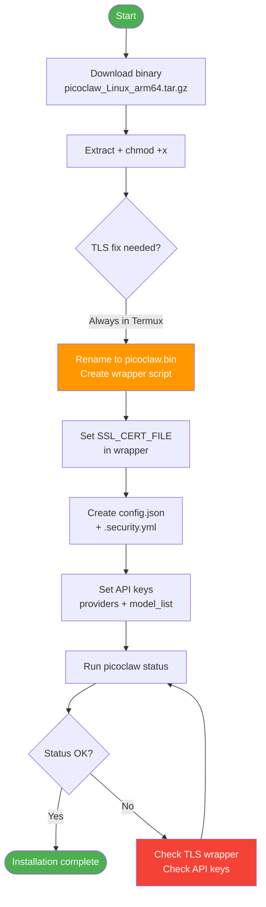
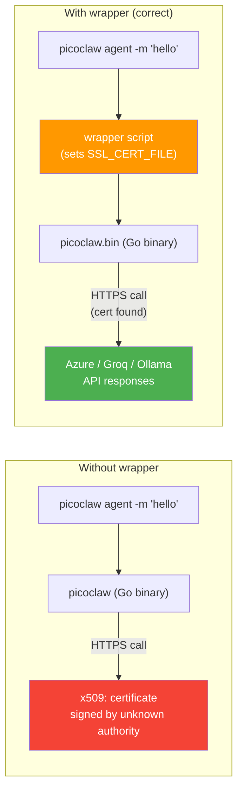
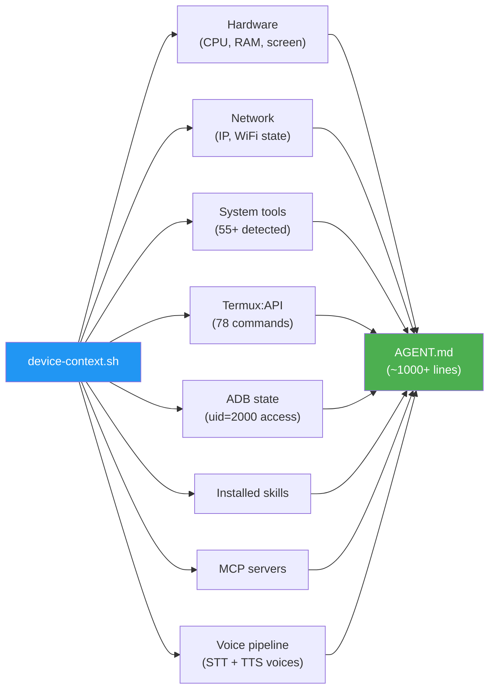

# 02 - PicoClaw Installation

This guide covers downloading the PicoClaw binary, applying the TLS fix for Termux, initial configuration, and verifying the installation.

## Installation Flow



> **Quick alternative**: The one-click installer handles all of this automatically. Run from Termux:
> ```bash
> curl -sL https://raw.githubusercontent.com/carrilloapps/picoclaw-dotfiles/main/utils/install.sh | bash
> ```
> If you prefer a manual step-by-step setup, continue below.

---

## Step 1: Download PicoClaw

Download the latest PicoClaw release for ARM64 Linux:

```bash
# On the device (via SSH or Termux terminal)
cd ~
curl -LO https://github.com/sipeed/picoclaw/releases/latest/download/picoclaw_Linux_arm64.tar.gz
tar xzf picoclaw_Linux_arm64.tar.gz
chmod +x picoclaw picoclaw-launcher picoclaw-launcher-tui
```

This extracts three binaries:

| Binary | Size | Purpose |
| ------ | ---- | ------- |
| `picoclaw` | ~25.7 MB | Core agent CLI (Go, aarch64) |
| `picoclaw-launcher` | ~18.1 MB | Web UI launcher |
| `picoclaw-launcher-tui` | ~7.0 MB | Terminal UI launcher |

---

## Step 2: TLS Certificate Fix (Critical)

Go applications look for CA certificates at `/etc/ssl/certs/`, which does not exist in Termux. Without a fix, every HTTPS call fails with:

```
x509: certificate signed by unknown authority
```

Termux stores certificates at `/data/data/com.termux/files/usr/etc/tls/cert.pem`. The solution is a **wrapper script** that sets `SSL_CERT_FILE` before running the binary.

### Create the Wrapper

```bash
# Rename the original binary
mv ~/picoclaw ~/picoclaw.bin

# Create the wrapper script
cat > ~/picoclaw << 'EOF'
#!/data/data/com.termux/files/usr/bin/bash
export SSL_CERT_FILE=/data/data/com.termux/files/usr/etc/tls/cert.pem
exec /data/data/com.termux/files/home/picoclaw.bin "$@"
EOF

chmod +x ~/picoclaw
```

### Why Not Just Use .bashrc?

Termux only sources `.bashrc` for interactive login shells. The wrapper guarantees `SSL_CERT_FILE` is set for ALL invocation methods: direct execution, cron jobs, boot scripts, SSH commands, and the gateway process.

### Automated Deployment

The repo includes a script that handles this idempotently:

```bash
python scripts/deploy_wrapper.py
# or: make deploy
```

---

## Step 3: Initial Configuration

PicoClaw uses two configuration files on the device.

### config.json

Location: `~/.picoclaw/config.json`

This is the main configuration file containing providers, models, tools, and channel settings. A sanitized template is at [`config/config.template.json`](../config/config.template.json).

**Critical quirk**: PicoClaw v0.2.4+ requires `api_key` and `api_base` in BOTH the `providers` section AND each `model_list` entry. Missing either causes:

```
api_key or api_base is required for HTTP-based protocol "openai"
```

Minimal example:

```json
{
  "providers": {
    "openai": {
      "base_url": "https://ollama.com/v1",
      "api_key": "<YOUR_KEY>"
    }
  },
  "model_list": [
    {
      "model_name": "my-model",
      "model": "openai/my-model",
      "api_key": "<YOUR_KEY>",
      "api_base": "https://ollama.com/v1"
    }
  ]
}
```

### .security.yml

Location: `~/.picoclaw/.security.yml`

Stores sensitive tokens (Telegram bot token, API keys for voice, and model API keys):

```yaml
channels:
  telegram:
    token: "<TELEGRAM_BOT_TOKEN>"
model_list:
  azure-gpt4o:0:
    api_keys:
      - "<AZURE_API_KEY>"
  gpt-oss:120b:0:
    api_keys:
      - "<OLLAMA_API_KEY>"
voice:
  groq_api_key: "<GROQ_API_KEY>"
  elevenlabs_api_key: ""
web: {}
skills: {}
```

> **v0.2.6 critical**: The `model_list` section with API keys is **required**. Without it, the gateway exits silently (writes PID file, then removes it and exits with code 1 — no error message). The first `picoclaw status` call auto-migrates config from v1 to v2, but **wipes the `model_list` API keys in security.yml**. Always verify security.yml after migration.

### Gateway port (v0.2.6+)

The `gateway.port` must be set to a valid port number (1-65535). Port `0` was accepted in v0.2.4 but is rejected in v0.2.6:

```json
{
  "gateway": {
    "host": "127.0.0.1",
    "port": 18790,
    "hot_reload": false
  }
}
```

---

## Step 4: Environment File

On your workstation, create a `.env` file from the template:

```bash
cp .env.example .env
# Edit .env with your actual values
```

This file stores all credentials and device connection details. It is git-ignored and never committed. See [`.env.example`](../.env.example) for the full list of variables.

---

## Step 5: Verify Installation

```bash
# On the device
./picoclaw status

# From your workstation
make status
make health
```

Send a test message:

```bash
./picoclaw agent -m "Hello, what can you do?"

# From workstation
make agent MSG="Hello"
```

---

## TLS Wrapper Architecture



---

## Full Automated Deployment

For a complete setup (all 10 steps including package installation, file deployment, config verification, and end-to-end testing):

```bash
python scripts/full_deploy.py
```

| Step | Description |
| ---- | ----------- |
| 1 | Install all required Termux packages |
| 2 | Check storage access |
| 3 | Deploy all `utils/` files to device |
| 4 | Generate AGENT.md with device context |
| 5 | Verify config.json |
| 6 | Verify security.yml |
| 7 | Test transcribe.sh |
| 8 | Test PicoClaw binary |
| 9 | Clear sessions + restart gateway |
| 10 | End-to-end agent test |

---

## AGENT.md — The Agent's Brain

PicoClaw's behavior, capabilities, and personality are defined in `~/.picoclaw/workspace/AGENT.md`. This file tells the LLM **what it can do** — every tool, script, API, and hardware capability.

### AGENT.md Generation Flow



### How it's generated

The `device-context.sh` script scans the device and generates AGENT.md dynamically:

```bash
~/bin/device-context.sh
```

It detects:
- Hardware (CPU, RAM, storage, screen size)
- Network (IP, gateway, WiFi/mobile state)
- All installed system tools (55+)
- All Termux:API commands (78)
- ADB self-bridge status
- Installed skills (31)
- MCP servers
- Voice pipeline (STT + TTS voices)
- UI automation capabilities
- USB OTG device control
- And more...

### When is it generated?

| Trigger | How |
| ------- | --- |
| **install.sh** | Runs `device-context.sh` at the end automatically |
| **full_deploy.py** | Step 4 generates AGENT.md |
| **Manual** | `~/bin/device-context.sh` anytime |
| **After installing new packages** | Re-run to update capabilities |

### Can I edit it?

Yes — `device-context.sh` generates the base, but you can add custom sections to the generated file. However, running `device-context.sh` again will overwrite your changes. For persistent customizations, edit `device-context.sh` itself.

### Sharing your AGENT.md

The `utils/AGENT.md` in the repo is a **static reference copy**. The real one on the device is generated dynamically and will be much more complete (1000+ lines with all detected capabilities).

---

<p align="center">
  <a href="01-hardware-setup.md">← Hardware Setup</a>
  &nbsp;&nbsp;|&nbsp;&nbsp;
  <a href="../README.md">📋 README</a>
  &nbsp;&nbsp;|&nbsp;&nbsp;
  <a href="03-providers-setup.md">Providers Setup →</a>
</p>
