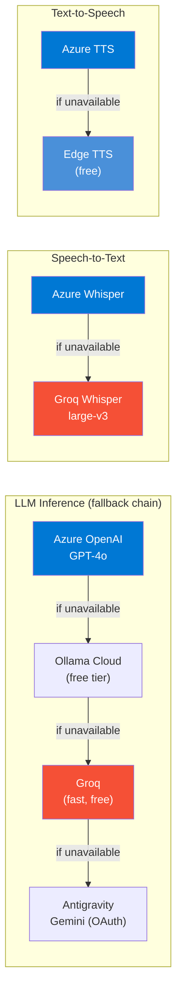
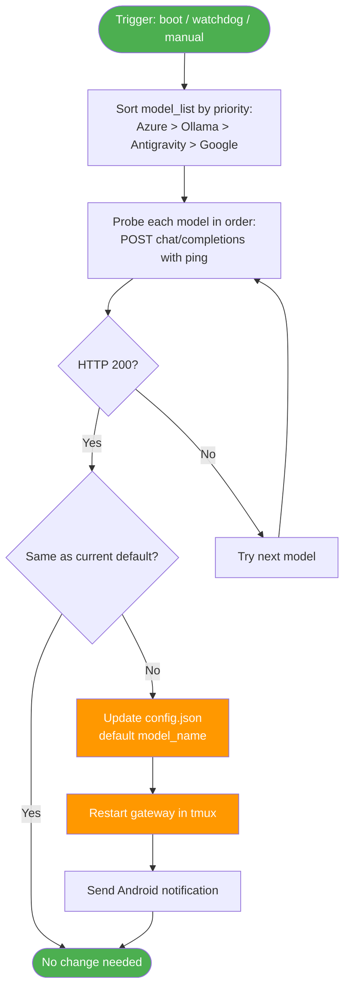
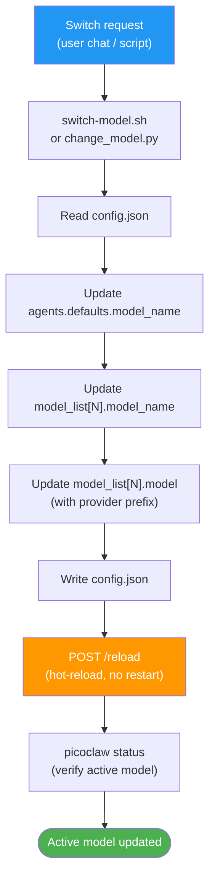

# 03 - Providers Setup

> **Note**: The one-click installer (`utils/install.sh`) prompts for API keys and handles all provider configuration automatically. This guide is for manual setup or adding providers after the initial install.

PicoClaw supports multiple LLM providers with automatic fallback. This guide covers configuring each provider and the model switching system.

---

## Provider Architecture



---

## Supported Provider Prefixes

| Prefix | Provider |
| ------ | -------- |
| `openai/` | OpenAI, Ollama Cloud, any OpenAI-compatible API |
| `azure/` | Azure OpenAI (deployment-based URLs) |
| `anthropic/` | Claude (native Anthropic API) |
| `groq/` | Groq (fast inference, free tier) |
| `antigravity/` | Google Cloud AI / Gemini (OAuth) |
| `github-copilot/` | GitHub Copilot (OAuth) |
| `mistral/` | Mistral AI |
| `openrouter/` | OpenRouter (multi-model gateway) |
| `kimi/` | Moonshot (Kimi) |
| `minimax/` | MiniMax |
| `cerebras/` | Cerebras |
| `bedrock/` | AWS Bedrock |

---

## Azure OpenAI (Enterprise)

Azure OpenAI provides dedicated deployments with enterprise SLAs. Used as the primary provider in this implementation.

### Setup

1. Create an Azure OpenAI resource in the [Azure Portal](https://portal.azure.com).
2. Deploy a model (e.g., `gpt-4o`) in Azure AI Studio.
3. Copy the endpoint URL and API key from "Keys and Endpoint".

### Configuration

In `.env`:

```bash
AZURE_OPENAI_BASE_URL=https://your-resource.openai.azure.com
AZURE_OPENAI_API_KEY=<32-char-hex-key>
AZURE_OPENAI_DEPLOYMENT=gpt-4o-2
AZURE_OPENAI_API_VERSION=2024-06-01
```

In `config.json` on the device:

```json
{
  "providers": {
    "azure": {
      "base_url": "https://your-resource.openai.azure.com",
      "api_key": "<key>"
    }
  },
  "model_list": [
    {
      "model_name": "azure-gpt4o",
      "model": "azure/gpt-4o-2",
      "api_key": "<key>",
      "api_base": "https://your-resource.openai.azure.com"
    }
  ]
}
```

Azure is also used for Whisper STT and TTS deployments. The API keys for voice scripts are stored in `~/.picoclaw_keys`:

```bash
AZURE_OPENAI_API_KEY="<key>"
AZURE_OPENAI_BASE_URL="https://your-resource.openai.azure.com"
AZURE_WHISPER_DEPLOYMENT="whisper-1"
```

---

## Ollama Cloud (Free)

[Ollama Cloud](https://ollama.com) provides free access to a variety of open-source models via an OpenAI-compatible API. Used as the first fallback.

### Setup

1. Create an account at [ollama.com](https://ollama.com).
2. Generate an API key from account settings.

### Configuration

In `.env`:

```bash
OLLAMA_API_KEY=<32-char-hex>.<26-char-secret>
OLLAMA_BASE_URL=https://ollama.com/v1
OLLAMA_MODEL=<model-name>
```

In `config.json`:

```json
{
  "providers": {
    "openai": {
      "base_url": "https://ollama.com/v1",
      "api_key": "<key>"
    }
  },
  "model_list": [
    {
      "model_name": "deepseek-v3.2",
      "model": "openai/deepseek-v3.2",
      "api_key": "<key>",
      "api_base": "https://ollama.com/v1"
    }
  ]
}
```

### Available Ollama Cloud Models

| Model | Size | Type |
| ----- | ---- | ---- |
| `gpt-oss:120b` | 120B | General |
| `deepseek-v3.2` | -- | General |
| `qwen3.5:397b` | 397B | General |
| `kimi-k2:1t` | 1T | General |
| `mistral-large-3:675b` | 675B | General |
| `glm-5` | -- | General |
| `qwen3-coder:480b` | 480B | Coding |
| `cogito-2.1:671b` | 671B | Reasoning |

---

## Google AI Studio (Free, Gemini)

[Google AI Studio](https://aistudio.google.com) provides free access to Gemini models via a simple API key. No OAuth required (unlike the Antigravity provider which uses Google OAuth).

### Setup

1. Go to [aistudio.google.com/apikey](https://aistudio.google.com/apikey)
2. Sign in with your Google account
3. Click **"Create API Key"** and copy it

### Configuration

In `.env`:

```bash
GOOGLE_AI_STUDIO_API_KEY=AIzaSy...
GOOGLE_AI_STUDIO_MODEL=gemini-2.5-flash
```

In `config.json` — register only in `model_list` (PicoClaw doesn't accept `google` as a provider type, but Google AI Studio's OpenAI-compatible endpoint works through the `openai/` prefix):

```json
{
  "model_list": [
    {
      "model_name": "gemini-2.5-flash",
      "model": "openai/gemini-2.5-flash",
      "api_key": "AIzaSy...",
      "api_base": "https://generativelanguage.googleapis.com/v1beta/openai"
    }
  ],
  "agents": {
    "defaults": {
      "provider": "openai",
      "model_name": "gemini-2.5-flash"
    }
  }
}
```

> **v0.2.6 critical**:
> - The base URL is `https://generativelanguage.googleapis.com/v1beta/openai` (no trailing slash — verified; `/` returns 404).
> - Provider type must be `openai` (not `google`). PicoClaw only recognizes: `openai`, `azure`, `anthropic`, `groq`, `antigravity`.
> - Add the API key to `security.yml` under `model_list.<model_name>:0.api_keys` (v0.2.6 requires it here or the gateway exits silently).
> - The `providers` section in `config.json` is auto-stripped during the v1→v2 migration. The source of truth is `model_list[].api_base` and `security.yml`.

### Available Models

| Model | Context | Output | Best for |
| ----- | ------- | ------ | -------- |
| `gemini-2.5-flash` | 1M | 65K | Default -- fast, cost-effective |
| `gemini-2.5-pro` | 1M | 65K | Complex reasoning (lower free quota) |
| `gemini-3.1-pro-preview` | 1M | 65K | Latest preview |
| `gemini-2.0-flash` | 1M | 8K | Ultra fast responses |
| `gemini-2.5-flash-lite` | 1M | 65K | Lightest, fastest |
| `gemma-4-31b-it` | 256K | 32K | Open model, 31B parameters |

### Google AI Studio vs Antigravity

| | Google AI Studio | Antigravity |
|-|-----------------|-------------|
| **Auth** | Simple API key | Google OAuth (browser flow) |
| **Setup** | 1 minute | 5 minutes |
| **Free tier** | Yes (rate-limited) | Yes (through Google Cloud) |
| **Provider prefix** | `openai/` (compatible) | `antigravity/` |
| **When to use** | Default for most users | If you need OAuth-gated models |

---

## Groq (Free, Fast)

[Groq](https://console.groq.com) provides extremely fast inference on their LPU hardware with a free tier.

### Setup

1. Create an account at [console.groq.com](https://console.groq.com).
2. Generate an API key from the API Keys section.

### Configuration

In `.env`:

```bash
GROQ_API_KEY=gsk_<alphanumeric>
```

In `config.json`:

```json
{
  "providers": {
    "groq": {
      "base_url": "https://api.groq.com/openai/v1",
      "api_key": "gsk_..."
    }
  }
}
```

Groq is used for both LLM inference and Whisper STT (voice transcription fallback).

---

## Antigravity / Google Gemini (OAuth)

The `antigravity/` provider uses Google OAuth instead of a static API key. It serves as the last-resort LLM fallback because it requires periodic re-authentication.

### One-Time Setup

1. Run `~/bin/auth-antigravity.sh start` on the device -- it prints a Google OAuth URL.
2. Open the URL in any browser and sign in with your Google account.
3. The browser redirects to `localhost:51121` (connection refused -- this is expected).
4. Copy the full redirect URL from the browser address bar.
5. Run `~/bin/auth-antigravity.sh paste "<redirect-URL>"` on the device.

### Token Management

```bash
~/bin/auth-antigravity.sh status    # Check token validity
~/bin/auth-antigravity.sh refresh   # Logout + re-auth (expired token)
./picoclaw auth status              # PicoClaw's native auth status
```

**Important**: `picoclaw auth login` resets `agents.defaults.model_name` to the just-authenticated provider. The `auth-antigravity.sh` script automatically restores the correct fallback order after authentication.

### Available Antigravity Models

| Model | Description |
| ----- | ----------- |
| `gemini-flash` | Gemini 3 Flash |
| `gemini-flash-agent` | Gemini 3 Flash Agent |
| `gemini-pro-low` | Gemini 3 Pro (Low) |
| `gemini-pro-high` | Gemini 3 Pro (High) |
| `gemini-3.1-pro` | Gemini 3.1 Pro (High) |
| `gemini-2.5-pro` | Gemini 2.5 Pro |
| `gemini-thinking` | Gemini 3.1 Flash Thinking |
| `gemini-image` | Gemini 3.1 Flash Image |
| `claude-opus` | Claude Opus 4.6 (Thinking) |
| `claude-sonnet` | Claude Sonnet 4.6 (Thinking) |
| `gpt-oss-ag` | GPT-OSS 120B via Antigravity |

---

## Automatic Provider Failover

PicoClaw Dotfiles ships with `~/bin/auto-failover.sh` which automatically detects provider outages and switches to the next healthy one. This is the production-grade solution, replacing the need to manually set `model_fallbacks`.

### Priority Order

```
Azure GPT-4o --> Ollama Cloud (gpt-oss:120b) --> Antigravity (OAuth) --> Google AI Studio (last)
```

### How it Works



### When it Runs

| Trigger | How | Frequency |
|---------|-----|-----------|
| **Boot** | `start-picoclaw.sh` calls it before starting gateway | Every device reboot |
| **Watchdog** | Detects 429/500/503 errors in `gateway.log`, triggers failover | Every minute (with 5-min cooldown after trigger) |
| **Manual** | `~/bin/auto-failover.sh` | On demand |

### Usage

```bash
# Check status (read-only, no changes)
~/bin/auto-failover.sh --check

# Run failover (updates config + restarts gateway if provider changes)
~/bin/auto-failover.sh

# Silent mode (for cron)
~/bin/auto-failover.sh --quiet
```

### How It Detects Failures

For each model in priority order, the script:
1. Reads `api_base` and `api_key` from `config.json` + `security.yml`
2. Sends a minimal chat completion request (just `"hi"`, max 5 tokens)
3. Azure uses `api-key` header + deployment URL, others use `Authorization: Bearer`
4. Timeout: 10 seconds per provider
5. HTTP 200 = healthy. 401/429/500/503 = skip to next

### Logs

- Script output: `~/failover.log` (append-only, shows each check)
- Last failover timestamp: `~/.last_failover` (for cooldown)
- Gateway log: `~/.picoclaw/gateway.log` (where watchdog looks for errors)

### Android Notification

When the provider changes, a push notification appears on the device:

> **PicoClaw Failover**
> Switched from azure-gpt4o to gpt-oss:120b

### Built-in `model_fallbacks` (optional, legacy)

PicoClaw's built-in `model_fallbacks` config still works for in-request retries, but the automated failover script is recommended for outage-level recovery:

```json
{
  "agents": {
    "defaults": {
      "model_name": "azure-gpt4o",
      "model_fallbacks": ["gpt-oss:120b", "gemini-2.5-flash"]
    }
  }
}
```

---

## Switching Models

### How Model Switching Works



### From the Workstation

```bash
python scripts/change_model.py --list    # List available models
python scripts/change_model.py <MODEL>   # Switch model
make model M=<MODEL>                     # Same via Makefile
```

### From Telegram Chat

The LLM can switch its own model when the user asks. A device script handles all 25 models:

```bash
~/bin/switch-model.sh list               # Show all models
~/bin/switch-model.sh set deepseek       # Switch (aliases work)
~/bin/switch-model.sh current            # Show active model
~/bin/switch-model.sh recommend coding   # Suggest best for task
~/bin/switch-model.sh reset              # Restore default preset
```

The script uses hot-reload -- no gateway restart needed.

### Model Recommendations

| Task | Recommended Model |
| ---- | ----------------- |
| General use | `azure-gpt4o` (default) |
| Coding | `qwen3-coder:480b` |
| Reasoning | `cogito-2.1:671b` |
| Fast responses | `groq-llama` |
| Creative writing | `mistral-large-3:675b` |
| Image understanding | `gemini-image` |

---

<p align="center">
  <a href="02-picoclaw-installation.md">← PicoClaw Installation</a>
  &nbsp;&nbsp;|&nbsp;&nbsp;
  <a href="../README.md">📋 README</a>
  &nbsp;&nbsp;|&nbsp;&nbsp;
  <a href="04-telegram-integration.md">Telegram Integration →</a>
</p>
