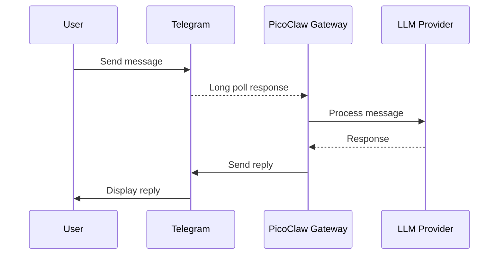
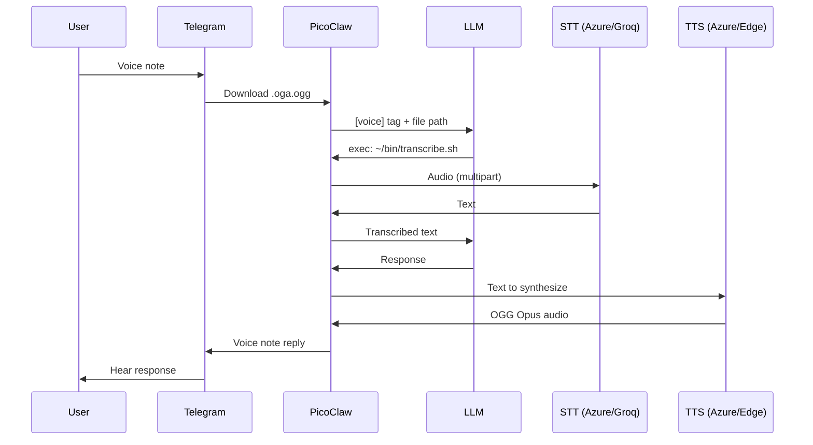

# 04 - Telegram Integration

> **Note**: The one-click installer (`utils/install.sh`) prompts for your Telegram bot token and configures the gateway automatically. This guide is for manual setup or reconfiguration.

PicoClaw connects to Telegram via long polling -- no webhooks or open ports required. This guide covers bot creation, configuration, security, and the voice pipeline.

---

## Architecture



The gateway process runs inside a persistent `tmux` session named `picoclaw` on the device. It survives SSH disconnects and is automatically restarted by the watchdog if it crashes.

---

## Step 1: Create a Telegram Bot

1. Open Telegram and search for [@BotFather](https://t.me/BotFather).
2. Send `/newbot` and follow the prompts to choose a name and username.
3. BotFather returns a **bot token** in the format `1234567890:ABCdefGHIjklMNOpqrsTUVwxyz`.
4. Save the token -- you will need it for configuration.

### Get Your User ID

To restrict the bot to only respond to you:

1. Search for [@userinfobot](https://t.me/userinfobot) on Telegram.
2. Send it any message -- it replies with your numeric user ID.

---

## Step 2: Configure

### .env (workstation)

```bash
TELEGRAM_BOT_TOKEN=1234567890:ABCdefGHIjklMNOpqrsTUVwxyz
TELEGRAM_BOT_USERNAME=your_bot_name
TELEGRAM_OWNER_ID=123456789
```

### .security.yml (device)

```yaml
channels:
  telegram:
    token: "1234567890:ABCdefGHIjklMNOpqrsTUVwxyz"
```

### config.json (device)

```json
{
  "channels": {
    "telegram": {
      "enabled": true,
      "allow_from": [123456789]
    }
  }
}
```

The `allow_from` array contains Telegram user IDs that are allowed to interact with the bot. Only the owner's ID should be listed.

---

## Step 3: Start the Gateway

```bash
# From workstation
make gateway-start
make gateway-status

# Or via script
python scripts/gateway.py start
python scripts/gateway.py status
```

### Gateway Management

| Command | Description |
| ------- | ----------- |
| `make gateway-start` | Start in persistent tmux session |
| `make gateway-stop` | Stop the gateway |
| `make gateway-restart` | Restart after config changes |
| `make gateway-status` | Check if running |
| `make gateway-logs` | Show recent logs |
| `make gateway-follow` | Follow logs in real-time |

---

## Gateway Features

| Feature | Description |
| ------- | ----------- |
| **Typing indicator** | Shows "typing..." while the LLM generates a response |
| **Placeholder messages** | Sends an immediate placeholder before the full response |
| **Streaming** | Edits the placeholder in-place as tokens stream in |
| **Hot reload** | Config changes apply without restart (`POST http://127.0.0.1:18790/reload`) |
| **Health endpoints** | `/health`, `/ready`, `/reload` at `http://127.0.0.1:18790` |

---

## Voice Pipeline

PicoClaw handles voice messages in both directions through shell scripts invoked by the LLM.

### Voice Architecture



### Speech-to-Text (STT)

The `~/bin/transcribe.sh` script implements a provider cascade:

1. **Azure OpenAI Whisper** -- Enterprise deployment (if configured).
2. **Groq Whisper large-v3** -- Free tier, fast inference.

PicoClaw v0.2.4's built-in transcription does not work correctly. The workaround is a shell script that calls the Whisper API directly, invoked by the LLM via the `exec` tool.

Requirements:
- `tools.exec.allow_remote: true` in config.json
- API keys in `~/.picoclaw_keys`
- Voice handling instructions at the top of AGENT.md

### Text-to-Speech (TTS)

The `~/bin/tts-reply.sh` script generates OGG Opus audio files:

1. **Azure OpenAI TTS** -- Enterprise deployment (if configured).
2. **Microsoft Edge TTS** -- Free, same Azure neural voices.

### Available Voices

| Alias | Voice | Language | Gender |
| ----- | ----- | -------- | ------ |
| `paola` / `venezolana` / `default` | es-VE-PaolaNeural | Spanish (VE) | Female |
| `sebastian` / `venezolano` | es-VE-SebastianNeural | Spanish (VE) | Male |
| `salome` / `colombiana` | es-CO-SalomeNeural | Spanish (CO) | Female |
| `gonzalo` / `colombiano` | es-CO-GonzaloNeural | Spanish (CO) | Male |
| `jenny` / `english` / `en` | en-US-JennyNeural | English (US) | Female |
| `guy` / `ingles` | en-US-GuyNeural | English (US) | Male |

Usage:

```bash
~/bin/tts-reply.sh "Hola mundo"              # Paola (default)
~/bin/tts-reply.sh "Hola mundo" sebastian    # Sebastian
~/bin/tts-reply.sh "Hello world" jenny       # Jenny
~/bin/tts-reply.sh "Bonjour" fr-FR-HenriNeural  # Any Edge TTS voice
```

---

## WhatsApp (Not Currently Active)

Two integration paths exist but are not currently activated:

| Approach | Description | Status |
| -------- | ----------- | ------ |
| **Native** (`whatsmeow`) | Requires recompiling with `-tags whatsapp_native` | Binary lacks build tag |
| **Bridge** | External WebSocket bridge daemon | Not deployed |

The device's WhatsApp client can be controlled indirectly via UI automation (`ui-auto.py`) as a workaround. See [05-device-control.md](05-device-control.md) for details.

---

<p align="center">
  <a href="03-providers-setup.md">← Providers Setup</a>
  &nbsp;&nbsp;|&nbsp;&nbsp;
  <a href="../README.md">📋 README</a>
  &nbsp;&nbsp;|&nbsp;&nbsp;
  <a href="05-device-control.md">Device Control →</a>
</p>
