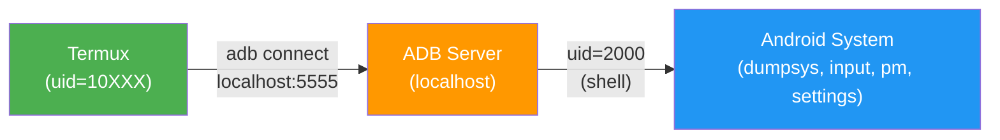

# 05 - Device Control

PicoClaw has full control of the Android device through an ADB self-bridge, UI automation scripts, and 44 Android permissions. No root required.

---

## ADB Self-Bridge

The phone connects to itself via ADB TCP on `localhost:5555` (loopback). This provides shell-level privileges (uid=2000) for operations Termux's app user cannot perform.

### How It Works



**Key advantage**: Uses `localhost` loopback, so it works on any network (WiFi, mobile data, or offline).

### What ADB Shell Unlocks

| Category | Example | Description |
| -------- | ------- | ----------- |
| UI Input | `input tap 540 1200` | Simulate taps, swipes, key presses |
| Screen | `screencap -p /sdcard/ss.png` | Screenshots, screen recording |
| Apps | `am start -n pkg/.Activity` | Launch, stop, uninstall apps |
| Settings | `settings put system screen_brightness 128` | Read/write Android settings |
| System | `dumpsys battery` | Battery, WiFi, memory, network stats |
| Network | `cat /proc/net/arp` | MAC addresses of all devices on network |
| Logs | `logcat -d -t 20` | Android system logs |
| Packages | `pm list packages` | List all installed apps |

### Usage

```bash
# Direct command
~/bin/adb-shell.sh "dumpsys battery"

# If ADB disconnects
~/bin/adb-enable.sh
```

### Persistence

The boot script re-enables ADB TCP on every reboot:

```bash
setprop service.adb.tcp.port 5555
stop adbd; start adbd
adb connect localhost:5555
```

The watchdog checks ADB connectivity every minute and reconnects if needed.

---

## Android Permissions

44 runtime permissions and 17 appops are granted via `grant-permissions.sh`. This requires a one-time USB ADB connection from a computer.

### Permissions Granted

| Category | Permissions |
| -------- | ----------- |
| **Location** | Fine, coarse, background, media location |
| **Camera** | Camera access |
| **Microphone** | Audio recording |
| **Phone** | Read state, read numbers, make calls, answer calls, call log, voicemail, SIP |
| **Contacts** | Read, write, get accounts |
| **SMS** | Read, send, receive SMS/MMS/WAP push |
| **Storage** | Read/write external, media images/video/audio, manage external |
| **Notifications** | Post notifications |
| **Sensors** | Body sensors, background sensors |
| **Nearby** | Nearby WiFi devices, Bluetooth |
| **System** | Schedule exact alarms, foreground service, system alert window |

### Running the Script

```bash
# From computer with phone connected via USB
bash utils/grant-permissions.sh
# or: make grant-permissions
```

---

## UI Automation

Two complementary tools provide full Android UI control.

### ui-control.sh (40+ Commands)

Simple, direct commands for common operations:

```bash
# Device state
~/bin/ui-control.sh status              # Full state report
~/bin/ui-control.sh screen              # Screen on/off
~/bin/ui-control.sh locked              # Lock state

# Screen control
~/bin/ui-control.sh wake                # Wake screen
~/bin/ui-control.sh unlock <PIN>        # Wake + enter PIN
~/bin/ui-control.sh sleep               # Turn screen off
~/bin/ui-control.sh screenshot          # Take screenshot
~/bin/ui-control.sh screenrecord 15     # Record for 15 seconds
~/bin/ui-control.sh brightness 128      # Set brightness (0-255)

# App control
~/bin/ui-control.sh open <package>      # Launch any app
~/bin/ui-control.sh close <package>     # Force-close
~/bin/ui-control.sh current             # Currently active app
~/bin/ui-control.sh apps                # Running apps
~/bin/ui-control.sh installed           # All installed apps
~/bin/ui-control.sh url "https://..."   # Open URL in browser

# Touch simulation
~/bin/ui-control.sh tap X Y             # Tap coordinates
~/bin/ui-control.sh taptext "Login"     # Find button by text, tap it
~/bin/ui-control.sh longpress X Y       # Long press
~/bin/ui-control.sh swipe X1 Y1 X2 Y2  # Swipe gesture
~/bin/ui-control.sh scroll down         # Scroll
~/bin/ui-control.sh type "text"         # Type into focused field
~/bin/ui-control.sh key HOME            # Press hardware key

# System toggles
~/bin/ui-control.sh wifi on/off
~/bin/ui-control.sh bluetooth on/off
~/bin/ui-control.sh airplane on/off
~/bin/ui-control.sh volume 10
```

### ui-auto.py (Advanced XML-Based Automation)

For complex app interactions (setup wizards, login flows, form filling). Parses the actual UI hierarchy XML:

```bash
# Find elements
python3 ~/bin/ui-auto.py dump           # All clickable elements
python3 ~/bin/ui-auto.py all            # ALL elements (including non-clickable)
python3 ~/bin/ui-auto.py buttons        # All buttons
python3 ~/bin/ui-auto.py inputs         # All text input fields
python3 ~/bin/ui-auto.py find "Accept"  # Search by text

# Tap elements
python3 ~/bin/ui-auto.py tap "AGREE"        # Tap by text
python3 ~/bin/ui-auto.py tapid "com.app:id/btn"  # Tap by resource-id
python3 ~/bin/ui-auto.py tapdesc "Accept"   # Tap by content-description
python3 ~/bin/ui-auto.py tapxy 540 1800     # Tap by coordinates

# Wait for elements
python3 ~/bin/ui-auto.py wait "Continue" 20     # Wait up to 20s
python3 ~/bin/ui-auto.py waittap "Accept" 15    # Wait then tap

# Text input
python3 ~/bin/ui-auto.py type "Hello world"
python3 ~/bin/ui-auto.py clear              # Clear current field
python3 ~/bin/ui-auto.py key ENTER
```

### Example: WhatsApp Setup Walkthrough

```bash
# 1. Open WhatsApp
~/bin/ui-control.sh open com.whatsapp
sleep 3

# 2. Inspect the screen
python3 ~/bin/ui-auto.py dump
python3 ~/bin/ui-auto.py screenshot

# 3. Accept terms
python3 ~/bin/ui-auto.py waittap "AGREE AND CONTINUE" 10

# 4. Enter phone number
python3 ~/bin/ui-auto.py inputs
python3 ~/bin/ui-auto.py tapxy X Y
python3 ~/bin/ui-auto.py type "+573001234567"
python3 ~/bin/ui-auto.py tap "Next"

# 5. Verify result
python3 ~/bin/ui-auto.py screenshot
```

---

## Screen Unlock

The device auto-locks after 2 minutes. All UI commands automatically call `ensure-unlocked.sh` before executing.

### How It Works

1. Check current state (awake? locked?)
2. If sleeping: send `KEYCODE_WAKEUP`
3. If locked: swipe up, enter PIN, press Enter
4. Verify unlock succeeded

### PIN Sources (in order)

1. CLI argument: `~/bin/ensure-unlocked.sh 123456`
2. Environment variable: `DEVICE_PIN`
3. File: `~/.device_pin`

### Manual Usage

```bash
~/bin/ensure-unlocked.sh           # Auto-unlock with stored PIN
~/bin/ensure-unlocked.sh 123456    # Override PIN
```

---

## Media Capture

The `~/bin/media-capture.sh` script provides unified media capture:

```bash
~/bin/media-capture.sh photo [front|back]     # Camera photo
~/bin/media-capture.sh audio [seconds]        # Microphone recording
~/bin/media-capture.sh screenshot             # Screen capture via ADB
~/bin/media-capture.sh screenrecord [seconds] # Screen recording
~/bin/media-capture.sh sensors [name]         # Sensor data
```

Files are saved to `~/media/` with timestamps. The back camera supports up to 108 MP (on the author's Redmi Note 10 Pro).

---

## Next Steps

Proceed to [06 - Resilience](06-resilience.md) to set up automatic recovery and monitoring.
