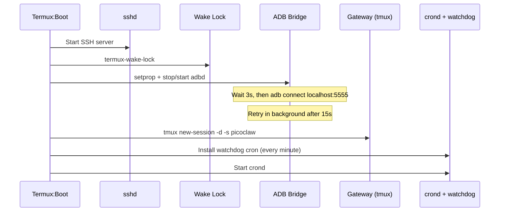
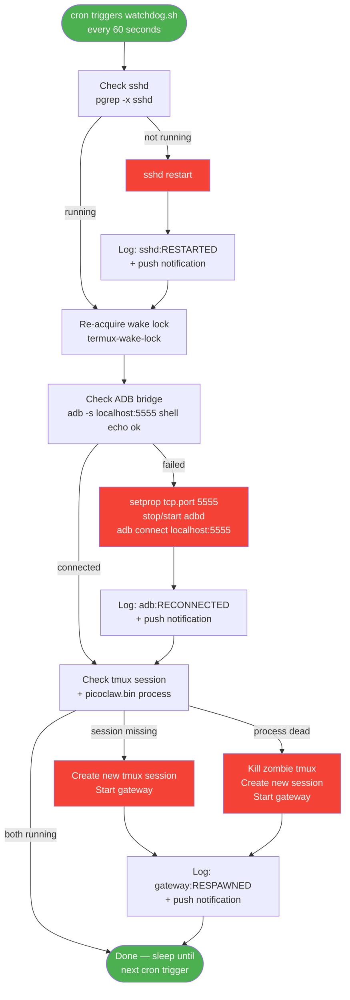
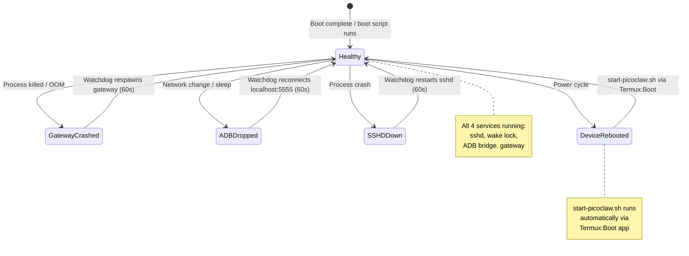

# 06 - Resilience

> **Note**: The one-click installer (`utils/install.sh`) installs the boot script, watchdog, and all cron jobs automatically. This guide explains what was set up and how to verify it.

PicoClaw is designed to survive gateway crashes, ADB disconnects, and device reboots without manual intervention. This guide covers the boot script, watchdog, and verification.

---

## Boot Script

Location on device: `~/.termux/boot/start-picoclaw.sh`

Executed automatically by Termux:Boot when the phone starts. It brings up all services in order:



### Boot Script Contents

| Step | Action | Purpose |
| ---- | ------ | ------- |
| 1 | `sshd` | Remote access (must start first) |
| 2 | `termux-wake-lock` | Prevent Android from killing Termux |
| 3 | ADB TCP setup | Elevated shell access via loopback |
| 4 | tmux + gateway | Telegram/WhatsApp message processing |
| 5 | Watchdog cron | Per-minute service monitoring |
| 6 | `crond` | Cron daemon for scheduled tasks |

---

## Watchdog

Location on device: `~/bin/watchdog.sh`

Runs every minute via cron. Monitors four critical services and restarts any that are down. Only logs when a restart actually occurs.

### Watchdog Flow



### Services Monitored

| Service | Check | Recovery |
| ------- | ----- | -------- |
| **sshd** | `pgrep -x sshd` | `sshd` |
| **Wake lock** | (idempotent) | `termux-wake-lock` |
| **ADB bridge** | `adb -s localhost:5555 shell echo ok` | Re-enable TCP + reconnect |
| **Gateway** | `tmux has-session -t picoclaw` + `pgrep -f "picoclaw.bin gateway"` | Kill stale tmux + restart |

The watchdog handles two gateway failure modes:
1. **tmux session gone**: Creates a new session with the gateway.
2. **tmux exists but process died**: Kills the zombie session, creates a fresh one.

### Log

Restart events are appended to `~/watchdog.log`:

```
[14:32:15] sshd:RESTARTED gateway:RESPAWNED
[14:33:15] adb:RECONNECTED
```

---

## termux-job-scheduler

In addition to the cron-based watchdog, `termux-job-scheduler` runs the watchdog at the Android OS level. This means monitoring continues even if Termux's cron daemon is killed by Android's process manager.

---

## Android Notifications

The watchdog can send Android push notifications when services are restarted:

```bash
termux-notification -t "PicoClaw Watchdog" -c "Gateway restarted" --priority high
```

This ensures the device owner is aware of service recovery events even when not actively monitoring.

---

## Automated Tasks (Cron)

| Schedule | Task | Description |
| -------- | ---- | ----------- |
| Every minute | `watchdog.sh` | Monitor + restart sshd, gateway, ADB |
| Every hour | `media-cleanup.sh` | Delete temp files older than 60 minutes |
| Daily 8 AM | Morning briefing | Battery, storage, network, weather summary |
| Sunday midnight | Session cleanup | Delete `.jsonl` session files older than 7 days |
| Every 6 hours | Disk monitor | Android notification if free space < 2 GB |

---

## Heartbeat (Available, Not Enabled)

PicoClaw has a built-in heartbeat system for autonomous periodic tasks. When enabled, it runs tasks defined in `HEARTBEAT.md` using isolated sessions to minimize token costs.

Enable in `config.json`:

```json
{
  "heartbeat": {
    "enabled": true,
    "interval": 3600
  }
}
```

---

## System Recovery State Machine



---

## 8-Phase Resilience Verification

Run the full verification suite to confirm the system will survive failures:

```bash
python scripts/verify_resilience.py
# or: make verify
```

### Phases

| Phase | Description |
| ----- | ----------- |
| 1 | **Baseline**: Verify sshd, gateway, tmux, ADB, crond, watchdog cron, boot script |
| 2 | **Gateway recovery**: Kill gateway + tmux, run watchdog, confirm auto-recovery |
| 3 | **ADB recovery**: Disconnect ADB bridge, run watchdog, confirm auto-reconnect |
| 4 | **Boot script audit**: Check 9 required elements in boot script |
| 5 | **Watchdog audit**: Check 8 required elements in watchdog script |
| 6 | **Telegram health**: Verify gateway log shows active channels |
| 7 | **Log review**: Check recent watchdog restart events |
| 8 | **Final state**: Re-verify all 7 services are running |

The test exits with a clear `ALL CHECKS PASSED` or `SOME CHECKS FAILED` summary.

---

<p align="center">
  <a href="05-device-control.md">← Device Control</a>
  &nbsp;&nbsp;|&nbsp;&nbsp;
  <a href="../README.md">📋 README</a>
  &nbsp;&nbsp;|&nbsp;&nbsp;
  <a href="07-skills-and-mcp.md">Skills & MCP →</a>
</p>
