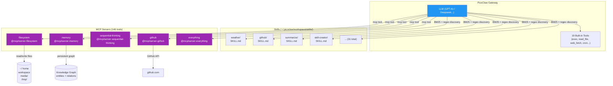

# 07 - Skills and MCP

> **Note**: The one-click installer (`utils/install.sh`) configures the five active MCP servers and installs the built-in skills automatically. This guide covers what is included and how to extend the setup.

PicoClaw is extensible through **skills** (task-specific instruction sets) and **MCP servers** (Model Context Protocol tools). This guide covers what is installed and how to add more.

## Architecture



---

## Skills

Skills are directories inside `~/.picoclaw/workspace/skills/` containing a `SKILL.md` file with instructions and triggers. The LLM loads relevant skills based on the conversation context.

### Managing Skills

```bash
# List installed skills
picoclaw skills list

# Search ClawhHub registry
picoclaw skills search <query>

# Install from GitHub
picoclaw skills install <github-user/repo>

# Install all built-in skills
picoclaw skills install-builtin

# Remove a skill
picoclaw skills remove <skill-name>

# Show skill details
picoclaw skills show <skill-name>
```

### Creating Custom Skills

1. Create directory: `~/.picoclaw/workspace/skills/<skill-name>/`
2. Create `SKILL.md` with YAML frontmatter:

```markdown
---
name: my-skill
description: What this skill does
triggers:
  - keyword1
  - keyword2
---

Instructions for the LLM when this skill is activated...
```

The `skill-creator` meta-skill can also generate new skills interactively.

---

## MCP Servers

Four MCP (Model Context Protocol) servers are active, providing 146 additional tools. They are configured in `tools.mcp.servers` in `config.json` and use BM25 + regex discovery.

### Active Servers

| Server | npm Package | Tools | Purpose |
| ------ | ----------- | ----- | ------- |
| `filesystem` | `@modelcontextprotocol/server-filesystem` | File ops | Read, write, search files across home, workspace, media, tmp |
| `memory` | `@modelcontextprotocol/server-memory` | Knowledge graph | Persistent entities and relations |
| `sequential-thinking` | `@modelcontextprotocol/server-sequential-thinking` | Reasoning | Structured multi-step problem solving |
| `github` | `@modelcontextprotocol/server-github` | Git ops | PRs, issues, repos, commits (PAT needed for private repos) |

Servers auto-start with the gateway and auto-recover via the watchdog.

### Disabled / Unavailable

| Server | Status | Reason |
| ------ | ------ | ------ |
| `brave-search` | Installed, disabled | No API key configured |
| `@nicklaus9527/adb` | Does not exist | Package not on npm |
| `@nicklaus9527/whatsapp` | Does not exist | Package not on npm |
| `@nicklaus9527/notify` | Does not exist | Package not on npm |
| `@anthropic/mcp-server-sqlite` | Does not exist | Package not on npm |
| `server-puppeteer` | Incompatible | Requires Chromium (not available on ARM) |

### Adding an MCP Server

Add entries to `tools.mcp.servers` in `config.json`:

```json
{
  "tools": {
    "mcp": {
      "enabled": true,
      "servers": {
        "new-server": {
          "command": "npx",
          "args": ["-y", "@modelcontextprotocol/server-whatever", "/path/to/data"]
        }
      }
    }
  }
}
```

Restart the gateway after adding: `make gateway-restart`

### Available MCP Servers to Add

| Package | Purpose |
| ------- | ------- |
| `@modelcontextprotocol/server-fetch` | HTTP fetch with content extraction |
| `@modelcontextprotocol/server-time` | Timezone and date operations |
| `@modelcontextprotocol/server-git` | Local git repository operations |

---

## Installing Skills from GitHub

```bash
# Install from a GitHub repository
picoclaw skills install username/repo-name

# The skill is cloned to ~/.picoclaw/workspace/skills/repo-name/
```

### Installing from ClawhHub

```bash
# Search the registry
picoclaw skills search "weather"

# Install by name
picoclaw skills install weather
```

---

## Enabled Tools (19)

These are PicoClaw's built-in tools, configured in `config.json`:

| Tool | Purpose |
| ---- | ------- |
| `exec` | Shell command execution (`allow_remote: true`) |
| `read_file` | Read file contents |
| `write_file` | Write/create files |
| `edit_file` | Edit existing files |
| `append_file` | Append to files |
| `list_dir` | Directory listing |
| `web` | DuckDuckGo web search |
| `web_fetch` | Fetch URL content |
| `cron` | Scheduled tasks |
| `skills` | Skill management |
| `find_skills` | Search for skills |
| `install_skill` | Install skills |
| `message` | Send messages to channels |
| `send_file` | Send files to channels |
| `spawn` | Spawn sub-agents |
| `spawn_status` | Check sub-agent progress |
| `subagent` | Sub-agent management |
| `media_cleanup` | Clean temporary media files |
| `mcp` | Model Context Protocol (146 tools) |

---

## Next Steps

Proceed to [08 - Advanced Features](08-advanced-features.md) for web scraping, knowledge base, and more.
