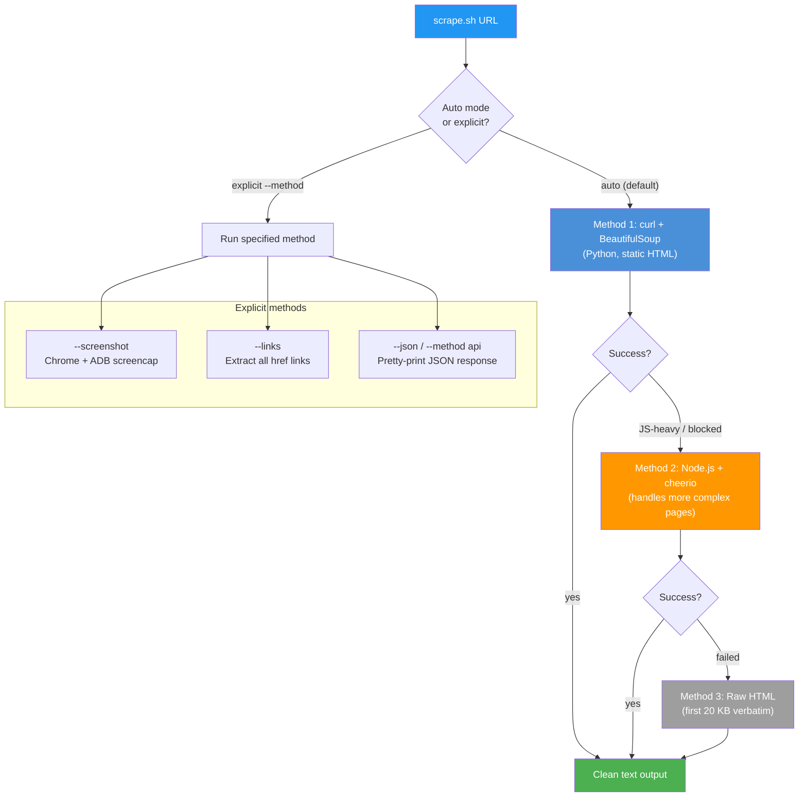
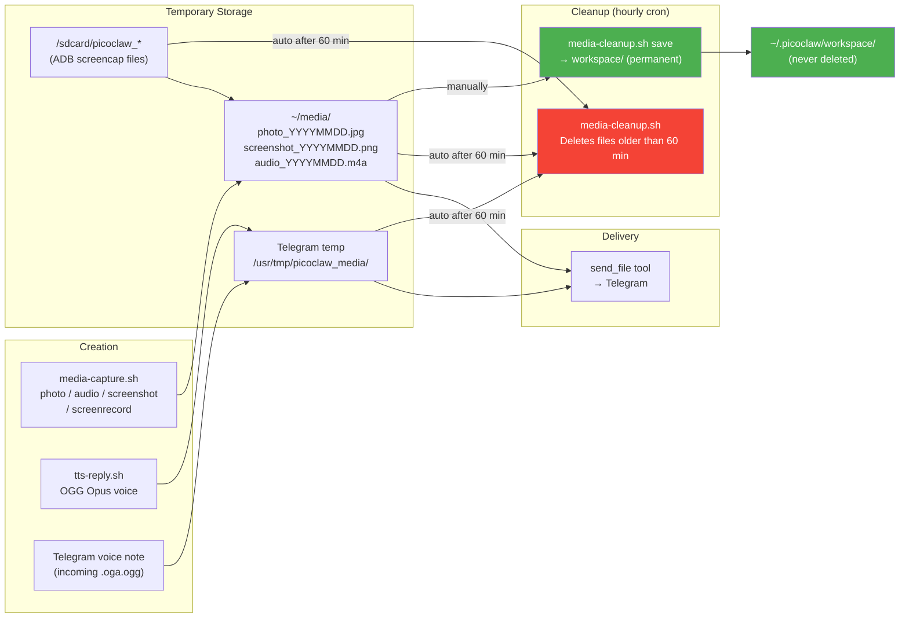

# 08 - Advanced Features

> **Note**: The one-click installer (`utils/install.sh`) deploys all scripts described here. Use `make install-scraping` to add the optional web scraping stack and `make setup-knowledge` to initialize the knowledge base after installation.

This guide covers web scraping, the knowledge base, media cleanup, model switching, background tasks, and cron jobs.

---

## Web Scraping

The `~/bin/scrape.sh` script provides universal web scraping with automatic method fallback.

### Scraping Method Cascade



### Methods

| Method | Flag | Description |
| ------ | ---- | ----------- |
| Auto | (default) | Tries curl+BS4, then Node/cheerio |
| curl | `--method curl` | Static pages with Python text extraction |
| puppet | `--method puppet` | Node.js + cheerio for JS-heavy pages |
| raw | `--method raw` | Raw HTML output |
| api | `--method api` / `--json` | JSON API response parsing |
| screenshot | `--screenshot` | Open URL in Chrome, capture via ADB |
| links | `--links` | Extract all href links from page |

### Usage

```bash
~/bin/scrape.sh https://example.com                    # Auto
~/bin/scrape.sh https://api.example.com/data --json    # JSON API
~/bin/scrape.sh https://example.com --links            # All links
~/bin/scrape.sh https://example.com --screenshot       # Visual capture
```

### Install Dependencies

```bash
python scripts/install_scraping.py
# or: make install-scraping
```

This installs Python packages (`httpx`, `beautifulsoup4`, `trafilatura`, etc.) and Node.js packages (`cheerio`).

---

## Knowledge Base

PicoClaw can persist context to a local knowledge base for long-term memory across sessions.

### Location

```
~/.picoclaw/workspace/knowledge/
```

### How It Works

The LLM creates `.md` files in the knowledge directory when the user says "guarda el contexto" (save context) or similar. Files are:

- Searchable via `grep`
- Accessible through the `filesystem` MCP server
- Persistent across sessions and gateway restarts
- Organized by topic with descriptive filenames

### Setup

```bash
python scripts/setup_knowledge.py
# or: make setup-knowledge
```

This creates the directory and adds instructions to AGENT.md so the LLM knows to write there.

---

## Media Lifecycle



## Media Cleanup

Temporary media files (screenshots, recordings, voice notes, TTS audio) accumulate quickly. The `~/bin/media-cleanup.sh` script handles automatic cleanup.

### Directories Cleaned

| Directory | Contents |
| --------- | -------- |
| `~/media/` | Screenshots, recordings, TTS audio |
| `/usr/tmp/picoclaw_media/` | Voice messages from Telegram |
| `/sdcard/picoclaw_*` | ADB screencap/screenrecord temp files |

### Usage

```bash
~/bin/media-cleanup.sh              # Run cleanup (deletes files > 60 min old)
~/bin/media-cleanup.sh status       # Show what would be deleted
~/bin/media-cleanup.sh save <file>  # Move file to permanent workspace storage
```

### Automatic Cleanup

Runs every hour via cron. Files in `~/.picoclaw/workspace/` are permanent and never deleted.

To save a temporary file permanently:

```bash
~/bin/media-cleanup.sh save ~/media/photo_20260329.jpg "important_photo.jpg"
```

---

## Model Switching (25 Models)

The `~/bin/switch-model.sh` script provides hot-swappable model switching across all providers.

### Available Models

| Category | Models |
| -------- | ------ |
| **Azure** | GPT-4o (default) |
| **Ollama Cloud** | GPT-OSS 120B, DeepSeek V3.2, Qwen 3.5 397B, Kimi K2 1T, Mistral Large 3 675B, GLM-5, Qwen3 Coder 480B, Cogito 2.1 671B |
| **Groq** | Llama 3.3 70B, Kimi K2, Compound AI, Qwen3 32B |
| **Antigravity** | Gemini Flash/Pro variants, Claude Opus 4.6, Claude Sonnet 4.6, GPT-OSS via AG |

### Usage

```bash
~/bin/switch-model.sh list              # Show all 25 models
~/bin/switch-model.sh set deepseek      # Switch (aliases work)
~/bin/switch-model.sh current           # Show active model
~/bin/switch-model.sh recommend coding  # Suggest best for task
~/bin/switch-model.sh reset             # Restore default preset
```

The script uses hot-reload -- no gateway restart needed. The LLM can also switch models when asked by the user in chat.

### Task-Based Recommendations

| Task | Best Model | Alternative |
| ---- | ---------- | ----------- |
| General | `azure-gpt4o` | `deepseek-v3.2` |
| Coding | `qwen3-coder:480b` | `groq-qwen3-32b` |
| Reasoning | `cogito-2.1:671b` | `claude-opus` |
| Fast | `groq-llama` | `groq-compound` |
| Creative | `mistral-large-3:675b` | `claude-sonnet` |
| Images | `gemini-image` | -- |

---

## Background Task Notifications

When PicoClaw spawns sub-agents or runs long commands, it follows a notification protocol:

1. **Before starting**: Tells the user what it is about to do
2. **While running**: Reports active background tasks if asked
3. **When complete**: Immediately notifies with the result
4. **If failed**: Notifies with the error

Telegram format:

```
[BG] Iniciando: <description>
[BG] Completado: <result>
[BG] Error: <error>
```

---

## Cron Jobs

| Schedule | Script | Description |
| -------- | ------ | ----------- |
| Every minute | `watchdog.sh` | Monitor + restart sshd, gateway, ADB |
| Every hour | `media-cleanup.sh` | Delete temp files older than 60 min |
| Daily 8 AM | (configurable) | Morning briefing: battery, storage, weather |
| Sunday midnight | (configurable) | Session cleanup: delete old `.jsonl` files |
| Every 6 hours | (configurable) | Disk monitor: notify if free space < 2 GB |

### Managing Cron

```bash
# View current crontab
crontab -l

# Edit crontab
crontab -e

# PicoClaw can also manage cron via the built-in `cron` tool
```

---

## Gateway Health Endpoints

The gateway exposes health endpoints at `http://127.0.0.1:18790`:

| Endpoint | Purpose |
| -------- | ------- |
| `/health` | Basic health check |
| `/ready` | Readiness check |
| `/reload` | Trigger config hot-reload |

```bash
# Check health
curl http://127.0.0.1:18790/health

# Hot-reload config (no restart needed)
curl -X POST http://127.0.0.1:18790/reload
```

---

## Future Enhancements

These features exist in PicoClaw or as supported integrations but are not currently configured:

| Feature | Description | How to Enable |
| ------- | ----------- | ------------- |
| Heartbeat system | Autonomous periodic tasks via `HEARTBEAT.md` | Set `heartbeat.enabled: true` in config |
| Model routing | Auto-route simple queries to cheaper models | Configure `routing` threshold |
| Extended thinking | Per-model reasoning depth (`low`/`medium`/`high`/`adaptive`) | Set `thinking_level` in model_list |
| Discord channel | Chat via Discord bot | Configure `channels.discord` + token |
| Brave Search MCP | Web search via Brave API | Add Brave API key (package installed) |
| Slack / Matrix | Additional chat channels | Configure in config.json + tokens |
