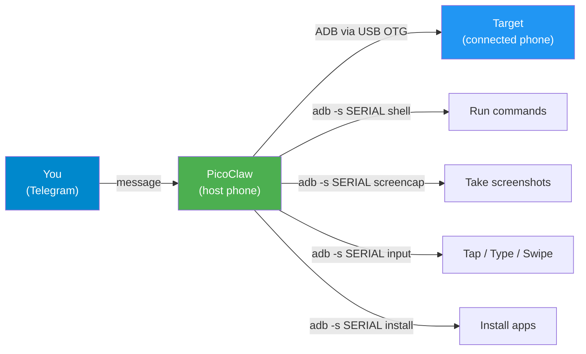

# 09 — Remote Device Control via USB OTG

> The one-click installer (`utils/install.sh`) installs `android-tools` (ADB). This guide explains how to control other devices connected via USB OTG.

PicoClaw can control **other Android devices** connected to its phone via a USB OTG cable. This turns the PicoClaw phone into a command center that can manage multiple devices through Telegram chat.

---

## Requirements

| Item | Description |
| ---- | ----------- |
| **USB OTG adapter** | USB-C (or Micro-USB) to USB-A female adapter (~$3) |
| **USB cable** | Standard charging cable for the target device |
| **Target device** | Any Android phone/tablet with USB Debugging enabled |

```
┌─────────────┐    USB OTG    ┌──────────────┐
│  PicoClaw    │──────────────│  Target      │
│  Phone       │   adapter    │  Device      │
│  (host)      │  + cable     │  (controlled)│
└─────────────┘               └──────────────┘
```

---

## Setup

### 1. Enable USB Debugging on the Target Device

On the **target device** (the one you want to control):

1. Go to **Settings → About Phone** → tap **Build Number** 7 times
2. Go to **Settings → System → Developer Options**
3. Enable **USB Debugging**

### 2. Connect the Devices

1. Plug the USB OTG adapter into the **PicoClaw phone**
2. Connect the target device to the OTG adapter via USB cable
3. A prompt will appear on the **target device**: "Allow USB debugging?" → tap **Allow** (check "Always allow" for persistence)

### 3. Verify Connection

From Telegram, ask PicoClaw to list devices:

```
"List connected USB devices"
```

PicoClaw runs:
```bash
~/bin/remote-device.sh list
```

Output:
```
=== Connected Devices ===

Self (PicoClaw host):
  emulator-5554 (connected)
  localhost:5555 (connected)

External (USB OTG):
  XXXXXXXX — Samsung Galaxy S21 (Android 14)
```

---

## What You Can Do

### From Telegram Chat

| You say | PicoClaw does |
| ------- | ------------- |
| "show connected devices" | `remote-device.sh list` |
| "info of the connected phone" | `remote-device.sh info` — brand, model, battery, storage |
| "take screenshot of the other phone" | `remote-device.sh screenshot` — captures and sends via Telegram |
| "open Chrome on the other phone" | `remote-device.sh open auto com.android.chrome` |
| "install this APK on the other phone" | `remote-device.sh install auto /path/to/app.apk` |
| "type 'hello' on the other phone" | `remote-device.sh type auto "hello"` |
| "tap 540 1200 on the other phone" | `remote-device.sh tap auto 540 1200` |
| "reboot the other phone" | `remote-device.sh reboot` (asks confirmation) |

### Full Command Reference

```bash
# Connection
~/bin/remote-device.sh list                          # List all devices

# Information
~/bin/remote-device.sh info [serial]                 # Specs, battery, storage
~/bin/remote-device.sh screen [serial]               # Screen state
~/bin/remote-device.sh apps [serial]                 # Installed apps

# Control
~/bin/remote-device.sh shell [serial] "command"      # Run any ADB command
~/bin/remote-device.sh tap [serial] X Y              # Tap coordinates
~/bin/remote-device.sh type [serial] "text"          # Type text
~/bin/remote-device.sh key [serial] HOME             # Press key
~/bin/remote-device.sh wake [serial]                 # Wake screen
~/bin/remote-device.sh open [serial] com.app.name    # Open app
~/bin/remote-device.sh screenshot [serial]           # Capture screen

# File Transfer
~/bin/remote-device.sh push [serial] local remote    # Send file TO device
~/bin/remote-device.sh pull [serial] remote local    # Get file FROM device
~/bin/remote-device.sh install [serial] app.apk      # Install APK

# System
~/bin/remote-device.sh reboot [serial]               # Reboot device
```

> If `[serial]` is omitted, the command targets the first external (non-self) device automatically.

---

## How It Works



PicoClaw filters its own ADB connections (`emulator-5554`, `localhost:5555`) from external devices. When you say "the other phone", it automatically targets the first external device.

---

## Limitations

| Limitation | Reason |
| ---------- | ------ |
| **Target must have USB Debugging ON** | ADB requires this. No way around it. |
| **No simultaneous charging** | The OTG port is used for data, not charging. PicoClaw phone drains battery while hosting. |
| **Root commands unavailable** | ADB shell runs as `shell` user (uid=2000), not root. Same limitations as PicoClaw's self-bridge. |
| **One device at a time** | Most phones have one USB port. With a USB hub, multiple devices may work but is untested. |

---

## Use Cases

- **Manage a family member's phone** — install apps, take screenshots, check battery
- **Control a secondary device** — a tablet used as a dashboard, another old phone
- **Transfer files** — push/pull files between phones without cloud
- **Remote troubleshooting** — a friend brings their phone, you debug via Telegram
- **Automation** — script repetitive tasks across multiple devices

---

## Next Steps

← [08 — Advanced Features](08-advanced-features.md)
