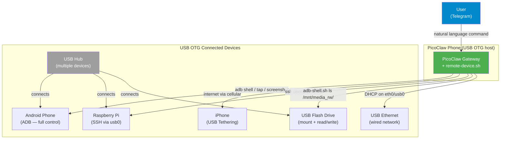

# 09 — Remote Device Control

> PicoClaw can detect and interact with any device connected via USB OTG: Android phones, iPhones, Raspberry Pi, USB drives, Ethernet adapters, and more.

---

## Supported Devices

| Device | Connection | What PicoClaw Can Do |
| ------ | ---------- | -------------------- |
| **Android phone** | USB OTG + ADB | Full control: screenshots, apps, tap, type, install APKs, file transfer |
| **iPhone** | USB OTG + tethering | Use iPhone's internet, SSH if jailbroken |
| **Raspberry Pi** | USB gadget mode or Ethernet | Full SSH control: run commands, transfer files |
| **Linux laptop/PC** | USB Ethernet adapter | SSH access if on same network |
| **USB flash drive** | USB OTG | Read/write files, mount storage |
| **USB Ethernet adapter** | USB OTG | Add wired network connection |
| **USB hub** | USB OTG | Connect multiple devices simultaneously |



---

## Quick Start

Connect any device via USB OTG cable, then from Telegram:

```
"scan connected devices"
```

PicoClaw runs `~/bin/remote-device.sh scan` and shows everything connected.

---

## Android Devices (ADB)

### Setup
1. **Target phone**: Settings → About → tap Build Number 7x → Developer Options → USB Debugging ON
2. **Connect**: USB OTG adapter on PicoClaw phone + USB cable to target
3. **Accept**: tap "Allow USB debugging" on target screen

### Commands from Telegram

| You say | What happens |
| ------- | ------------ |
| "info of the connected phone" | Shows brand, model, battery, storage |
| "screenshot of the other phone" | Captures screen and sends it |
| "open Chrome on the other phone" | Launches app via ADB |
| "type 'hello' on the other phone" | Types text on target screen |
| "install this APK on the other phone" | Pushes and installs APK |
| "list apps on the other phone" | Shows installed apps |

```bash
~/bin/remote-device.sh android info
~/bin/remote-device.sh android screenshot
~/bin/remote-device.sh android shell "dumpsys battery"
~/bin/remote-device.sh android open com.android.chrome
~/bin/remote-device.sh android tap 540 1200
~/bin/remote-device.sh android type "hello world"
~/bin/remote-device.sh android apps
~/bin/remote-device.sh android push local.txt /sdcard/
~/bin/remote-device.sh android pull /sdcard/photo.jpg ./
```

---

## iPhone (USB Tethering)

### Setup
1. **iPhone**: Settings → Personal Hotspot → Allow Others to Join
2. **Connect**: Lightning/USB-C cable + OTG adapter to PicoClaw phone
3. iPhone creates a network interface (`ncm0` or `usb0`) on PicoClaw

### What it does
- PicoClaw gets internet through the iPhone's cellular connection
- Useful when WiFi is unavailable — iPhone becomes the internet source
- Check with: `~/bin/remote-device.sh network`

### SSH (jailbroken iPhone only)
If the iPhone is jailbroken with OpenSSH installed:
```bash
~/bin/remote-device.sh ssh root@172.20.10.1 "uname -a"
```

---

## Raspberry Pi / Linux Devices (SSH)

### Setup — USB Gadget Mode (no network needed)
1. On the Pi, enable USB gadget mode in `/boot/config.txt`: `dtoverlay=dwc2`
2. Add `modules-load=dwc2,g_ether` to `/boot/cmdline.txt`
3. Connect Pi to PicoClaw phone via USB + OTG
4. The Pi appears as a USB Ethernet device (`usb0`)
5. SSH: `~/bin/remote-device.sh ssh pi@10.0.0.2 "command"`

### Setup — Same WiFi Network
If both devices are on the same WiFi:
```bash
~/bin/remote-device.sh ssh pi@raspberrypi.local "uname -a"
~/bin/remote-device.sh ssh user@<device-ip> "ls /home/"
```

### Examples from Telegram
| You say | What happens |
| ------- | ------------ |
| "run 'uptime' on the raspberry pi" | SSH + execute command |
| "check temp on the pi" | `ssh pi@host "vcgencmd measure_temp"` |
| "list files on the pi" | `ssh pi@host "ls -la /home/pi/"` |
| "reboot the pi" | `ssh pi@host "sudo reboot"` |

---

## USB Flash Drives

When a USB drive is connected via OTG:
1. Android auto-mounts it under `/mnt/media_rw/` or `/storage/`
2. Check: `~/bin/remote-device.sh storage`
3. Files are accessible for read/write

```bash
# List contents
~/bin/adb-shell.sh "ls /mnt/media_rw/*/

# Copy file to USB drive
~/bin/adb-shell.sh "cp /sdcard/backup.zip /mnt/media_rw/*/"

# Copy file from USB drive
~/bin/adb-shell.sh "cp /mnt/media_rw/*/document.pdf /sdcard/"
```

---

## USB Ethernet Adapters

Connect a USB Ethernet adapter via OTG for wired network:
1. Plug adapter into OTG
2. Connect Ethernet cable
3. Check: `~/bin/remote-device.sh network`
4. The interface (`eth0` or `usb0`) gets an IP via DHCP

Supported chipsets: Realtek RTL8152/8153, ASIX AX88179, CDC-Ethernet.

---

## Full Command Reference

```bash
# Detection
~/bin/remote-device.sh scan                           # All connected devices

# Android
~/bin/remote-device.sh android info [serial]          # Device info
~/bin/remote-device.sh android shell [serial] "cmd"   # Run command
~/bin/remote-device.sh android screenshot [serial]    # Take screenshot
~/bin/remote-device.sh android tap [serial] X Y       # Tap screen
~/bin/remote-device.sh android type [serial] "text"   # Type text
~/bin/remote-device.sh android key [serial] HOME      # Press key
~/bin/remote-device.sh android open [serial] pkg      # Open app
~/bin/remote-device.sh android apps [serial]          # List apps
~/bin/remote-device.sh android install [serial] apk   # Install APK
~/bin/remote-device.sh android push [serial] l r      # Send file
~/bin/remote-device.sh android pull [serial] r l      # Get file
~/bin/remote-device.sh android reboot [serial]        # Reboot

# SSH (Linux, Raspberry Pi, jailbroken iPhone)
~/bin/remote-device.sh ssh user@host "command"

# USB
~/bin/remote-device.sh usb                            # Raw USB devices
~/bin/remote-device.sh storage                        # USB flash drives
~/bin/remote-device.sh network                        # USB network interfaces
```

---

## Limitations

| | |
| --- | --- |
| **iPhone control** | No ADB for iOS. Only USB tethering (internet) and SSH (jailbreak only). |
| **No charging while OTG** | The USB port is used for data. PicoClaw phone drains battery. |
| **Root for mount** | Mounting USB storage may need root on some Android versions. |
| **One port** | Most phones have one USB-C. Use a USB hub for multiple devices. |

---

<p align="center">
  <a href="08-advanced-features.md">← Advanced Features</a>
  &nbsp;&nbsp;|&nbsp;&nbsp;
  <a href="../README.md">📋 README</a>
  &nbsp;&nbsp;|&nbsp;&nbsp;
  
</p>
