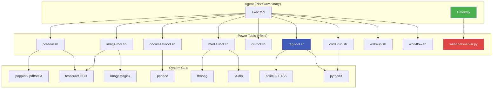

# 11 — Power Tools (OpenClaw Parity)

PicoClaw Dotfiles extends the base PicoClaw binary with 10 specialized tools that give the agent capabilities comparable to OpenClaw: PDF/image/document analysis, code execution, RAG, scheduling, workflows, webhooks, and more — all running locally on the phone.

---

## Overview



---

## Capability Matrix

| Capability | Tool | Backend | Example |
|------------|------|---------|---------|
| Read PDF | `pdf-tool.sh text` | poppler | Extract text from any PDF with layout preserved |
| OCR PDF | `pdf-tool.sh ocr` | poppler + tesseract | Scan-based PDFs become searchable |
| OCR image | `image-tool.sh ocr` | tesseract (eng+spa) | Extract text from photos, screenshots |
| Image manipulation | `image-tool.sh` | ImageMagick | Resize, crop, rotate, compress, annotate, EXIF |
| Document convert | `document-tool.sh` | pandoc | md ↔ pdf ↔ docx ↔ html ↔ epub (40+ formats) |
| Video/audio download | `media-tool.sh` | yt-dlp | YouTube, Twitter, Instagram, 1000+ sites |
| Video processing | `media-tool.sh` | ffmpeg | Trim, resize, GIF, extract audio, thumbnails |
| QR generate/scan | `qr-tool.sh` | qrcode + zbar | Create QR codes or read from images |
| Code execution | `code-run.sh` | python3, node | Sandboxed with 30s timeout |
| RAG (knowledge base) | `rag-tool.sh` | SQLite FTS5 | Indexing + BM25 search + LLM-augmented Q&A |
| Scheduled wakeups | `wakeup.sh` | sleep + bash | One-shot timed agent prompts |
| Multi-step workflows | `workflow.sh` | bash + jq | Chained agent calls with output passing |
| Webhook triggers | `webhook-server.py` | Flask | HTTP endpoint → agent prompt |

---

## Tool-by-Tool

### PDF Tool

```bash
~/bin/pdf-tool.sh text document.pdf                 # Extract all text
~/bin/pdf-tool.sh text document.pdf 3               # Just page 3
~/bin/pdf-tool.sh ocr scanned.pdf                   # OCR image-based PDFs
~/bin/pdf-tool.sh info document.pdf                 # Pages, metadata
~/bin/pdf-tool.sh to-images document.pdf            # Export pages as PNG
~/bin/pdf-tool.sh compress big.pdf small.pdf        # Reduce size (Ghostscript)
~/bin/pdf-tool.sh merge out.pdf a.pdf b.pdf c.pdf   # Combine PDFs
~/bin/pdf-tool.sh split document.pdf                # Split to individual pages
```

Backend: `pdftotext`, `pdftoppm`, `pdfinfo` (poppler), `tesseract`, `gs` (Ghostscript).

### Image Tool

```bash
~/bin/image-tool.sh ocr photo.jpg                   # Extract text (multi-lang)
~/bin/image-tool.sh ocr photo.jpg spa               # Spanish OCR
~/bin/image-tool.sh info image.png                  # Format, dimensions, depth
~/bin/image-tool.sh resize in.jpg out.jpg 800x600   # Resize
~/bin/image-tool.sh thumbnail in.jpg thumb.jpg 200x200
~/bin/image-tool.sh crop in.jpg out.jpg 500x500+100+100  # W×H+X+Y
~/bin/image-tool.sh annotate in.jpg out.jpg "Caption text"
~/bin/image-tool.sh meta photo.jpg                  # EXIF: GPS, camera, date
~/bin/image-tool.sh compress big.jpg small.jpg 75   # Quality 0-100
```

Backend: ImageMagick (`convert`, `identify`), `tesseract`.

### Document Tool

```bash
~/bin/document-tool.sh convert input.md output.pdf  # Auto-detect formats
~/bin/document-tool.sh md2docx report.md report.docx
~/bin/document-tool.sh docx2md report.docx report.md
~/bin/document-tool.sh html2pdf page.html page.pdf
~/bin/document-tool.sh to-epub book.md book.epub
~/bin/document-tool.sh wordcount article.md
~/bin/document-tool.sh toc README.md                # Generate TOC
```

Supports: Markdown, HTML, PDF, DOCX, ODT, EPUB, RTF, LaTeX, RST, and 40+ more via pandoc.

### Media Tool

```bash
~/bin/media-tool.sh info 'https://youtube.com/watch?v=...'
~/bin/media-tool.sh audio 'https://youtube.com/...'         # MP3
~/bin/media-tool.sh audio-ogg 'https://soundcloud.com/...'  # OGG Opus
~/bin/media-tool.sh download 'https://twitter.com/i/status/...'
~/bin/media-tool.sh subtitles 'https://youtu.be/...' es
~/bin/media-tool.sh trim in.mp4 out.mp4 00:01:00 00:03:30
~/bin/media-tool.sh resize in.mp4 out.mp4 720
~/bin/media-tool.sh to-gif in.mp4 out.gif 10
~/bin/media-tool.sh extract-audio in.mp4 out.mp3
~/bin/media-tool.sh concat out.mp4 a.mp4 b.mp4 c.mp4
~/bin/media-tool.sh thumbnail video.mp4 thumb.jpg 00:00:05
```

Supports 1,000+ sites via yt-dlp: YouTube, Twitter/X, Instagram, TikTok, Twitch, SoundCloud, Spotify preview, Vimeo, etc.

### QR Tool

```bash
~/bin/qr-tool.sh gen "https://picoclaw.dev" ~/media/qr.png
~/bin/qr-tool.sh gen-terminal "Wi-Fi password: xxx"       # ASCII in terminal
~/bin/qr-tool.sh scan ~/media/photo-of-qr.jpg
```

Uses Python `qrcode` library for generation (no qrencode dependency needed).

### Code Runner (sandboxed)

```bash
~/bin/code-run.sh py "import math; print(math.pi ** 2)"
~/bin/code-run.sh py-file ~/scratch.py
~/bin/code-run.sh node "console.log([1,2,3].map(x => x*2))"
~/bin/code-run.sh bash "uptime; df -h"
~/bin/code-run.sh eval "sum(range(100))"                   # Safe math eval
```

Timeout: 30s (configurable via `TIMEOUT=60 ~/bin/code-run.sh ...`). Output capped at 5000 lines.

### RAG (Knowledge Base)

Local retrieval-augmented generation over your own documents — no cloud embeddings needed. Uses SQLite FTS5 with BM25 ranking.

```bash
~/bin/rag-tool.sh init                                       # Create DB
~/bin/rag-tool.sh add-text note1 "Remember to renew domain on March 15"
~/bin/rag-tool.sh add my-book.md ~/Documents/my-book.md      # Index a file
~/bin/rag-tool.sh add-dir ~/Documents/notes/                 # Bulk index .md/.txt
~/bin/rag-tool.sh search "domain renewal"                    # Find relevant chunks
~/bin/rag-tool.sh query "When should I renew the domain?"    # RAG: search + LLM answer
~/bin/rag-tool.sh list                                       # Show indexed docs
~/bin/rag-tool.sh stats                                      # DB size, counts
~/bin/rag-tool.sh remove note1
```

DB location: `~/.picoclaw/workspace/knowledge/rag.db` (portable SQLite file).

### Wakeups (One-Shot Scheduling)

```bash
~/bin/wakeup.sh in 5m "Check the weather and notify me"
~/bin/wakeup.sh in 2h30m "Summarize today's emails"
~/bin/wakeup.sh at "14:30" "Meeting starts in 15 min"
~/bin/wakeup.sh at "tomorrow 08:00" "Good morning briefing"
~/bin/wakeup.sh list                                         # Pending wakeups
~/bin/wakeup.sh cancel wake_1234567_890
```

Complements cron (recurring) with one-time timed prompts. Sends Android notification on fire.

### Workflow Engine

Multi-step agent pipelines with output chaining:

```json
{
  "name": "daily-briefing",
  "steps": [
    {"id": "weather",  "prompt": "Get the weather for Madrid today"},
    {"id": "news",     "prompt": "List 3 top tech headlines"},
    {"id": "summary",  "prompt": "Write a 2-line morning briefing using: ${weather} and ${news}",
                       "depends_on": ["weather", "news"]}
  ]
}
```

```bash
~/bin/workflow.sh new daily-briefing            # Create template
~/bin/workflow.sh run briefing.json             # Execute
~/bin/workflow.sh list                          # Past runs with status
~/bin/workflow.sh status <run-id>               # Inspect outputs
```

State persisted in `~/.picoclaw/workflow-runs/<id>/state.json`.

#### When the agent should reach for workflows

Per the AGENT.md Orchestration Policy, the default posture on this device is **maximum leverage**. If a request will touch more than ~3 visible steps (multi-step installs, long scrapes, batch data gathering, multi-file edits), the agent should declare a workflow up front instead of running loose shell commands one after another. Benefits:

- **Resumable** — survives gateway restarts, network blips, handler timeouts.
- **Inspectable** — `workflow.sh status` shows exactly where the run stopped.
- **Cancellable** — the operator can stop a long task mid-flight without losing intermediate outputs.
- **Composable** — steps can depend on each other's outputs via `${step_id}` substitution, so the agent can fan out (parallel probes) then fan in (summary).

#### Plans on demand

When the operator says "dame un plan", "cómo harías X", "propón pasos", the agent should respond with a numbered plan that:

1. Lists every tool call and file path involved.
2. Highlights destructive or irreversible steps (so the operator can veto them).
3. Ends with a verification checklist.

Then asks *once* for confirmation. After confirmation, the agent proceeds through the plan end-to-end — usually via `workflow.sh run` — without stopping between trivial steps. This is the "plan → approve once → execute fully" contract the device is built around.

### Webhook Server

Lightweight Flask server that forwards HTTP webhooks to the agent:

```bash
# Start (foreground or background)
python3 ~/bin/webhook-server.py &

# Optional: require bearer token
WEBHOOK_TOKEN=secret123 python3 ~/bin/webhook-server.py &
```

Endpoints (on `127.0.0.1:18791`):

| Endpoint | Purpose |
|----------|---------|
| `POST /hook/<name>` | JSON payload → agent prompt `[WEBHOOK:<name>] ...` |
| `POST /notify` | Simple text → agent prompt |
| `GET /health` | Health check |

Use cases: GitHub webhooks, monitoring alerts, smart home triggers, IFTTT/Zapier, n8n.

---

## CLI Tool Suite Installed

The installer adds these system tools for the agent to use via `exec`:

| Tool | Command | Use case |
|------|---------|----------|
| yt-dlp | `yt-dlp` | Download from 1000+ video/audio sites |
| ffmpeg | `ffmpeg`, `ffprobe` | Audio/video processing |
| ImageMagick | `convert`, `identify` | Image manipulation |
| pandoc | `pandoc` | Document conversion (40+ formats) |
| tesseract | `tesseract` | OCR (eng, spa, multi-lang) |
| poppler | `pdftotext`, `pdftoppm`, `pdfinfo` | PDF text/image extraction |
| Ghostscript | `gs` | PDF compression, merging |
| ripgrep | `rg` | Fast recursive search |
| fd | `fd` | Fast file finder |
| bat | `bat` | Syntax-highlighted file viewing |
| glow | `glow` | Markdown rendering |
| jq | `jq` | JSON processing |
| yq | `yq` | YAML processing |
| sqlite3 | `sqlite3` | Local DB queries |
| p7zip | `7z` | Archive support |
| zstd | `zstd` | Fast compression |
| fzf | `fzf` | Interactive fuzzy finder |
| tree | `tree` | Directory visualization |
| htop | `htop` | Process monitor |
| lsof | `lsof` | Open file listing |
| git-delta | `delta` | Better git diffs |
| rsync | `rsync` | Incremental sync |
| aria2 | `aria2c` | Multi-connection downloads |
| nmap | `nmap` | Network scanning |

---

## Comparison with OpenClaw

| Feature | OpenClaw | PicoClaw (with power tools) |
|---------|----------|-----------------------------|
| PDF analysis | Built-in `pdf` tool | `~/bin/pdf-tool.sh` (poppler + tesseract) |
| Image analysis | Built-in `image` tool | `~/bin/image-tool.sh` (ImageMagick + tesseract) |
| Document conversion | Via skill | `~/bin/document-tool.sh` (pandoc) |
| Web scraping | Firecrawl (paid) + web_fetch | `scrape.sh` (curl/cheerio/Playwright cascade) |
| Code interpreter | Via skill | `~/bin/code-run.sh` (sandboxed py/node/bash) |
| RAG | Via skill / QMD | `~/bin/rag-tool.sh` (SQLite FTS5) |
| Browser (CDP) | Built-in | **Not yet** (Chromium not in Termux repos) |
| Webhook triggers | Gmail PubSub, custom | `webhook-server.py` (Flask) |
| Wakeups | Built-in | `~/bin/wakeup.sh` |
| Workflows | Lobster engine | `~/bin/workflow.sh` |
| Video download | Via skill | `~/bin/media-tool.sh` (yt-dlp) |
| QR gen/scan | Via skill | `~/bin/qr-tool.sh` (Python qrcode) |

**Trade-off**: PicoClaw Dotfiles achieves parity for ~90% of OpenClaw's practical capabilities using shell scripts that call system CLIs — all while keeping the base binary under 30 MB and running on a phone with <100 MB RAM.

---

<p align="center">
  <a href="10-complete-setup-guide.md">&larr; Complete Setup Guide</a>
  &nbsp;&nbsp;|&nbsp;&nbsp;
  <a href="../README.md">README</a>
</p>
