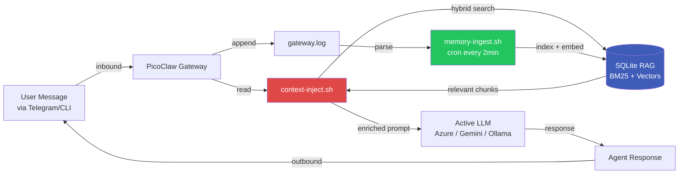

# 13 — Central Memory Architecture

PicoClaw v0.3 introduces **central memory**: every conversation flows through RAG, so context is consistent regardless of which LLM is active. Switch between Azure GPT-4o, Gemini, Ollama, or any provider — the memory is the same SQLite database.

---

## Architecture



---

## Why Central Memory

| Without Central Memory | With Central Memory |
|------------------------|---------------------|
| Each LLM session has its own context | All LLMs share the same persistent memory |
| Switching models loses conversation history | Switch freely, memory survives |
| RAG only works if explicitly invoked | Every response auto-includes relevant past context |
| User must repeat info across sessions | Agent remembers across days/weeks |
| LLM cost scales with context window | Hybrid retrieval keeps prompts small |

---

## Components

### 1. `memory-ingest.sh` (auto-runs every 2 min via cron)

Parses `~/.picoclaw/gateway.log` for:
- Inbound user messages (any channel)
- Agent responses with text content

Each conversation chunk gets:
- BM25 full-text index (SQLite FTS5)
- Gemini embedding (`gemini-embedding-001`, 768-dim)
- Stored as `mem:<session>:<timestamp>` document in `rag.db`

```bash
~/bin/memory-ingest.sh             # Process new log entries (incremental)
~/bin/memory-ingest.sh full        # Reindex from scratch
~/bin/memory-ingest.sh stats       # See total chunks/sessions
~/bin/memory-ingest.sh search "<q>"  # Search conversation history only
```

### 2. `context-inject.sh` (called by agent before responding)

Retrieves top-3 relevant chunks (mixing past conversations + indexed docs) and prepends them to the user's message:

```
<memory>
[mem:agent:main:telegram:...] rrf=0.04
  [user] What's the failover priority?
  [assistant] Azure → Ollama → Antigravity → Google...
[my-notes #2] rrf=0.02
  Production deployment requires...
</memory>

<actual user message here>
```

```bash
~/bin/context-inject.sh "<message>"               # Default: 3 chunks, md format
~/bin/context-inject.sh --count 5 "<message>"
~/bin/context-inject.sh --format json "<message>"
~/bin/context-inject.sh --session abc123 "<message>"
```

### 3. `rag-tool.sh` (manual indexing + search)

```bash
~/bin/rag-tool.sh init                              # Create DB
~/bin/rag-tool.sh add-text <id> "<text>"            # Index text
~/bin/rag-tool.sh add-pdf <id> <file.pdf>           # Index PDF
~/bin/rag-tool.sh add-url <id> <url>                # Index webpage
~/bin/rag-tool.sh add-dir <directory>               # Bulk index .md/.txt
~/bin/rag-tool.sh search "<query>" [n]              # Hybrid (BM25 + semantic)
~/bin/rag-tool.sh search-bm25 "<q>"                 # Keyword only
~/bin/rag-tool.sh search-semantic "<q>"             # Semantic only
~/bin/rag-tool.sh query "<question>" [model]        # RAG: retrieve + LLM
~/bin/rag-tool.sh stats
~/bin/rag-tool.sh reindex                           # Regenerate embeddings
```

---

## DB Schema

Storage: `~/.picoclaw/workspace/knowledge/rag.db`

```sql
-- Full-text search (BM25 ranking)
CREATE VIRTUAL TABLE docs USING fts5(
    doc_id UNINDEXED,
    chunk_idx UNINDEXED,
    content,
    tokenize='porter unicode61'
);

-- Document metadata (deduplication via hash)
CREATE TABLE meta (
    doc_id TEXT PRIMARY KEY,
    path TEXT,
    added_at TEXT,
    chunks INTEGER,
    content_hash TEXT
);

-- 768-dim Gemini embeddings (float32 packed as BLOB)
CREATE TABLE embeddings (
    doc_id TEXT,
    chunk_idx INTEGER,
    vector BLOB,
    PRIMARY KEY(doc_id, chunk_idx)
);
```

---

## Hybrid Search (Reciprocal Rank Fusion)

When you `search` (default), both signals run in parallel:

1. **BM25** — keyword/syntactic match (best for exact terms, names, code)
2. **Semantic cosine similarity** — concept/meaning match (best for paraphrasing)

Then **RRF** combines them:

```
score(doc) = 1/(60 + rank_bm25(doc)) + 1/(60 + rank_semantic(doc))
```

This balances precision (BM25 is good for keywords) and recall (semantic catches paraphrases). Top-k by combined score is returned.

Example: query "italian food"
- BM25: matches none directly
- Semantic: matches "Pizza is a savory Italian dish..." (cos=0.51)
- Returned: pizza chunk

---

## Cron Schedule (with memory-ingest)

| Frequency | Job | Purpose |
|-----------|-----|---------|
| Every minute | `watchdog.sh` | Monitor sshd, gateway, ADB |
| **Every 2 min** | **`memory-ingest.sh`** | **Index new conversations into RAG** |
| Every hour | `media-cleanup.sh` | Delete temp media >60min |
| Every 6 hours | Disk monitor | Alert if >90% full |
| Weekly | Session cleanup | Delete sessions >7 days |

---

## Cloudflare Tunnel (webhook security)

Three configuration paths:

### 1. From `.env` (workstation deploy)

```bash
CLOUDFLARE_TUNNEL_TOKEN=eyJhIjoi...base64...
```

`full_deploy.py` reads this and sets it on the device.

### 2. From chat (agent runs the command)

User: "configure cloudflare with token eyJ..."
Agent: executes `~/bin/cloudflare-tool.sh token-set eyJ...`

### 3. Manually on phone (Termux)

```bash
~/bin/cloudflare-tool.sh token-set eyJ...     # Save token
~/bin/cloudflare-tool.sh daemon               # Start tunnel (tmux)
~/bin/cloudflare-tool.sh status               # Check
~/bin/cloudflare-tool.sh logs                 # View logs
```

### Termux limitation

Token-mode tunnels require SRV DNS records. **Android's Bionic libc + Go's resolver fall back to `[::1]:53` when `/etc/resolv.conf` is missing**, which fails on Termux. Workarounds:

```bash
# Option A: anonymous quick tunnel (works on Termux, no SRV needed)
~/bin/cloudflare-tool.sh quick-daemon

# Option B: run cloudflared on a PC/router/VPS where DNS works
~/bin/cloudflare-tool.sh print-host-script    # Generates one-liner
```

The quick tunnel produces a `https://*.trycloudflare.com` URL that points to your phone's webhook server. Token-based named tunnels (with custom domain) require a non-Termux host.

---

## Security Layers

| Layer | Mechanism |
|-------|-----------|
| Tunnel transport | TLS 1.3 (Cloudflare-controlled) |
| Webhook auth | HMAC-SHA256 (`WEBHOOK_HMAC_SECRET`) |
| Bearer token | `WEBHOOK_TOKEN` env |
| Per-source HMAC | `GITHUB_WEBHOOK_SECRET`, `GITLAB_WEBHOOK_TOKEN` |
| Cloudflare Access JWT | `CF_ACCESS_AUD`, `CF_ACCESS_TEAM` |
| IP allowlist | `WEBHOOK_IP_ALLOW=ip1,ip2,...` |
| Rate limiting | 60 req/min per IP (configurable) |
| Audit log | All requests logged to `~/webhook-audit.log` |

---

## Cross-session / cross-account recall

PicoClaw is designed for **single-operator** deployments — one person owns every channel and every account the agent talks to. Because `memory-ingest.sh` indexes every turn from `gateway.log` and every session JSONL into RAG, the agent can technically recall any message the owner sent from any source: CLI, Telegram (across multiple of the owner's accounts), WhatsApp, Discord, webhooks.

Whether the agent *does* recall across sessions is gated by a single env var:

| Value | Behavior |
|-------|----------|
| `AGENT_CROSS_CHAT_ACCESS=true` | The RAG is treated as the **owner's own memory**. When the owner asks about prior messages in another session/account/channel, the agent recalls and answers. No "privacy" refusal — the owner has given standing consent by enabling the flag. |
| `AGENT_CROSS_CHAT_ACCESS=false` *(default in template)* | The agent only uses the current-session context and refuses cross-session recall. Safe default for shared or multi-tenant setups. |

The flag lives in `~/.picoclaw_keys` (or `.env` for remote deploys). `device-context.sh` reads it and renders the resolved policy directly into `~/.picoclaw/workspace/AGENT.md` so the LLM always sees the active rule.

### The recall tool (`chat-history.sh`)

When the flag is ON, the agent uses `~/bin/chat-history.sh` — a thin wrapper around RAG + session JSONL files:

```bash
~/bin/chat-history.sh policy                       # Print current policy
~/bin/chat-history.sh accounts                     # Distinct Telegram IDs + counts
~/bin/chat-history.sh sessions                     # Every session file, size, line count
~/bin/chat-history.sh recent [N]                   # Last N messages across sessions
~/bin/chat-history.sh session <name-or-id> [N]    # One session (partial match OK)
~/bin/chat-history.sh search "<query>" [N]        # Hybrid RAG search
```

Every command exits with code `7` and a structured `{"status":"denied"}` JSON if the flag is OFF, so the agent can forward the refusal message verbatim instead of hallucinating one.

#### Example: multi-account recall

```bash
# Operator uses two Telegram accounts (667556873 and 1945416503)
$ ~/bin/chat-history.sh accounts
{
  "667556873": {"messages": 412, "bytes": 183294, "last": "2026-04-13T01:14:00"},
  "1945416503": {"messages": 86, "bytes": 38110, "last": "2026-04-13T00:52:17"}
}

# Ask from either account: "qué te dije ayer desde mi otra cuenta?"
$ ~/bin/chat-history.sh session 1945416503 10
[2026-04-12T23:41:12] (user) ayuda a configurar el webhook de github
[2026-04-12T23:41:48] (agent) voy a crear el endpoint ahora...
...

# Or search: "recuerdas el formulario de contacto que creaste?"
$ ~/bin/chat-history.sh search "formulario contacto"
[mem:telegram_direct_667556873:0014]
  "créame un formulario de contacto con nombre, email y mensaje..."
```

### Why not just trust the RAG?

The RAG by itself doesn't enforce the policy — it will happily return any matching chunk. The `AGENT_CROSS_CHAT_ACCESS` flag is an *agent-level* gate: the wrapper script refuses before a query ever reaches the DB. This separation lets you:

- Keep the RAG populated with full history (useful for backups, future analysis).
- Flip the flag at runtime without re-indexing.
- Share the device temporarily with someone else by flipping to `false`.

---

## Quick Reference

```bash
# View what's in memory
~/bin/memory-ingest.sh stats          # 7 chunks, 3 sessions
~/bin/rag-tool.sh list                # All indexed docs

# Force ingestion now (don't wait for cron)
~/bin/memory-ingest.sh

# Search past conversations (agent-gated recall)
~/bin/chat-history.sh search "voice notes"
~/bin/chat-history.sh recent 20
~/bin/chat-history.sh accounts

# Raw RAG search (no policy gate — operator-only)
~/bin/memory-ingest.sh search "voice notes"

# Test context injection
~/bin/context-inject.sh "What models are configured?"

# Manually add knowledge
~/bin/rag-tool.sh add-pdf manual ~/Documents/manual.pdf
~/bin/rag-tool.sh add-url docs https://example.com/article

# Cloudflare tunnel
~/bin/cloudflare-tool.sh token-set eyJ...      # Save token
~/bin/cloudflare-tool.sh quick-daemon          # Public URL (Termux-friendly)
~/bin/cloudflare-tool.sh status

# Webhook server
python3 ~/bin/webhook-server.py &              # Start on port 18791
curl http://localhost:18791/health             # Verify
```

---

<p align="center">
  <a href="12-vs-openclaw.md">&larr; vs OpenClaw</a>
  &nbsp;&nbsp;|&nbsp;&nbsp;
  <a href="../README.md">README</a>
</p>
