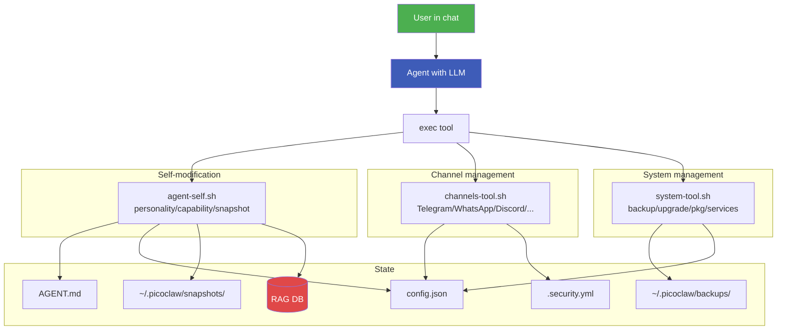

# 14 — Self-Administration

PicoClaw v0.3+ supports complete self-administration from chat. The user can ask the agent to add users, configure channels, backup, restore, upgrade, install packages, or modify any configuration — and the agent executes those commands on itself without restart or manual intervention.

---

## Architecture



---

## Live Channel Management (`channels-tool.sh`)

Every change auto-snapshots the config and reloads the gateway. No restart needed in most cases.

### Telegram

```bash
~/bin/channels-tool.sh telegram add-user 123456789     # Idempotent: no-op if already present
~/bin/channels-tool.sh telegram remove-user 123456789  # Strips ALL occurrences (safe on pre-existing dupes)
~/bin/channels-tool.sh telegram dedupe-users           # Collapse any duplicates (preserves order)
~/bin/channels-tool.sh telegram list-users             # JSON array
~/bin/channels-tool.sh telegram set-token <TOKEN>      # Update bot token
~/bin/channels-tool.sh telegram set-owner 123456789    # Replace allow_from with single user
~/bin/channels-tool.sh telegram enable
~/bin/channels-tool.sh telegram disable
~/bin/channels-tool.sh telegram status                 # Full config dump
```

> **Idempotency note.** `add-user` on an ID that's already authorized prints `already authorized (no change)` and does not re-write the file. Safe to retry from chat if the agent loses confirmation state and re-fires the command. `remove-user` strips every copy of the ID even if the list drifted out of sync in an earlier bug.

### WhatsApp (native, Baileys-based)

```bash
~/bin/channels-tool.sh whatsapp enable
~/bin/channels-tool.sh whatsapp set-number +1234567890   # E.164 format
~/bin/channels-tool.sh whatsapp add-allow +1987654321    # Allow specific sender
~/bin/channels-tool.sh whatsapp remove-allow +1987654321
~/bin/channels-tool.sh whatsapp disable
~/bin/channels-tool.sh whatsapp status
```

### Discord / Slack / Matrix / Signal / Feishu / Line / QQ / DingTalk / WeChat / IRC / OneBot

```bash
~/bin/channels-tool.sh discord set-token <TOKEN>
~/bin/channels-tool.sh discord add-allow <GUILD_ID>
~/bin/channels-tool.sh discord enable

~/bin/channels-tool.sh matrix set-field homeserver "https://matrix.org"
~/bin/channels-tool.sh matrix set-token <TOKEN>
~/bin/channels-tool.sh matrix enable

# Pattern: <channel> enable|disable|set-token|set-field|add-allow|remove-allow|status
```

### Generic

```bash
~/bin/channels-tool.sh list                    # All channels + enabled state
~/bin/channels-tool.sh enable <name>           # Any channel
~/bin/channels-tool.sh disable <name>
~/bin/channels-tool.sh status <name>
~/bin/channels-tool.sh reload                  # Force-reload gateway config
```

### Example: from chat

User message to Telegram bot:
> "Agrega al usuario 987654321 a la whitelist"

Agent internally:
```bash
~/bin/channels-tool.sh telegram add-user 987654321
```

---

## System Self-Administration (`system-tool.sh`)

### Backups

Full backups include: `config.json`, `.security.yml`, `AGENT.md`, `rag.db`, `.picoclaw_keys`, `cloudflared token`, and `crontab`.

```bash
~/bin/system-tool.sh backup                    # Auto-named backup-<timestamp>
~/bin/system-tool.sh backup my-stable-v1       # Custom name
~/bin/system-tool.sh backups                   # List all with sizes + dates
~/bin/system-tool.sh restore my-stable-v1      # Auto-snapshots current first
~/bin/system-tool.sh export [name]             # Creates shareable .tar.gz
~/bin/system-tool.sh import <file.tar.gz>      # Load a previous export
~/bin/system-tool.sh cleanup-backups 30        # Delete backups >30 days old
```

Location: `~/.picoclaw/backups/<name>/`

### Upgrades / Downgrades

```bash
~/bin/system-tool.sh upgrade picoclaw            # Latest binary from GitHub
~/bin/system-tool.sh upgrade picoclaw v0.2.6     # Specific version
~/bin/system-tool.sh upgrade scripts             # Pull latest utils/ from GitHub
~/bin/system-tool.sh upgrade self                # Clone/pull the dotfiles repo
~/bin/system-tool.sh downgrade picoclaw v0.2.4   # Downgrade to older version
~/bin/system-tool.sh version                     # Show all installed versions
```

### Package Management

Full Termux apt + pip + npm access:

```bash
# Termux packages
~/bin/system-tool.sh pkg install curl wget
~/bin/system-tool.sh pkg remove unused-pkg
~/bin/system-tool.sh pkg update                   # Refresh lists
~/bin/system-tool.sh pkg upgrade                  # Upgrade all installed
~/bin/system-tool.sh pkg search <query>
~/bin/system-tool.sh pkg installed                # List with versions
~/bin/system-tool.sh pkg show <pkg>               # Package info

# Python
~/bin/system-tool.sh pip install <package>

# Node (global)
~/bin/system-tool.sh npm install <package>
```

### Service Control

```bash
~/bin/system-tool.sh services                    # Status of all services

~/bin/system-tool.sh start gateway               # PicoClaw gateway
~/bin/system-tool.sh start webhook               # Webhook server (:18791)
~/bin/system-tool.sh start cloudflared           # CF tunnel
~/bin/system-tool.sh start sshd                  # SSH daemon
~/bin/system-tool.sh start crond                 # Cron daemon

~/bin/system-tool.sh stop <service>
~/bin/system-tool.sh restart <service>
```

### Maintenance

```bash
~/bin/system-tool.sh cleanup                     # Clean caches, rotate logs
~/bin/system-tool.sh disk                        # Disk usage report
~/bin/system-tool.sh health                      # Full health check
~/bin/system-tool.sh self-check                  # Verify every script compiles
```

---

## Log Rotation (`log-rotate.sh`)

Logs never grow unbounded. `~/bin/log-rotate.sh` runs every hour via cron (`15 * * * *`) and tail-rotates every log-like file it finds below a hard size cap. Plain in-place truncation — no compression, no numbered backups, no fragmented state on disk.

### Limits (override via env vars)

| File class | Default cap | Lines kept | Examples |
|------------|-------------|-----------|----------|
| `.log` / `.out` / `.err` / `.txt` | **2 MB** | last **5 000** | gateway, watchdog, cloudflared, webhook-server, custom-log |
| `.jsonl` (data) | **5 MB** | last **10 000** | `webhooks/*/data.jsonl`, memory-ingest queue, audit logs |
| npm cache | **100 MB** | (purged) | `~/.npm/_logs`, `~/.npm/_cacache` |
| pip cache | **100 MB** | (purged) | `~/.cache/pip` |
| apt cache | **50 MB** | (purged) | `$PREFIX/var/cache/apt` |
| media (captures) | age-based | 2-day retention | `~/media/` |
| backups | age-based | 30-day retention | `~/.picoclaw/backups/` |
| snapshots | age-based | 14-day retention | `~/.picoclaw/snapshots/` |

Override any cap at invocation time:

```bash
MAX_LOG_SIZE=$((1*1024*1024)) KEEP_LOG_LINES=2000 ~/bin/log-rotate.sh
```

### Discovery

Rotation is glob-based, not a hardcoded list. The script walks:

- `$HOME` (depth 1) for `*.log`, `*.out`, `*.err` and oversized `*.txt`
- `$HOME/.picoclaw` (recursive) for `*.log` and `*.jsonl`
- `$HOME/.picoclaw/webhooks/*/data.jsonl` (per-route submissions)
- `$HOME/.termux` (Termux boot logs)
- `$HOME/.npm/_logs` and `$HOME/.cache` for npm / pip internals
- `$PREFIX/tmp` (depth 2, older than 1 day)

New tools can drop `.log` files anywhere under `$HOME` and rotation covers them on the next hour.

### Commands

```bash
~/bin/log-rotate.sh                   # Default: rotate everything that exceeds its cap
~/bin/log-rotate.sh --stats           # Human-readable report: every file, size, class
~/bin/log-rotate.sh --discover        # Just list what would be rotated
~/bin/log-rotate.sh --file <path>     # Rotate one specific file
~/bin/log-rotate.sh --aggressive      # Half the caps (1 000 lines / 512 KB) + purge caches
~/bin/log-rotate.sh --clean-caches    # Only purge npm/pip/apt/media/tmp/backups
```

### Example conversation

> User: "Cuánto ocupan mis logs?"
>
> Agent: `~/bin/log-rotate.sh --stats`
> ```
> Log/data files managed by log-rotate:
>   FILE                               SIZE    CLASS
>   ------------------------------------------------
>   ~/watchdog.log                    1.4MB    log
>   ~/webhook-audit.log                812KB   log
>   ~/.picoclaw/webhooks/contact/data.jsonl   3.2MB   data
>   ~/.npm/_logs/2026-04-debug-0.log   18MB    log
>   ------------------------------------------------
>   Total: 15 files, 84MB
> Caches:
>   npm cache: 107M
>   pip cache:  24M
>   backups:    67M
> ```
>
> User: "Libera espacio"
>
> Agent: `~/bin/log-rotate.sh --aggressive`
> ```
> rotated watchdog.log: 1.4MB -> 180KB (log)
> rotated 2026-04-debug-0.log: 18MB -> 96KB (log)
> cleaned npm cache (107MB -> purged)
> aggressive rotation complete
> ```

### Cron wiring

```cron
15 * * * * $HOME/bin/log-rotate.sh >> $HOME/log-rotate.log 2>&1
```

The rotator rotates its own output file (`log-rotate.log`) on the next pass, so there is no unbounded growth anywhere. A `--clean-caches` pass piggybacks once a day at 03:15.

---

## Example Conversations

### Example 1: Add Telegram user

> User: "Agrega al usuario 555666777 al bot"
>
> Agent: "Voy a agregar al usuario 555666777 a la lista permitida."
> [Executes] `~/bin/channels-tool.sh telegram add-user 555666777`
> [Gateway reloads automatically]
>
> Agent: "Listo. El usuario 555666777 ya puede interactuar con el bot. Verifiqué la lista y ahora contiene: [667556873, 555666777]."

### Example 2: Upgrade PicoClaw

> User: "Actualiza a la última versión"
>
> Agent: "Voy a crear un backup, descargar la última versión, y reiniciar."
> [Executes]
> ```
> ~/bin/system-tool.sh backup pre-upgrade
> ~/bin/system-tool.sh upgrade picoclaw
> ~/bin/system-tool.sh restart gateway
> ```
>
> Agent: "Actualizado a v0.2.7. Todos los servicios reiniciados. Si algo falla: `~/bin/system-tool.sh restore pre-upgrade`."

### Example 3: Install tool + create capability

> User: "Instala el paquete yq y luego crea una capacidad llamada `parse-yaml` que use yq"
>
> Agent:
> ```bash
> ~/bin/system-tool.sh pkg install yq
> ~/bin/agent-self.sh capability-add parse-yaml 'yq "$@"'
> ```
>
> Agent: "Listo. `~/bin/parse-yaml.sh <path> <file>` ya está disponible."

### Example 4: Change personality

> User: "A partir de ahora responde siempre en inglés formal"
>
> Agent:
> ```bash
> ~/bin/agent-self.sh personality-add "Always respond in formal English"
> ~/bin/agent-self.sh restart
> ```
>
> Agent: "Understood. From now on, I will respond in formal English. Previous personality snapshot saved to RAG."

### Example 5: Configure Cloudflare

> User: "configura cloudflare con el token eyJhIjoi..."
>
> Agent:
> ```bash
> ~/bin/cloudflare-tool.sh token-set eyJhIjoi...
> ~/bin/cloudflare-tool.sh daemon
> ```
>
> Agent: "Tunnel activo. 4 conexiones registradas en edges de Cloudflare. Webhook server accesible externamente."

### Example 6: Disk cleanup

> User: "Cuánto disco tengo libre?"
>
> Agent:
> ```bash
> ~/bin/system-tool.sh disk
> ```
>
> Agent: "Uso actual: 54GB / 107GB (51%). El directorio más grande es `~/bin/` (37MB). Si quieres, puedo ejecutar cleanup para liberar espacio."

---

## Security Considerations

All self-administration respects the existing security model:

1. **Auto-snapshots**: Every destructive action creates a backup first (`pre-<action>-<timestamp>`)
2. **Rollback**: `~/bin/system-tool.sh restore` or `~/bin/agent-self.sh rollback`
3. **Audit log**: Every self-modification is logged to `~/.picoclaw/agent-self.log` (JSON-Lines)
4. **RAG memory**: Personality changes indexed as `self:personality:*` searchable chunks
5. **Permissions**: All scripts stay `chmod 700`, secrets stay `chmod 600`
6. **Telegram allow_from**: Only configured users can invoke these commands
7. **Rate limiting**: The webhook server limits external triggers

---

## Quick Reference

```bash
# === Channels ===
~/bin/channels-tool.sh list
~/bin/channels-tool.sh telegram add-user <id>
~/bin/channels-tool.sh <channel> enable/disable
~/bin/channels-tool.sh <channel> set-token <token>
~/bin/channels-tool.sh reload

# === Self ===
~/bin/agent-self.sh personality-add "<trait>"
~/bin/agent-self.sh capability-add <name> <script>
~/bin/agent-self.sh snapshot
~/bin/agent-self.sh rollback <snap-id>
~/bin/agent-self.sh restart

# === System ===
~/bin/system-tool.sh backup / restore / export / import
~/bin/system-tool.sh upgrade picoclaw / scripts / self
~/bin/system-tool.sh pkg install / remove / update / upgrade
~/bin/system-tool.sh services / start / stop / restart
~/bin/system-tool.sh health / disk / cleanup / self-check

# === Cloudflare ===
~/bin/cloudflare-tool.sh token-set <token>
~/bin/cloudflare-tool.sh daemon / status / logs / stop

# === Memory ===
~/bin/memory-ingest.sh stats / search "<q>"
~/bin/rag-tool.sh add-url / add-pdf / add-text
~/bin/rag-tool.sh search "<q>"

# === Logs ===
~/bin/log-rotate.sh                     # Rotate every log-like file above its cap
~/bin/log-rotate.sh --stats             # Per-file size + class + cache totals
~/bin/log-rotate.sh --aggressive        # Halve caps and purge caches
~/bin/log-rotate.sh --clean-caches      # npm / pip / apt / media / backups

# === Webhooks (full CRUD from chat) ===
~/bin/webhook-manage.sh create-form / create-route / clone
~/bin/webhook-manage.sh list / show / data / url / stats <name>
~/bin/webhook-manage.sh update-html / update-handler / rename / auth / methods
~/bin/webhook-manage.sh clear-data / remove <name>
```

---

<p align="center">
  <a href="13-central-memory.md">&larr; Central Memory</a>
  &nbsp;&nbsp;|&nbsp;&nbsp;
  <a href="../README.md">README</a>
</p>
