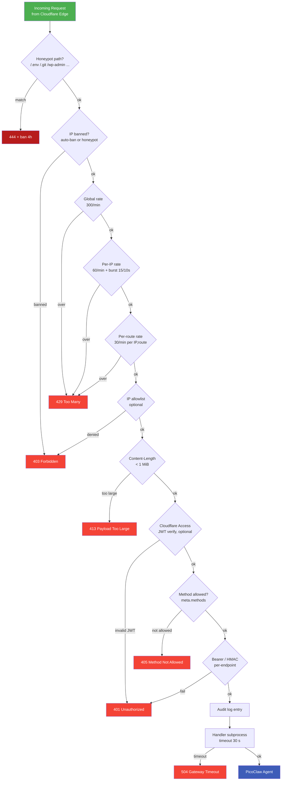

# 15 — Webhook Security & Activation

Complete guide for securing and activating the PicoClaw webhook server exposed via Cloudflare Tunnel.

---

## URL scheme

All user-created routes live under the short `/c/` prefix:

```
https://pico.yourdomain.com/c/<name>
```

The old `/custom/<name>` prefix is kept as a **308 Permanent Redirect** (preserves method + body) so any public link minted before the rename keeps working. New code should always write to `/c/`.

Route names are strictly validated: `^[a-z0-9][a-z0-9_-]{0,62}$`. Anything else is rejected by both `webhook-manage.sh` (at creation) and `webhook-server.py` (at request time) with `404`.

---

## Security Layers

Designed for an Android phone on a residential connection (Snapdragon 732G, 6 GB RAM) — every layer is tuned to stop abuse **before** it reaches the agent or spawns a subprocess.



### What each layer protects against

| # | Layer | Threat class mitigated |
|---|-------|------------------------|
| 0 | Honeypot bot trap | Automated scanners (`.env`, `.git`, `wp-admin`, `phpmyadmin`, `actuator`, `.aws/credentials`…) |
| 1 | IP ban list | Repeat offenders, brute-force, post-honeypot IPs |
| 2 | Global rate limit | Distributed floods, amplification, device-level DoS |
| 3 | Per-IP rate + 10-s burst | Single-source DoS, slow drip scrapers, Slowloris-style |
| 4 | Per-route rate | Targeted endpoint abuse (e.g. hammering one form) |
| 5 | IP allowlist | Only-these-sources should ever hit (webhooks from known CIDRs) |
| 6 | `Content-Length` cap (1 MiB) | Memory exhaustion via oversize POST; disk-fill via huge bodies |
| 7 | CF Access JWT | Public-URL hardening behind Zero-Trust identity |
| 8 | Method enforcement | Surface-area reduction (no `DELETE`/`PUT` unless declared in meta) |
| 9 | Bearer / HMAC | Authenticated origin, replay protection via HMAC |
| 10 | Audit log | Forensic trail, real-time abuse detection |
| 11 | Handler subprocess timeout | Runaway shell, fork-bomb inside handler, resource leak |
| — | Path-name regex | Path traversal, directory escape (`../`), symlink abuse |
| — | Hardening headers | XSS/clickjacking (X-Frame-Options, CSP, Referrer-Policy, Permissions-Policy, HSTS, X-Content-Type-Options) |

### Auto-ban policy

After **10 authentication failures (401/403) in 5 minutes** from the same IP, the IP is banned for **60 minutes**. A honeypot hit bans immediately for **4 hours**. Both defaults are tunable (`WEBHOOK_AUTH_FAIL_THRESHOLD`, `WEBHOOK_BAN_MINUTES`).

### Per-endpoint enforcement matrix

| Endpoint | Rate | Allowlist | CF Access | Bearer | HMAC / Token | Body cap | Method check |
|----------|:---:|:---------:|:---------:|:------:|:------------:|:--------:|:-----:|
| `GET /health` | ✗ | ✗ | ✗ | ✗ | ✗ | ✗ | ✗ |
| `GET /metrics` | ✗ | ✗ | ✗ | ✗ | ✗ | ✗ | ✗ |
| `POST /notify` | ✓ | ✓ | ✓ | ✓ | ✗ | ✓ | ✓ |
| `POST /hook/<name>` | ✓ | ✓ | ✓ | ✓ | ✓ (`WEBHOOK_HMAC_SECRET`) | ✓ | ✓ |
| `POST /hook/github/<event>` | ✓ | ✓ | ✓ | ✗ | ✓ (`X-Hub-Signature-256`) | ✓ | ✓ |
| `POST /hook/gitlab/<event>` | ✓ | ✓ | ✓ | ✗ | token (`X-Gitlab-Token`) | ✓ | ✓ |
| `* /c/<name>` (user-defined) | ✓ | ✓ | ✓ | ✓ (meta.auth_required) | per-handler | ✓ | ✓ (meta.methods) |
| `* /custom/<name>` | — | — | — | — | — | — | **308 redirect → `/c/<name>`** |

---

## Environment Variables

All variables live in `~/.picoclaw_keys` (chmod 600) on the device. The `webhook-start.sh` wrapper sources them before launching the server.

### Authentication

| Variable | Purpose | Generate |
|----------|---------|----------|
| `WEBHOOK_TOKEN` | Bearer token for `/notify` and `/hook/*` | `python3 -c 'import secrets; print(secrets.token_urlsafe(32))'` |
| `WEBHOOK_HMAC_SECRET` | HMAC-SHA256 for generic `/hook/*` | `python3 -c 'import secrets; print(secrets.token_hex(32))'` |
| `GITHUB_WEBHOOK_SECRET` | GitHub signature verification | Same as above |
| `GITLAB_WEBHOOK_TOKEN` | GitLab token header | Any string |
| `CF_ACCESS_AUD` | Cloudflare Access application AUD | From CF Zero Trust dashboard |
| `CF_ACCESS_TEAM` | Cloudflare Zero Trust team name | From CF dashboard |

### Network policy & limits (device-aware defaults)

| Variable | Default | Purpose |
|----------|---------|---------|
| `WEBHOOK_RATE_PER_IP` | `60` | Per-IP sliding-window rate (req/min) |
| `WEBHOOK_RATE_PER_ROUTE` | `30` | Per (IP, route) rate — stops targeted flooding |
| `WEBHOOK_RATE_GLOBAL` | `300` | Device-wide ceiling (req/min) — hard floor for the Redmi |
| `WEBHOOK_BURST_PER_IP` | `15` | Max requests from one IP in any 10-second window |
| `WEBHOOK_MAX_BODY` | `1048576` | Content-Length cap in bytes (1 MiB) |
| `WEBHOOK_HANDLER_TIMEOUT` | `30` | Subprocess timeout (s) — kills runaway handlers |
| `WEBHOOK_AUTH_FAIL_THRESHOLD` | `10` | Failed auth events before auto-ban |
| `WEBHOOK_BAN_MINUTES` | `60` | Ban duration (honeypot hits get 4×) |
| `WEBHOOK_IP_ALLOW` | *(none)* | Comma-separated allowlist (empty = all) |
| `WEBHOOK_TRUST_PROXY` | `0` | Set `1` **only** if the server sits behind CF — then reads `CF-Connecting-IP` / `X-Forwarded-For` |
| `PORT` | `18791` | Listen port (bound to `127.0.0.1` only) |

Why these values? On the target device (6 GB RAM, 8-core 732G, residential bandwidth) each legitimate submission fires a 50–300 ms handler plus an optional Telegram/RAG round-trip. The limits let a well-behaved caller burst a form submission flow (~3-5 requests/s) while a scraper or attacker is stopped within seconds.

---

## Complete Activation Flow

### Phase 1 — Device prep (one-time)

Already done by `install.sh` or `full_deploy.py`:

1. `cloudflared` binary installed at `~/bin/cloudflared`
2. `chromium` + `proot` installed (for headless browsing + cloudflared DNS workaround)
3. `webhook-server.py`, `webhook-start.sh`, `cloudflare-tool.sh` deployed to `~/bin/`
4. Boot script + watchdog configured to auto-restart webhook and tunnel

### Phase 2 — Cloudflare Tunnel setup

#### 2.1 Create tunnel in Cloudflare dashboard

1. Go to https://one.dash.cloudflare.com → **Zero Trust** → **Networks** → **Tunnels**
2. Click **Create a tunnel**
3. Select **Cloudflared**
4. Name it (e.g., `pico`)
5. **Copy the install token** (starts with `eyJhIjoi...`) — this is your `CLOUDFLARE_TUNNEL_TOKEN`

#### 2.2 Configure Public Hostname

On the same tunnel's **Public Hostname** tab:

| Field | Value |
|-------|-------|
| Subdomain | `pico` (or your choice) |
| Domain | `yourdomain.com` (select from dropdown — must be a CF-managed zone) |
| Type | `HTTP` |
| URL | `localhost:18791` |
| **HTTP Settings** → No TLS Verify | `ON` (localhost has no TLS) |
| **HTTP Settings** → HTTP2 connection | `ON` |

Click **Save hostname**. Cloudflare auto-creates the CNAME: `pico.yourdomain.com → <tunnel-id>.cfargotunnel.com`.

#### 2.3 Apply token to device

**Option A — from workstation via `.env`**:

```bash
# Edit .env
CLOUDFLARE_TUNNEL_TOKEN=eyJhIjoi...
WEBHOOK_PUBLIC_URL=https://pico.yourdomain.com

python scripts/full_deploy.py   # Applies automatically
```

**Option B — direct on device**:

```bash
~/bin/cloudflare-tool.sh token-set eyJhIjoi...
~/bin/cloudflare-tool.sh url-set https://pico.yourdomain.com
~/bin/cloudflare-tool.sh daemon
```

**Option C — from chat**:

> "Configura Cloudflare con el token eyJhIjoi..."

The agent runs `cloudflare-tool.sh token-set` and `daemon` automatically.

### Phase 3 — Security secrets

`install.sh` auto-generates random secrets on first install. If they need to be regenerated:

```bash
# On device (or via chat)
python3 -c "
import secrets
print('WEBHOOK_TOKEN=' + secrets.token_urlsafe(32))
print('WEBHOOK_HMAC_SECRET=' + secrets.token_hex(32))
print('GITHUB_WEBHOOK_SECRET=' + secrets.token_hex(32))
" >> ~/.picoclaw_keys

# Dedupe + restart webhook
~/bin/system-tool.sh restart webhook
```

### Phase 4 — Start services

All services auto-start on boot via `~/.termux/boot/start-picoclaw.sh`. Manual control:

```bash
~/bin/system-tool.sh start webhook          # Webhook server
~/bin/system-tool.sh start cloudflared      # Tunnel daemon
~/bin/system-tool.sh services               # Check all
```

The watchdog restarts any dropped service within 60 seconds.

### Phase 5 — Verify

```bash
# 1. Public /health (no auth required)
curl https://pico.yourdomain.com/health
# → {"status":"ok","uptime":"...","metrics":{...}}

# 2. Public /notify WITHOUT bearer (expect 401)
curl -X POST https://pico.yourdomain.com/notify \
  -H "Content-Type: application/json" \
  -d '{"text":"test"}'
# → 401 Unauthorized

# 3. Public /notify WITH bearer (expect 200 + agent response)
curl -X POST https://pico.yourdomain.com/notify \
  -H "Authorization: Bearer <YOUR_WEBHOOK_TOKEN>" \
  -H "Content-Type: application/json" \
  -d '{"text":"Hello from internet"}'
# → {"status":"processed","preview":"..."}

# 4. Generic hook with HMAC
BODY='{"event":"deploy","status":"success"}'
SECRET="<YOUR_WEBHOOK_HMAC_SECRET>"
SIG=$(echo -n "$BODY" | openssl dgst -sha256 -hmac "$SECRET" | awk '{print $2}')
curl -X POST https://pico.yourdomain.com/hook/deploy \
  -H "Authorization: Bearer <YOUR_WEBHOOK_TOKEN>" \
  -H "X-Signature-256: sha256=$SIG" \
  -H "Content-Type: application/json" \
  -d "$BODY"
```

---

## Integrating External Services

### GitHub webhooks

1. In your GitHub repo → **Settings** → **Webhooks** → **Add webhook**
2. **Payload URL**: `https://pico.yourdomain.com/hook/github/push` (or any event name)
3. **Content type**: `application/json`
4. **Secret**: paste the value of `GITHUB_WEBHOOK_SECRET` from your device
5. **SSL verification**: Enable
6. Select events → Save

PicoClaw verifies `X-Hub-Signature-256` and forwards to the agent with context `[GITHUB:<event>] <sender> on <repo>...`.

### GitLab webhooks

1. Project → **Settings** → **Webhooks**
2. **URL**: `https://pico.yourdomain.com/hook/gitlab/push`
3. **Secret token**: paste `GITLAB_WEBHOOK_TOKEN`
4. Select events → Save

PicoClaw validates the `X-Gitlab-Token` header match.

### Cloudflare Access (advanced — zero-trust)

For extra security, put the webhook behind Cloudflare Access (requires Zero Trust plan):

1. CF dashboard → **Zero Trust** → **Access** → **Applications** → **Add application**
2. Type: **Self-hosted**
3. Application domain: `pico.yourdomain.com`
4. Add policies (email, SSO, IP rules)
5. Note the **Application Audience (AUD) Tag** and **Team domain**

On device:

```bash
echo 'CF_ACCESS_AUD=<aud-tag>' >> ~/.picoclaw_keys
echo 'CF_ACCESS_TEAM=<team-name>' >> ~/.picoclaw_keys
~/bin/system-tool.sh restart webhook
```

Now the webhook also verifies the `Cf-Access-Jwt-Assertion` header on every request.

### Uptime monitoring (UptimeRobot, Healthchecks.io)

Configure a monitor hitting `GET /health` — it's public and returns 200 when the gateway + webhook are alive. Agent calls are counted in `/metrics` (Prometheus format) for Grafana integration.

---

## Abuse & Exfiltration Controls

### Response hardening headers

Every response (including legacy redirects and error pages) carries:

```
Strict-Transport-Security: max-age=31536000; includeSubDomains
X-Content-Type-Options: nosniff
X-Frame-Options: DENY
Referrer-Policy: no-referrer
Permissions-Policy: camera=(), microphone=(), geolocation=(), payment=()
Cross-Origin-Opener-Policy: same-origin
Content-Security-Policy: default-src 'self'; frame-ancestors 'none'; base-uri 'none'
Server: picoclaw
```

Clickjacking, MIME-sniff, origin-leak, cross-origin popup and credentials-over-HTTP attacks are blocked. CSP can be relaxed per-handler if the form needs to embed external assets (the handler can set its own headers).

### Preventing data exfiltration

- **Handler stdout is sanitized**: JSON-looking responses are only sent with `application/json` if they actually parse. HTML is flagged explicitly. Everything else ships as `text/plain` — nothing can smuggle its own Content-Type.
- **Body logging is off by default**: `webhook-audit.log` stores only event names, sizes, IPs and timestamps — never request bodies, so a form leak cannot be replayed from disk.
- **Bound filesystem access**: `/c/<name>` resolves the route directory with `Path.resolve()` and rejects anything outside `~/.picoclaw/webhooks/` — path traversal via name (`../../etc/passwd`) is impossible at two levels (regex + canonical check).
- **No shell interpolation of request data**: `handler.sh` receives body on `stdin` and request metadata on `env` / `argv`, never built into a shell command string.
- **Secrets never echoed**: Bearer tokens are compared with `hmac.compare_digest()` (constant-time); HMAC is compared the same way. The root `/` endpoint advertises *which* security layers are enabled but never the values.
- **Metrics are numeric only**: `/metrics` exposes counts, not request details — safe to leave public.

### Honeypot (bot trap)

Any request to any of these paths is instantly dropped with `444` (no response) and the source IP is banned for 4 hours:

```
/.env  /.env.local  /.env.production
/.git/config  /.git/HEAD
/wp-admin  /wp-login.php  /wp-config.php  /wordpress
/phpmyadmin  /phpMyAdmin  /pma  /admin.php  /administrator
/xmlrpc.php  /.aws/credentials  /config.yml  /config/database.yml
/server-status  /.DS_Store  /.htaccess  /.htpasswd
/actuator  /actuator/env  /actuator/health  /actuator/heapdump
/jenkins  /manager/html  /solr  /druid  /eureka
/api/v1/pods  /console  /swagger.json
```

And any path starting with `/cgi-bin/`, `/vendor/`, `/.aws/`, `/.ssh/`, `/boaform/`.

The list is in `utils/webhook-server.py` (`HONEYPOT_PATHS` / `HONEYPOT_PREFIXES`). A single honeypot hit both stops the scanner mid-sweep and immunizes the server against whatever follow-up the scanner was going to try.

### DoS budget (Redmi Note 10 Pro)

Every check above happens **before** any subprocess, filesystem read, or outbound call. In the worst case (max burst of legitimate traffic: 15 req / 10 s per IP × 300 req / min global × 1 MiB each) the server caps at ~5 MB/s ingest and ~10 concurrent subprocesses — well within the device's thermal and memory envelope. A flood past the caps is rejected with a plain `429 Retry-After` at the Flask layer, long before Termux starts swapping.

### Kill switch

```bash
# Temporarily close everything but /health and /metrics
~/bin/system-tool.sh stop webhook          # Drop the server
~/bin/cloudflare-tool.sh stop              # Drop the tunnel
# -- or keep server up but close to the world --
WEBHOOK_IP_ALLOW=127.0.0.1 ~/bin/system-tool.sh restart webhook
```

---

## Operational Security

### Rotation

```bash
# Rotate webhook bearer token
NEW=$(python3 -c 'import secrets; print(secrets.token_urlsafe(32))')
sed -i "s|^WEBHOOK_TOKEN=.*|WEBHOOK_TOKEN=\"$NEW\"|" ~/.picoclaw_keys
~/bin/system-tool.sh restart webhook
echo "New token: $NEW"
# Update your external callers with the new token
```

### Audit log

All requests are logged as JSON-Lines at `~/webhook-audit.log`:

```json
{"ts":"2026-04-13T05:11:15+00:00","event":"hook","ip":"1.2.3.4","detail":{"name":"deploy","size":128}}
{"ts":"2026-04-13T05:11:16+00:00","event":"denied_bearer","ip":"9.9.9.9","detail":{"name":"test"}}
{"ts":"2026-04-13T05:11:17+00:00","event":"rate_limited","ip":"9.9.9.9","detail":{}}
```

```bash
# Analyze from device
~/bin/audit-log.sh tail 50
~/bin/audit-log.sh search denied
~/bin/audit-log.sh stats
```

### Metrics

```bash
curl https://pico.yourdomain.com/metrics
# webhook_requests_total 42
# webhook_agent_calls 18
# webhook_rate_limited 0
# webhook_agent_timeouts 0
```

Scrape this from Prometheus for dashboards.

### Key storage

- `~/.picoclaw_keys` — chmod 600, sourced by webhook-start.sh
- `~/.cloudflared/token` — chmod 600, CF tunnel only
- `~/.cloudflared/webhook-url` — chmod 600, public URL
- NEVER committed to git (all git-ignored)

---

## Full System Status Check

```bash
# One-command health check (from device)
~/bin/system-tool.sh health

# Expected output:
# PicoClaw:    0.2.6
# Node:        v24.14.1
# Python:      3.13.13
# Go:          go1.26.1
# cloudflared: cloudflared version 2026.3.0
# chromium:    Chromium 146.0.7680.177
#
# [OK] sshd
# [OK] crond
# [OK] tmux
# [OK] cloudflared
# [OK] picoclaw-gateway
# [OK] webhook-server
```

---

## Troubleshooting

| Symptom | Cause | Fix |
|---------|-------|-----|
| `NXDOMAIN` on public URL | Public Hostname not configured | Add it in CF tunnel's Public Hostname tab |
| `HTTP 530 1033` | Tunnel not running on device | `~/bin/system-tool.sh restart cloudflared` |
| `HTTP 401` on all requests | Missing `Authorization: Bearer` | Send `-H "Authorization: Bearer $WEBHOOK_TOKEN"` |
| `HTTP 401` on hooks with signature | HMAC mismatch | Verify secret + correct header (`X-Signature-256` or `X-Hub-Signature-256`) |
| `HTTP 429` | Rate limit exceeded | Lower call rate or raise `WEBHOOK_RATE_PER_IP` / `WEBHOOK_RATE_GLOBAL` |
| `HTTP 413` | Body > 1 MiB | Raise `WEBHOOK_MAX_BODY` or chunk uploads on the client |
| `HTTP 405` | Method not in `meta.methods` | `~/bin/webhook-manage.sh methods <name> GET,POST` |
| `HTTP 504` (handler) | Handler took >30 s | Raise `WEBHOOK_HANDLER_TIMEOUT` or make handler async |
| `HTTP 504` (agent) | Agent took >120s to respond | Check gateway.log; LLM may be slow |
| `HTTP 403` recurring | IP auto-banned after auth failures | Wait `WEBHOOK_BAN_MINUTES` or restart webhook to clear |
| `HTTP 444` / silent close | Honeypot hit | Stop scanning `.env`/`.git`/`wp-*` — those paths are booby-trapped |
| `/custom/*` now returns 308 | Legacy prefix redirects to `/c/*` | Update the client to the new short prefix |
| Tunnel keeps disconnecting | Termux cron not running | `~/bin/system-tool.sh start crond` |

---

## Quick Reference

```bash
# === Activation (one-time) ===
# 1. Create tunnel + public hostname in CF dashboard
# 2. Apply:
~/bin/cloudflare-tool.sh token-set eyJ...
~/bin/cloudflare-tool.sh url-set https://pico.yourdomain.com
~/bin/cloudflare-tool.sh daemon

# === Public endpoints ===
GET  /health                   (public)
GET  /metrics                  (public, Prometheus)
POST /notify                   (Bearer)
POST /hook/<name>              (Bearer + optional HMAC)
POST /hook/github/<event>      (HMAC X-Hub-Signature-256)
POST /hook/gitlab/<event>      (X-Gitlab-Token)
*    /c/<name>                 (user-defined; per-route auth + method list)
*    /custom/<name>            (legacy; 308 redirects to /c/<name>)

# === Diagnostics ===
~/bin/system-tool.sh services  # service status
~/bin/system-tool.sh health    # full health
~/bin/audit-log.sh tail        # recent requests
~/bin/cloudflare-tool.sh url   # current public URL
~/bin/cloudflare-tool.sh logs  # tunnel logs

# === Security ops ===
~/bin/cloudflare-tool.sh token-set <new>   # rotate tunnel
~/bin/system-tool.sh restart webhook       # apply env changes
```

---

<p align="center">
  <a href="14-self-administration.md">&larr; Self-Administration</a>
  &nbsp;&nbsp;|&nbsp;&nbsp;
  <a href="../README.md">README</a>
</p>
