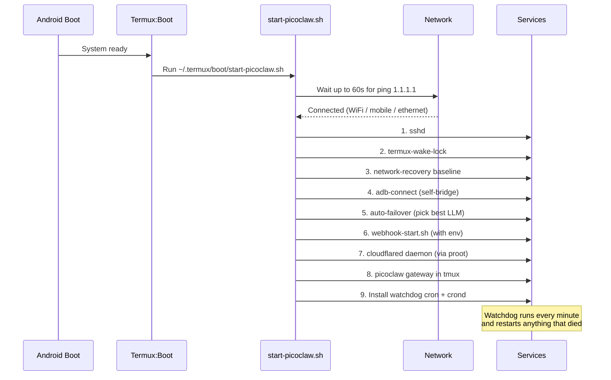

# 16 — Resilience & Dynamic Webhooks

Complete guide to reboot resilience, multi-network operation, and agent-driven runtime creation of webhooks/forms.

---

## Full Reboot Resilience

After a device power-cycle, every service recovers automatically in this order:



### What survives a reboot

| Component | How it persists | Recovery time |
|-----------|----------------|---------------|
| **SSH daemon** | `sshd` auto-start in `start-picoclaw.sh` | ~5s after boot |
| **ADB self-bridge** | `adb-connect.sh` tries port 5555 + scan | ~10s |
| **PicoClaw gateway** | tmux session `picoclaw` recreated | ~15s |
| **Webhook server** | tmux session `webhook` with env from `~/.picoclaw_keys` | ~15s |
| **Cloudflare Tunnel** | `cloudflared daemon` from `~/.cloudflared/token` | ~20s (+DNS propagation if needed) |
| **Cron jobs** | crontab persisted by Termux | Immediate |
| **RAG memory** | SQLite file at `~/.picoclaw/workspace/knowledge/rag.db` | Immediate |
| **Custom webhooks** | `~/.picoclaw/webhooks/<name>/` | Immediate (served on first request) |
| **All secrets** | `~/.picoclaw_keys` chmod 600 | Immediate |

### Network resilience (WiFi / Mobile / Ethernet)

`network-recovery.sh` runs every minute via watchdog:

```bash
~/bin/network-recovery.sh status
# === Network status ===
# Interface: wlan0 192.168.1.101
# Type:      wifi(MyHome5G)
# Online:    yes
```

When the connection type changes (e.g., you leave WiFi and switch to mobile data):
- New interface detected
- ADB self-bridge reconnected (localhost-based, survives IP changes)
- Cloudflare Tunnel auto-reconnects (its own internal logic — 4 parallel connections)
- Gateway keeps running (no need to restart)
- Notification sent to the device

### Wireless Debugging persistence

After a reboot, wireless debugging is off by default unless enabled in Developer Options → **Wireless Debugging**. With that ON, the ADB TCP service persists and the self-bridge reconnects automatically via `adb connect localhost:5555`.

If the user's phone doesn't auto-start wireless debugging:
- `grant-permissions.sh` runs `adb tcpip 5555` (survives until reboot)
- On reboot, the watchdog tries `adb-connect.sh` which scans ports — if the daemon isn't listening, ADB features degrade gracefully
- The user can re-pair via wireless debugging in 30 seconds if needed

---

## Dynamic Webhooks & Forms (Create from Chat)

The agent can create HTTP endpoints and HTML forms at runtime. No server restart, no code change — just add a directory in `~/.picoclaw/webhooks/<name>/`.

> **URL shape**: every user-defined route is served under `/c/<name>` (short prefix). The old `/custom/<name>` path still works as a `308 Permanent Redirect` so public links minted before the rename keep functioning.
>
> **Name rules**: `^[a-z0-9][a-z0-9_-]{0,62}$` — lowercase alphanumerics, underscore, hyphen, 1–63 chars, cannot start with a hyphen. Anything else is rejected at both creation and request time.

### Example conversations

#### 1. Create a contact form

> User: "Créame un formulario de contacto con nombre, email y mensaje"
>
> Agent:
> ```bash
> cat > /tmp/form.html << 'HTML'
> <!DOCTYPE html>
> <html><head><title>Contact</title></head>
> <body><h1>Contacto</h1>
> <form method="POST">
>   <input name="name" placeholder="Nombre" required><br>
>   <input name="email" type="email" placeholder="Email" required><br>
>   <textarea name="message" placeholder="Mensaje" required></textarea><br>
>   <button>Enviar</button>
> </form></body></html>
> HTML
> ~/bin/webhook-manage.sh create-form contact /tmp/form.html
> ```
>
> Agent: "Formulario creado. URL pública: https://pico.carrillo.app/c/contact
> Los envíos se guardan en `~/.picoclaw/webhooks/contact/data.jsonl`.
> Para ver los envíos: `~/bin/webhook-manage.sh data contact`"

#### 2. Create a logging webhook

> User: "Haz un webhook que registre todos los eventos de GitHub Actions en un archivo"
>
> Agent:
> ```bash
> HANDLER='cat >> ~/github-actions.log; echo \"{\\\"ok\\\":true}\"'
> ~/bin/webhook-manage.sh create-route gh-actions "$HANDLER" on
> ```
>
> Agent: "Webhook creado con autenticación Bearer.
> URL: `https://pico.carrillo.app/c/gh-actions`
> Configura el webhook de GitHub Actions con:
>   - URL: https://pico.carrillo.app/c/gh-actions
>   - Secret: (tu WEBHOOK_TOKEN)
>   - Header: Authorization: Bearer \<token\>
> Logs en `~/github-actions.log`"

#### 3. Create a custom API endpoint

> User: "Necesito un endpoint que reciba JSON con una lista de tareas y las agregue a la base de conocimiento"
>
> Agent:
> ```bash
> HANDLER='python3 -c "
> import sys, json, subprocess
> data = json.loads(sys.stdin.read())
> for task in data.get(\"tasks\", []):
>     subprocess.run([\"/data/data/com.termux/files/home/bin/rag-tool.sh\", \"add-text\", f\"task-{task[\\\"id\\\"]}\", task[\"description\"]])
> print(json.dumps({\"indexed\": len(data.get(\"tasks\", []))}))
> "'
> ~/bin/webhook-manage.sh create-route add-tasks "$HANDLER" on
> ```
>
> Agent: "Endpoint creado: https://pico.carrillo.app/c/add-tasks
> POST JSON con `{\"tasks\":[{\"id\":1,\"description\":\"...\"}]}` y se indexan en RAG."

### Storage layout

```
~/.picoclaw/webhooks/
├── contact/
│   ├── form.html           # Served on GET
│   ├── handler.sh          # Executed on POST
│   ├── data.jsonl          # Form submissions
│   └── meta.json           # Route config
├── gh-actions/
│   ├── handler.sh
│   └── meta.json
└── add-tasks/
    ├── handler.sh
    └── meta.json
```

### Handler protocol

Each `handler.sh` receives:
- **stdin**: request body (text, JSON, or URL-encoded)
- **env**: `REQUEST_METHOD`, `REQUEST_PATH`, `REMOTE_ADDR`, `QUERY_STRING`, `CONTENT_TYPE`
- **argv**: `$1 = QUERY_STRING`

The handler writes the response to **stdout**. Content-Type is auto-detected:
- Starts with `<!DOCTYPE` or `<html` → `text/html`
- Starts with `{` or `[` → `application/json`
- Otherwise → `text/plain`

Exit code 0 → HTTP 200. Non-zero → HTTP 500.

### Management commands

The agent has a complete CRUD API for every custom route or form. Every mutating command auto-reloads the webhook server (`pkill -HUP`) so changes take effect immediately.

```bash
# --- Creation ---
~/bin/webhook-manage.sh create-route <name> <handler-script-or-inline> [on|off]
~/bin/webhook-manage.sh create-form  <name> <html-file-or-inline>
~/bin/webhook-manage.sh clone        <existing> <new-name>    # Copy + wipe submissions

# --- Inspection ---
~/bin/webhook-manage.sh list                                   # All routes with type/auth/count
~/bin/webhook-manage.sh show    <name>                         # Meta + handler + form
~/bin/webhook-manage.sh data    <name>                         # Last 10 submissions (pretty JSON)
~/bin/webhook-manage.sh url     <name>                         # Public URL
~/bin/webhook-manage.sh stats   <name>                         # Count + last timestamp + size

# --- Modification ---
~/bin/webhook-manage.sh update-html    <name> <html-file-or-inline>   # Snapshots previous
~/bin/webhook-manage.sh update-handler <name> <script-or-inline>      # Snapshots previous
~/bin/webhook-manage.sh rename         <old>  <new>                   # Changes public URL
~/bin/webhook-manage.sh auth           <name> on|off                  # Bearer auth toggle
~/bin/webhook-manage.sh methods        <name> GET,POST,DELETE         # Allowed HTTP verbs

# --- Deletion ---
~/bin/webhook-manage.sh remove     <name>                      # Tar.gz backup + remove
~/bin/webhook-manage.sh clear-data <name>                      # Archive data.jsonl, keep route
```

**Backups**: `remove` saves `~/.picoclaw/backups/webhook-<name>-<ts>.tar.gz`. `update-html` / `update-handler` keep `*.bak-<ts>` next to the file. `clear-data` archives as `data.jsonl.archived-<ts>`.

**Universal form handler** (`~/bin/form-handler.sh`): Every form created with `create-form` uses this shared script so behavior is consistent and updating the script updates every form. It does four things on POST:

1. Writes the submission to `data.jsonl`
2. Indexes it into RAG with `doc_id = form:<name>:<timestamp>` so the agent can recall it
3. Fires an Android notification (`termux-notification`)
4. Sends a Telegram message to the first allowed owner with the parsed fields

### Security per route

Each route's `meta.json` has `auth_required: true|false`. When `true`, the request must include `Authorization: Bearer <WEBHOOK_TOKEN>`. When `false`, the route is public (ideal for forms).

All routes share the global security layers (rate limit, IP allowlist, CF Access JWT). Custom routes can also implement their own auth inside the handler if needed.

---

## Full Control from Chat

The agent has complete write access to all these tools via `exec`. Examples of what the user can ask:

| Request | Agent action |
|---------|-------------|
| "Crea un formulario de feedback" | `create-form feedback ...` |
| "Quiero una URL que me devuelva mi IP" | `create-route myip 'curl -s icanhazip.com' off` |
| "Agrega un endpoint para logs de servidor" | `create-route serverlog 'tee -a ~/server.log' on` |
| "Muéstrame los envíos del formulario de contacto" | `webhook-manage.sh data contact` |
| "Elimina el webhook 'test'" | `webhook-manage.sh remove test` |
| "Hazlo público (sin auth)" | `webhook-manage.sh auth <name> off` |
| "Publica un script que uso diariamente como webhook" | Writes script + `create-route <name> <script>` |
| "Instala paquete X y crea un webhook que lo use" | `system-tool.sh pkg install X` + `create-route` |
| "Dame el URL para compartir" | `webhook-manage.sh url <name>` |
| "Cambia la URL de `contact` a `contacto`" | `webhook-manage.sh rename contact contacto` |
| "Actualiza el HTML del formulario de contacto" | `webhook-manage.sh update-html contact /tmp/new.html` |
| "Limpia las submisiones del formulario viejo" | `webhook-manage.sh clear-data contact` |
| "Cuántas submisiones ha tenido el formulario?" | `webhook-manage.sh stats contact` |
| "Duplica este formulario con otro nombre" | `webhook-manage.sh clone contact contact-prod` |
| "Permite solo POST en este endpoint" | `webhook-manage.sh methods api POST` |

### Self-hosting anything

Since handlers are shell scripts, the agent can expose:
- API proxies (curl-wrapped external APIs)
- Database queries (`sqlite3`)
- Python/Node scripts
- File uploads/downloads
- Image processing (ImageMagick/ffmpeg piped)
- LLM calls (yes, a custom route can invoke the agent recursively)

All with Cloudflare-level DDoS protection, your choice of auth, and zero extra infrastructure.

---

## Quick Reference

```bash
# === Resilience ===
~/bin/network-recovery.sh status           # Current interface + connectivity
~/bin/network-recovery.sh interfaces       # All active interfaces
~/bin/watchdog.sh                          # Run all recovery checks once
~/bin/system-tool.sh services              # Service health

# === Dynamic webhooks (full CRUD) ===
~/bin/webhook-manage.sh create-form    <name> <html>
~/bin/webhook-manage.sh create-route   <name> <handler> [on|off]
~/bin/webhook-manage.sh clone          <src> <new>
~/bin/webhook-manage.sh list / show / data / url / stats <name>
~/bin/webhook-manage.sh update-html    <name> <html>
~/bin/webhook-manage.sh update-handler <name> <script>
~/bin/webhook-manage.sh rename         <old> <new>
~/bin/webhook-manage.sh auth           <name> on|off
~/bin/webhook-manage.sh methods        <name> GET,POST
~/bin/webhook-manage.sh clear-data     <name>
~/bin/webhook-manage.sh remove         <name>

# === Network flow ===
# After reboot (no user action needed):
# 1. start-picoclaw.sh waits for network (ping 1.1.1.1, max 60s)
# 2. All services start in correct order
# 3. watchdog recovers anything that fails within 60s
# 4. network-recovery detects WiFi/mobile/ethernet changes
```

---

<p align="center">
  <a href="15-webhook-security.md">&larr; Webhook Security</a>
  &nbsp;&nbsp;|&nbsp;&nbsp;
  <a href="../README.md">README</a>
</p>
