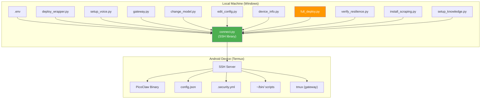

# Scripts

Python scripts for managing the PicoClaw device remotely from a workstation (Windows, macOS, Linux). All scripts communicate with the Android device over SSH using `paramiko`.

---

## Prerequisites

```bash
pip install paramiko python-dotenv
```

All scripts read connection credentials from `../.env`. Copy `../.env.example` to `../.env` and fill in your values before running.

---

## Script Architecture



---

## Available Scripts

### `connect.py` -- SSH Connection Helper

Reusable connection module and quick CLI for running commands on the device.

**As a CLI**:

```bash
# Run any command on the device
python scripts/connect.py "uname -a"
python scripts/connect.py "ls -la ~/bin/"
python scripts/connect.py "cat /proc/cpuinfo | head -20"

# Built-in shortcuts
python scripts/connect.py status                    # PicoClaw status
python scripts/connect.py agent '"Hello"'           # Send message to agent
```

**As a library** (used by all other scripts):

```python
from connect import connect, run

ssh = connect()                          # Returns paramiko.SSHClient
out, err = run(ssh, './picoclaw status 2>&1')
print(out)
ssh.close()
```

**Functions exported**:
- `connect()` -- Establishes SSH connection using `.env` credentials. Returns `SSHClient`.
- `run(ssh, cmd, timeout=30)` -- Executes command, returns `(stdout, stderr)` as strings.

---

### `change_model.py` -- Switch LLM Model

Changes the active model in all 3 required `config.json` locations on the device.

```bash
# List all available Ollama Cloud models
python scripts/change_model.py --list

# Switch to a different model
python scripts/change_model.py deepseek-v3.2
python scripts/change_model.py qwen3-coder:480b
python scripts/change_model.py kimi-k2.5
```

**What it does**:
1. Connects to device via SSH.
2. Reads current `config.json`.
3. Updates `agents.defaults.model_name`, `model_list[N].model_name`, and `model_list[N].model`.
4. Writes updated config back.
5. Runs `picoclaw status` to verify.
6. Optionally tests with a quick agent message.

---

### `deploy_wrapper.py` -- Deploy TLS Wrapper

Installs (or re-installs) the SSL wrapper script, shell profiles, and verifies the setup. **Idempotent** -- safe to run multiple times.

```bash
python scripts/deploy_wrapper.py
```

**What it does**:
1. Checks if `~/picoclaw` is already a wrapper or the raw binary.
2. Renames binary to `~/picoclaw.bin` (if needed).
3. Creates wrapper at `~/picoclaw` that sets `SSL_CERT_FILE`.
4. Copies wrapper to `~/bin/picoclaw` for PATH access.
5. Creates `~/.bash_profile` and updates `~/.bashrc`.
6. Creates `/usr/etc/profile.d/ssl-certs.sh`.
7. Runs `picoclaw status` to verify.

---

### `device_info.py` -- Full Device Diagnostic

Prints a comprehensive report covering hardware, software, PicoClaw status, config summary, installed skills, API connectivity, and more.

```bash
python scripts/device_info.py
```

**Report sections**: Device hardware, Android version, Termux packages, PicoClaw version and config, installed skills, enabled tools, active channels, API health, disk usage, network state.

---

### `edit_config.py` -- Remote Config Editor

Read and modify PicoClaw's `config.json` on the device without manual SSH.

```bash
# Dump current config summary (API keys masked)
python scripts/edit_config.py

# Get a specific field (dot-notation path)
python scripts/edit_config.py get agents.defaults.model_name
python scripts/edit_config.py get channels.telegram.enabled
python scripts/edit_config.py get tools.exec.allow_remote

# Set a specific field
python scripts/edit_config.py set agents.defaults.model_name "glm-5"
python scripts/edit_config.py set tools.exec.allow_remote true

# Enable a tool
python scripts/edit_config.py enable-tool exec
python scripts/edit_config.py enable-tool read_file
python scripts/edit_config.py enable-tool web

# Enable a messaging channel
python scripts/edit_config.py enable-channel telegram
python scripts/edit_config.py enable-channel whatsapp
```

---

### `gateway.py` -- Gateway Management

Start, stop, restart, and monitor the PicoClaw gateway process (Telegram, WhatsApp, etc.) running in a tmux session on the device.

```bash
python scripts/gateway.py start       # Start in persistent tmux session
python scripts/gateway.py stop        # Stop the gateway
python scripts/gateway.py restart     # Restart (stop + start)
python scripts/gateway.py status      # Check if running
python scripts/gateway.py logs        # Show recent gateway logs
python scripts/gateway.py logs -f     # Follow logs in real-time
```

**How it works**:
- Creates/manages a `tmux` session named `picoclaw` on the device.
- The gateway process runs `picoclaw.bin gateway` inside that session.
- Logs go to `~/.picoclaw/gateway.log`.
- Survives SSH disconnects (runs in tmux).

---

### `setup_voice.py` -- Configure Voice Transcription

Deploys and configures the Groq Whisper STT pipeline on the device.

```bash
python scripts/setup_voice.py            # Deploy + configure
python scripts/setup_voice.py --status   # Check current voice config
```

**What it does**:
1. Deploys `~/bin/transcribe.sh` to the device.
2. Configures Groq API key in `config.json` and `~/.picoclaw_keys`.
3. Enables `tools.exec.allow_remote: true` (required for voice to work on Telegram).
4. Verifies voice instructions exist in AGENT.md.

---

### `full_deploy.py` -- Complete Automated Deployment

Runs all 10 deployment steps in sequence for a complete setup or refresh.

```bash
python scripts/full_deploy.py
```

**Steps**:

| Step | Description |
| ---- | ----------- |
| 1 | Install all required Termux packages |
| 2 | Check storage access |
| 3 | Deploy all `utils/` files to device |
| 4 | Generate AGENT.md with device context |
| 5 | Verify config.json |
| 6 | Verify security.yml |
| 7 | Test transcribe.sh |
| 8 | Test PicoClaw binary |
| 9 | Clear sessions + restart gateway |
| 10 | End-to-end agent test |

This is the recommended way to set up a fresh device or recover from misconfiguration.

---

### `verify_resilience.py` -- 8-Phase Resilience Verification

Runs an end-to-end resilience test across 8 phases to confirm the system will survive failures, reboots, and crashes.

```bash
python scripts/verify_resilience.py
```

**Phases**:

| Phase | What It Tests |
| ----- | ------------- |
| 1 | Baseline state: sshd, gateway, tmux, ADB, crond, watchdog cron, boot script |
| 2 | Kill gateway + tmux → run watchdog → confirm gateway auto-recovered |
| 3 | Disconnect ADB bridge → run watchdog → confirm ADB auto-reconnected |
| 4 | Boot script content checks (9 required elements) |
| 5 | Watchdog script content checks (8 required elements) |
| 6 | Telegram gateway health (checks gateway log for active channels) |
| 7 | Watchdog log review (recent restart events) |
| 8 | Final state: all 7 services re-verified |

Exits with a clear `ALL CHECKS PASSED` or `SOME CHECKS FAILED` summary.

---

### `setup_knowledge.py` -- Create Knowledge Base

Creates the knowledge base directory on the device and adds voice + knowledge instructions to AGENT.md.

```bash
python scripts/setup_knowledge.py
```

**What it does**:
1. Creates `~/.picoclaw/workspace/knowledge/` on the device.
2. Adds a knowledge base section to AGENT.md (so the LLM knows to write there when the user says "guarda el contexto").

Knowledge files are `.md` files searchable via `grep` and the `filesystem` MCP server.

---

### `install_scraping.py` -- Install Web Scraping Stack

Installs all Python and Node.js web scraping dependencies on the device.

```bash
python scripts/install_scraping.py
```

**What it installs**:

| Step | Packages |
| ---- | -------- |
| 1 (Python, fast) | `httpx`, `parsel`, `feedparser`, `fake-useragent`, `cloudscraper`, `trafilatura`, `playwright` |
| 2 (Python, compiled, background) | `lxml`, `readability-lxml`, `newspaper4k`, `selectolax` |
| 3 (Node.js) | `puppeteer-core`, `cheerio` |
| 4 | Verification: lists all installed packages |

Compile-heavy packages (`lxml`, etc.) run in the background. Check progress with:

```bash
make ssh CMD="cat /tmp/pip_compile.log"
```

---

## Makefile Integration

All scripts have corresponding Makefile targets:

| Script | Makefile Target |
| ------ | --------------- |
| `connect.py status` | `make status` |
| `connect.py "cmd"` | `make ssh CMD="cmd"` |
| `device_info.py` | `make info` |
| `change_model.py --list` | `make models` |
| `change_model.py <M>` | `make model M=<M>` |
| `deploy_wrapper.py` | `make deploy` |
| `setup_voice.py` | `make setup-voice` |
| `setup_voice.py --status` | `make voice-status` |
| `gateway.py start` | `make gateway-start` |
| `gateway.py stop` | `make gateway-stop` |
| `gateway.py restart` | `make gateway-restart` |
| `gateway.py status` | `make gateway-status` |
| `gateway.py logs` | `make gateway-logs` |
| `gateway.py logs -f` | `make gateway-follow` |
| `edit_config.py` | `make config` |
| `edit_config.py get K` | `make config-get K=<key>` |
| `edit_config.py set K V` | `make config-set K=<key> V=<val>` |
| `edit_config.py enable-tool T` | `make enable-tool T=<tool>` |
| `edit_config.py enable-channel C` | `make enable-channel C=<channel>` |
| `verify_resilience.py` | `make verify` |
| `install_scraping.py` | `make install-scraping` |
| `setup_knowledge.py` | `make setup-knowledge` |

---

## Windows Encoding Notes

PicoClaw outputs emoji and ANSI escape codes that break Windows' default cp1252 encoding. All scripts handle this internally, but if you run paramiko commands directly, always set:

```bash
PYTHONIOENCODING=utf-8 python -u your_script.py
```

Or in Python:

```python
if sys.platform == 'win32' and hasattr(sys.stdout, 'reconfigure'):
    sys.stdout.reconfigure(encoding='utf-8', errors='replace')
```
