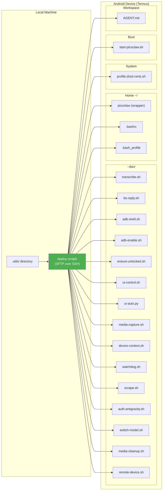

# Utils

Device-side files that are deployed to the Android/Termux device. These are the canonical copies kept under version control for disaster recovery, fresh deployments, and auditing.

---

## File Inventory

| File | Deployed To (on device) | Purpose |
| ---- | ----------------------- | ------- |
| `picoclaw-wrapper.sh` | `~/picoclaw` | TLS wrapper: sets `SSL_CERT_FILE` before exec-ing the Go binary |
| `transcribe.sh` | `~/bin/transcribe.sh` | STT with provider cascade: Azure Whisper -> Groq Whisper |
| `tts-reply.sh` | `~/bin/tts-reply.sh` | TTS with provider cascade: Azure TTS -> Edge TTS (4 voices) |
| `adb-shell.sh` | `~/bin/adb-shell.sh` | Execute commands with ADB shell privileges (uid=2000) |
| `adb-enable.sh` | `~/bin/adb-enable.sh` | Re-enable ADB TCP and reconnect loopback if connection lost |
| `ensure-unlocked.sh` | `~/bin/ensure-unlocked.sh` | Auto-unlock screen: wake + swipe + PIN entry + verify |
| `ui-control.sh` | `~/bin/ui-control.sh` | 40+ UI automation commands (Bash): tap, swipe, type, apps, settings |
| `ui-auto.py` | `~/bin/ui-auto.py` | Advanced UI automation (Python): XML parsing, element finding, waits |
| `media-capture.sh` | `~/bin/media-capture.sh` | Unified media capture: photo, audio, screenshot, screenrecord, sensors |
| `device-context.sh` | `~/bin/device-context.sh` | Generates AGENT.md with full device hardware/software/capability context |
| `boot-picoclaw.sh` | `~/.termux/boot/start-picoclaw.sh` | Auto-start on boot: sshd + wake-lock + ADB TCP + gateway in tmux |
| `grant-permissions.sh` | Run from host PC via ADB | Grants 44 runtime permissions + 17 appops to Termux packages |
| `ssl-certs.sh` | `/usr/etc/profile.d/ssl-certs.sh` | System-wide `SSL_CERT_FILE` export for all login shells |
| `bashrc` | `~/.bashrc` | Shell config: sshd auto-start, SSL fix, PATH |
| `bash_profile` | `~/.bash_profile` | Sources `.bashrc` for login shells |
| `AGENT.md` | `~/.picoclaw/workspace/AGENT.md` | Reference copy of agent persona (device-context.sh generates the live version); includes knowledge base instructions |
| `watchdog.sh` | `~/bin/watchdog.sh` | Cron-driven watchdog: monitors and auto-restarts sshd, gateway, ADB bridge, and wake lock every minute |
| `scrape.sh` | `~/bin/scrape.sh` | Universal web scraping tool with method cascade: curl+BS4 → Node/cheerio → raw HTML; supports screenshots and link extraction |
| `auth-antigravity.sh` | `~/bin/auth-antigravity.sh` | Google OAuth flow for Antigravity (Gemini) provider; preserves config.json model priority after auth |
| `switch-model.sh` | `~/bin/switch-model.sh` | Hot-swap LLM model from chat or CLI across all 25 models with aliases and recommendations |
| `media-cleanup.sh` | `~/bin/media-cleanup.sh` | Hourly cron job: deletes temp media files (screenshots, recordings, TTS audio) older than 60 minutes |
| `remote-device.sh` | `~/bin/remote-device.sh` | USB OTG device control: Android (ADB), Raspberry Pi (SSH), USB storage, USB Ethernet |
| `notifications.sh` | `~/bin/notifications.sh` | Read device notifications via ADB dumpsys (no listener permission needed) |
| `detect-ip.sh` | `~/bin/detect-ip.sh` | Auto-detect device IP via 5 methods (Termux:API, ADB, ifconfig, ip, getprop) |
| `adb-connect.sh` | `~/bin/adb-connect.sh` | Smart ADB self-bridge: auto-detects port (5555 → getprop → scan 5555-5559) |
| `auto-failover.sh` | `~/bin/auto-failover.sh` | LLM provider health check: probes each in priority order (Azure → Ollama → Antigravity → Google), updates config + restarts gateway on outage |
| `install.sh` | Run from Termux | One-click installer: packages, binary, config, scripts, MCP, gateway |

---

## Deployment Architecture



---

## Deployment

### Automated (recommended)

```bash
# Deploy everything (10-step process)
python scripts/full_deploy.py

# Or deploy individually:
python scripts/deploy_wrapper.py        # Wrapper + shell profiles
python scripts/setup_voice.py           # transcribe.sh + Groq config
make deploy-context                     # device-context.sh + AGENT.md generation
```

### Manual (via SCP/SFTP)

```bash
# From a machine with SSH access to the device:
scp utils/picoclaw-wrapper.sh   <USER>@<HOST>:~/picoclaw
scp utils/transcribe.sh         <USER>@<HOST>:~/bin/transcribe.sh
scp utils/tts-reply.sh          <USER>@<HOST>:~/bin/tts-reply.sh
scp utils/adb-shell.sh          <USER>@<HOST>:~/bin/adb-shell.sh
scp utils/adb-enable.sh         <USER>@<HOST>:~/bin/adb-enable.sh
scp utils/ensure-unlocked.sh    <USER>@<HOST>:~/bin/ensure-unlocked.sh
scp utils/ui-control.sh         <USER>@<HOST>:~/bin/ui-control.sh
scp utils/ui-auto.py            <USER>@<HOST>:~/bin/ui-auto.py
scp utils/media-capture.sh      <USER>@<HOST>:~/bin/media-capture.sh
scp utils/device-context.sh     <USER>@<HOST>:~/bin/device-context.sh
scp utils/boot-picoclaw.sh      <USER>@<HOST>:~/.termux/boot/start-picoclaw.sh
scp utils/bashrc                <USER>@<HOST>:~/.bashrc
scp utils/bash_profile          <USER>@<HOST>:~/.bash_profile
scp utils/ssl-certs.sh          <USER>@<HOST>:/data/data/com.termux/files/usr/etc/profile.d/ssl-certs.sh
scp utils/AGENT.md              <USER>@<HOST>:~/.picoclaw/workspace/AGENT.md
scp utils/watchdog.sh           <USER>@<HOST>:~/bin/watchdog.sh
scp utils/scrape.sh             <USER>@<HOST>:~/bin/scrape.sh
scp utils/auth-antigravity.sh  <USER>@<HOST>:~/bin/auth-antigravity.sh
scp utils/switch-model.sh     <USER>@<HOST>:~/bin/switch-model.sh
scp utils/media-cleanup.sh    <USER>@<HOST>:~/bin/media-cleanup.sh
scp utils/remote-device.sh   <USER>@<HOST>:~/bin/remote-device.sh

# Set permissions on the device:
chmod +x ~/picoclaw ~/bin/*.sh ~/bin/*.py ~/.termux/boot/start-picoclaw.sh
chmod 644 /data/data/com.termux/files/usr/etc/profile.d/ssl-certs.sh
```

### Permissions Script (host PC, requires USB ADB)

```bash
bash utils/grant-permissions.sh
# or: make grant-permissions
```

This script requires the device to be connected via USB with ADB authorized. It grants 44 runtime permissions and 17 appops to `com.termux`, `com.termux.api`, and `com.termux.boot`.

---

## Script Details

### `picoclaw-wrapper.sh`

The TLS wrapper that replaces the PicoClaw binary at `~/picoclaw`. Sets `SSL_CERT_FILE` to Termux's CA bundle path before exec-ing the real binary at `~/picoclaw.bin`.

**Prerequisite**: The original binary must be renamed to `~/picoclaw.bin` first.

### `transcribe.sh` -- Speech-to-Text

Provider cascade for voice transcription:

1. **Azure OpenAI Whisper** -- Uses `AZURE_OPENAI_API_KEY` and `AZURE_OPENAI_BASE_URL` from `~/.picoclaw_keys`.
2. **Groq Whisper large-v3** -- Uses `GROQ_KEY` from `~/.picoclaw_keys`.

```bash
~/bin/transcribe.sh /path/to/audio.oga.ogg         # Default language: es
~/bin/transcribe.sh /path/to/audio.oga.ogg en       # English
```

Called by the LLM via PicoClaw's `exec` tool when it receives a voice message with `[voice]` tag.

### `tts-reply.sh` -- Text-to-Speech

Provider cascade for generating voice replies:

1. **Azure OpenAI TTS** -- Enterprise deployment.
2. **Microsoft Edge TTS** -- Free, high-quality neural voices.

```bash
~/bin/tts-reply.sh "Hello world"                     # Default voice (es-VE-PaolaNeural)
~/bin/tts-reply.sh "Hola mundo" paola                # Venezuelan Spanish, female
~/bin/tts-reply.sh "Hello" jenny                     # US English, female
~/bin/tts-reply.sh "Hi there" en-US-GuyNeural        # Full voice name
```

**Voice aliases**: `paola`/`venezolana`/`es`/`default`, `sebastian`/`venezolano`, `jenny`/`english`/`en`, `guy`/`ingles`.

Generates OGG Opus files suitable for Telegram voice notes.

### `adb-shell.sh` -- Elevated Shell Access

Executes commands through the ADB self-bridge (`localhost:5555`), providing shell-level privileges (uid=2000) that Termux's app-level process cannot access directly.

```bash
~/bin/adb-shell.sh "dumpsys power | grep mWakefulness"
~/bin/adb-shell.sh "cat /proc/net/arp"
~/bin/adb-shell.sh "pm list packages"
~/bin/adb-shell.sh "input tap 540 1200"
~/bin/adb-shell.sh "screencap -p /sdcard/screenshot.png"
```

### `adb-enable.sh` -- Re-enable ADB TCP

If the ADB self-bridge drops (after sleep, network change, etc.), this script re-enables it:

```bash
~/bin/adb-enable.sh
```

Sets `service.adb.tcp.port 5555`, restarts adbd, and reconnects via `adb connect localhost:5555`.

### `ensure-unlocked.sh` -- Screen Auto-Unlock

Called automatically before any UI operation. Handles all device states:

- **Screen off** -- Wakes it.
- **Lock screen showing** -- Enters PIN to unlock.
- **Already unlocked** -- Does nothing (fast path).

```bash
~/bin/ensure-unlocked.sh              # PIN from ~/.device_pin or DEVICE_PIN env
~/bin/ensure-unlocked.sh 123456       # Override PIN
```

PIN resolution order: CLI argument > `DEVICE_PIN` env var > `~/.device_pin` file.

Exit codes: `0` = unlocked and ready, `1` = failed to unlock.

### `ui-control.sh` -- UI Automation (40+ Commands)

Full Android UI control via ADB shell. Auto-unlocks the screen for commands that need it.

```bash
# Device state
~/bin/ui-control.sh status                    # Full state (screen, lock, app)
~/bin/ui-control.sh screen                    # Screen on/off check
~/bin/ui-control.sh locked                    # Lock screen check

# Screen management
~/bin/ui-control.sh wake                      # Wake screen (no unlock)
~/bin/ui-control.sh unlock <PIN>              # Wake + unlock
~/bin/ui-control.sh sleep                     # Turn screen off

# App management
~/bin/ui-control.sh open <package>            # Open app by package name
~/bin/ui-control.sh close <package>           # Force-close app
~/bin/ui-control.sh current                   # Currently focused app
~/bin/ui-control.sh apps                      # List running apps
~/bin/ui-control.sh installed                 # List all installed apps

# Input simulation
~/bin/ui-control.sh tap X Y                   # Tap at coordinates
~/bin/ui-control.sh swipe X1 Y1 X2 Y2 [ms]   # Swipe gesture
~/bin/ui-control.sh type "text"               # Type text
~/bin/ui-control.sh key KEYCODE               # Press key (HOME, BACK, etc.)

# UI inspection
~/bin/ui-control.sh uidump                    # Dump UI hierarchy (XML)
~/bin/ui-control.sh find "text"               # Find element by text
~/bin/ui-control.sh screenshot [path]         # Screenshot

# System settings
~/bin/ui-control.sh brightness N              # Set brightness (0-255)
~/bin/ui-control.sh volume N                  # Set media volume
~/bin/ui-control.sh wifi on/off               # Toggle WiFi
~/bin/ui-control.sh airplane on/off           # Toggle airplane mode
~/bin/ui-control.sh rotation on/off           # Toggle auto-rotation
~/bin/ui-control.sh url "https://..."         # Open URL in browser
```

### `ui-auto.py` -- Advanced UI Automation

Python-based UI automation with XML element parsing. More powerful than `ui-control.sh` for complex multi-step flows (app setup wizards, form filling, etc.).

```bash
~/bin/ui-auto.py dump                           # Show all clickable elements
~/bin/ui-auto.py find "Accept"                  # Find by text (partial match)
~/bin/ui-auto.py findid "com.app:id/btn"        # Find by resource-id
~/bin/ui-auto.py tap "Accept"                   # Find by text and tap
~/bin/ui-auto.py tapid "agree_button"           # Find by resource-id and tap
~/bin/ui-auto.py tapdesc "Accept terms"         # Find by content-desc and tap
~/bin/ui-auto.py tapxy 540 1200                 # Tap coordinates
~/bin/ui-auto.py type "Hello world"             # Type text
~/bin/ui-auto.py clear                          # Clear text field
~/bin/ui-auto.py key ENTER                      # Press key
~/bin/ui-auto.py scroll down                    # Scroll direction
~/bin/ui-auto.py wait "Accept" 15               # Wait up to 15s for element
~/bin/ui-auto.py waittap "Accept" 15            # Wait then tap
~/bin/ui-auto.py buttons                        # List all buttons
~/bin/ui-auto.py inputs                         # List all input fields
~/bin/ui-auto.py all                            # ALL elements with bounds
~/bin/ui-auto.py screenshot                     # Take screenshot
```

### `media-capture.sh` -- Media Capture

Unified media capture using Termux:API and ADB:

```bash
~/bin/media-capture.sh photo [front|back]       # Camera photo (default: back)
~/bin/media-capture.sh audio [seconds]          # Microphone recording (default: 10s)
~/bin/media-capture.sh screenshot               # Screen capture via ADB
~/bin/media-capture.sh screenrecord [seconds]   # Screen recording
~/bin/media-capture.sh sensors [name]           # Sensor data
```

Files saved to `~/media/` with timestamps (e.g., `photo_20260328_143022.jpg`).

### `device-context.sh` -- AGENT.md Generator

Collects hardware, software, network, and capability information from the device and writes it to `~/.picoclaw/workspace/AGENT.md`. The generated file includes voice handling instructions, device specs, installed tools, available commands, and agent persona.

```bash
~/bin/device-context.sh
```

Run after initial setup or after installing new packages.

### `boot-picoclaw.sh` -- Auto-Start on Boot

Placed at `~/.termux/boot/start-picoclaw.sh` and executed by [Termux:Boot](https://f-droid.org/en/packages/com.termux.boot/) when the device boots.

**Sequence**:
1. Starts SSH server (`sshd`).
2. Acquires wake lock (`termux-wake-lock`) to prevent Android from killing Termux.
3. Enables ADB TCP on port 5555 and self-connects via localhost.
4. Starts PicoClaw gateway in a persistent tmux session.
5. Installs the `watchdog.sh` cron job (idempotent -- no duplicates).
6. Starts `crond` if not already running.

### `grant-permissions.sh` -- Android Permissions

Run from a host PC with USB ADB access. Grants permissions to `com.termux`, `com.termux.api`, and `com.termux.boot`:

- **44 runtime permissions**: Location, camera, microphone, phone, contacts, SMS, storage, notifications, sensors, nearby devices, etc.
- **17 appops**: Background location, run in background, change WiFi state, request install packages, system alert window, etc.

### `ssl-certs.sh` -- System SSL Fix

One-line script placed in Termux's `profile.d` directory:

```bash
export SSL_CERT_FILE=/data/data/com.termux/files/usr/etc/tls/cert.pem
```

Acts as a secondary safety net for shells that source `/etc/profile` but not `~/.bashrc`.

### `bashrc` / `bash_profile` -- Shell Configuration

- **bashrc**: Auto-starts sshd, sets `SSL_CERT_FILE`, adds `~/bin` to PATH.
- **bash_profile**: Sources `.bashrc` for login shells (ensures consistent environment).

### `watchdog.sh` -- Service Monitor (Cron)

Runs every minute via cron. Checks all critical services and restarts any that are down. Only logs when a restart actually happens (no noise in the log when everything is healthy).

**Services monitored**:
- **sshd** -- SSH server (restarts if not running)
- **Wake lock** -- Re-acquires via `termux-wake-lock` (idempotent)
- **ADB self-bridge** -- Reconnects `localhost:5555` if the bridge dropped
- **PicoClaw gateway** -- Restarts tmux session + gateway if gone or crashed

When any service is restarted, the watchdog sends an Android push notification via `termux-notification` so the device owner is alerted without needing to check logs. `termux-job-scheduler` also runs watchdog at the Android OS level, so it survives Termux process kills in addition to the per-minute cron entry.

**Install** (idempotent, also done by `boot-picoclaw.sh` on every boot):

```bash
(crontab -l 2>/dev/null | grep -v watchdog; echo "* * * * * $HOME/bin/watchdog.sh >> $HOME/watchdog.log 2>&1") | crontab -
```

**Log location**: `~/watchdog.log` (only has entries when something was restarted).

### `scrape.sh` -- Universal Web Scraper

Multi-method web scraping tool. Automatically selects the best method or lets you specify one explicitly.

```bash
~/bin/scrape.sh <url>                   # Auto-select (curl+BS4 → Node/cheerio)
~/bin/scrape.sh <url> --method curl     # curl + BeautifulSoup text extraction
~/bin/scrape.sh <url> --method puppet   # Node.js + cheerio
~/bin/scrape.sh <url> --method raw      # Raw HTML (first 20 KB)
~/bin/scrape.sh <url> --method api      # JSON API response (pretty-printed)
~/bin/scrape.sh <url> --screenshot      # Open in Chrome, capture screen
~/bin/scrape.sh <url> --links           # Extract all href links
```

**Requirements**: `beautifulsoup4` (pip) for the curl method; `cheerio` (npm) for the Node method. Install with `python scripts/install_scraping.py`.

### `auth-antigravity.sh` -- Google OAuth for Antigravity (Gemini)

Handles the Google OAuth flow required to activate the `antigravity/` provider (Google Cloud Gemini models). This is the third-tier LLM fallback after Azure GPT-4o and Ollama Cloud.

**Why this script exists**: `picoclaw auth login` completes OAuth but silently resets `agents.defaults.model_name` to the newly-authenticated provider. The script restores the correct model priority (Azure → Ollama → Antigravity) after the auth flow completes.

**Auth flow** (one-time setup or re-auth after token expiry):

```bash
# Step 1: Start auth -- prints a Google OAuth URL
~/bin/auth-antigravity.sh start

# Step 2: Open the URL on any device, sign in with Google.
#         The browser redirects to localhost:51121 (connection refused -- that's expected).

# Step 3: Copy the full redirect URL from the browser address bar.
#         Paste it into Telegram chat, or run:
~/bin/auth-antigravity.sh paste "https://localhost:51121/?code=4/0Af...&scope=..."

# Step 4: The script completes auth and restores the model priority order.
```

**Ongoing management**:

```bash
~/bin/auth-antigravity.sh status    # Check current auth state and token validity
~/bin/auth-antigravity.sh refresh   # Logout + re-auth (token expired or revoked)
```

**After successful auth**: Antigravity Gemini Flash is active as the 2nd fallback. Verify with:

```bash
./picoclaw auth status               # Shows provider auth state
./picoclaw status                    # Confirms model list and fallback chain
```

**Key behavior**:
- Auth tokens are stored in `~/.picoclaw/.security.yml` (git-ignored, never committed).
- Model priority in `config.json` is preserved: Azure GPT-4o (default) → Ollama Cloud (1st fallback) → Antigravity Gemini Flash (2nd fallback).
- The `antigravity/` provider prefix must already exist in `providers` and `model_list` in `config.json` for the fallback to work after auth.

### `switch-model.sh` -- Hot-Swap LLM Model

Switches the active LLM model across all providers with aliases, recommendations, and hot-reload (no gateway restart needed).

```bash
~/bin/switch-model.sh list              # Show all 25 models
~/bin/switch-model.sh set deepseek      # Switch (aliases work)
~/bin/switch-model.sh current           # Show active model
~/bin/switch-model.sh recommend coding  # Suggest best for task
~/bin/switch-model.sh reset             # Restore default preset
```

Directly edits `config.json` and triggers a gateway hot-reload via `POST http://127.0.0.1:18790/reload`.

### `media-cleanup.sh` -- Temporary Media Cleanup

Deletes temporary media files older than 60 minutes. Runs every hour via cron.

**Directories cleaned**:
- `~/media/` -- screenshots, recordings, TTS audio
- `/usr/tmp/picoclaw_media/` -- voice messages from Telegram
- `/sdcard/picoclaw_*` -- ADB screencap/screenrecord temp files

```bash
~/bin/media-cleanup.sh              # Run cleanup
~/bin/media-cleanup.sh status       # Show what would be deleted
~/bin/media-cleanup.sh save <file>  # Move to permanent workspace storage
```

Files in `~/.picoclaw/workspace/` are permanent and never deleted.

### `install.sh` -- One-Click Termux Installer

Runs directly from Termux on the phone to set up PicoClaw from scratch. Interactive, beginner-friendly, with prompts and confirmations for each step.

```bash
# Run remotely
curl -sL https://raw.githubusercontent.com/carrilloapps/picoclaw-dotfiles/main/utils/install.sh | bash

# Or from a cloned repo
bash utils/install.sh
```

**Steps**: Install packages, download binary, create TLS wrapper, prompt for API keys (Ollama, Azure, Groq, Telegram), deploy all scripts, install MCP servers, set up boot persistence and watchdog, start gateway.

### `AGENT.md` -- Agent Persona (Reference Copy)

Reference copy of the agent persona definition. The live version on the device is generated by `device-context.sh` and contains device-specific information (hardware specs, installed tools, available commands).

**Important**: Voice handling instructions MUST be at the top of AGENT.md (before the Role section) so the LLM sees them with highest priority in the system prompt.

---

## Important Notes

- **API keys**: `transcribe.sh` and `tts-reply.sh` source keys from `~/.picoclaw_keys`. This file must exist on the device with the correct credentials. See `SECRETS.md` for details.
- **Binary rename**: `picoclaw-wrapper.sh` assumes the Go binary is at `~/picoclaw.bin`. If you haven't renamed it yet, run `mv ~/picoclaw ~/picoclaw.bin` first.
- **ADB self-bridge**: All UI automation scripts depend on the ADB self-bridge (`localhost:5555`). If it stops working, run `~/bin/adb-enable.sh`.
- **PIN security**: `ensure-unlocked.sh` reads the device PIN from `~/.device_pin`. This file should have mode `600` and is never committed.
- **Knowledge base**: The agent writes persistent context to `~/.picoclaw/workspace/knowledge/` (created by `scripts/setup_knowledge.py`). This directory is not tracked in `utils/` — it is created directly on the device. AGENT.md includes instructions that tell the LLM to write `.md` files there when the user says "guarda el contexto".

---

<p align="center">
  <a href="../README.md">📋 Back to README</a>
  &nbsp;&nbsp;|&nbsp;&nbsp;
  <a href="../docs/01-hardware-setup.md">📖 Documentation</a>
</p>
